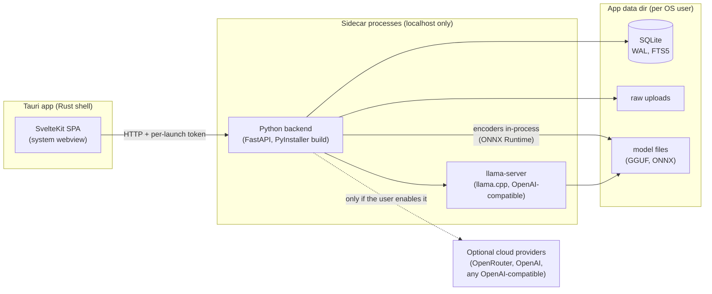

# Plan: local-first desktop harness

Created: 2026-09-25. **Approved direction; Phase 1 starting.** Decisions made so
far are logged in §14. Model choices are ratified in decision record 012
after the Phase 0 bake-off; check items off as they land, as in
`plan-workspace-harness.md`.

Model facts below were checked on 2026-09-25 against the sources listed at
the end. Re-check a model card before engineering depends on a detail.

---

## 1. Goal

The app becomes a **downloadable desktop tool** that runs on the student's
own laptop. No server, no hosting bill, no accounts. The default chat model
is a small open model that runs locally; users can opt into a larger local
model or any cloud provider they choose.

What we gain: $0 to run, no server ops, the user owns their data outright.
What we lose: **compute.** Almost every design choice below is about
getting good results from a ~2B model on a laptop CPU.

The hosted design's multi-user safeguards (accounts, tiers, spend pools,
sharing, provider vendor rules) existed to protect *other people's data
and the operator's wallet*. A local tool has neither, so they are removed,
not ported. The user decides what leaves their machine.

The hosted path is dropped (the droplet deploy scripts were deleted
2026-09-25). If a shared server is ever wanted, the backend is still an
ordinary FastAPI app.

## 2. Stance: a harness, not a tool

A plain tool hands the model the problem and trusts what comes back. A
harness does the thinking-about-the-task itself and asks the model only for
the narrow step it is good at. With a 2B model this is the product.

1. **The harness frames the task; the model fills it in.** Which document
   "this doc" refers to, which chunks matter, what shape the answer takes,
   whether citations apply — resolved *before* the prompt and stated as
   facts, never left for the model to deliberate over.
2. **One small step per call.** Classify → select → draft → verify, rather
   than one open-ended "answer this".
3. **Structure is enforced, not requested.** Anything that must parse uses
   constrained decoding (JSON schema / GBNF), not prompt pleading.
4. **Everything the model produces is checked.** The citation gate and
   withheld-with-reason contract (decision 009, `tutor/workspace.py`)
   extend to every model output.
5. **Design for the weakest supported model.** Bigger models make answers
   better; they never make the harness *work*. Same contracts everywhere.
6. **Encoders are cheap; generation is expensive.** Spend encoder compute
   freely to shrink what the generator must read and decide.
7. **Do the work once.** Anything expensive happens at ingestion, in the
   background, and is reused by every later question.

## 3. Evidence: MiniCPM5-2B trace (2026-09-25)

A full thinking trace from MiniCPM5-2B answering "What are the main ways I
should structure my homework based on this doc example?" over three
retrieved chunks of a topic-modelling homework. Caveat: this ran through
**LM Studio's RAG prompt with mid-sentence chunks**, not our harness — it
shows the model's disposition, not our pipeline.

**Capable of the synthesis step.** It correctly identified what each
truncated chunk was (header/intro, analysis building on prior weeks, topic
comparison), produced a sensible grounded structure, pulled real specifics
(Gensim/LDA, lambda, figure references, the education theme) and did not
invent course facts.

**Not trustworthy with task framing.**
- ~2,500 words of thinking, re-deciding "should I use the citations?" five
  or more times — deliberation over ambiguity a harness removes up front.
- Drafted the full answer inside the thinking, then emitted it again:
  roughly double the tokens, i.e. minutes on a laptop CPU before the first
  visible word.
- No citation markers in the final answer despite having sources.
- Leaked prompt internals into its reasoning ("Desired oververbose True").

**Implications:** thinking off by default; the prompt states resolved
facts, not open questions; citations are structurally enforced; latency is
measured as time-to-first-answer-token, not just quality.

## 4. Target architecture

- The SPA is the existing frontend, unchanged in spirit; it gets its API
  base URL and auth token from the Tauri shell at startup instead of a
  reverse proxy.
- The backend binds `127.0.0.1` on a random free port and requires a
  per-launch secret header, so other local programs and web pages can't
  call it (DNS-rebinding / CSRF protection — the only auth a local tool
  needs).
- `llama-server` exposes the same OpenAI-style API the `generate` seam
  already speaks, so local and cloud models share one code path.

## 5. Models

### 5.1 Generation candidates

| Model | Size | License | Context | Notes |
|---|---|---|---|---|
| **MiniCPM5-2B** | 2.52B dense | Apache-2.0 | 128K | Proposed default. Official GGUF, llama.cpp supported. Ships a speculative-decoding draft model (DSpark) |
| **Ling 3.0 Tiny** | 7.9B MoE, 1.3B active | MIT | 256K (8K standard deploy) | Switchable thinking/instant modes. Decodes at ~1.3B-model speed but needs ~8B-model RAM. llama.cpp support (`bailingmoe3`) merged 2026-08-17 — pin a build with it |
| **K2 Horizon 3.7B** | 3.7B dense | Apache-2.0 | 512K | Official GGUF. Reasoning-first: card recommends ≥32K output tokens at high effort — must be tested with reasoning off/low or it will be far too slow |
| **K2 Horizon 7B** | 7B dense | Apache-2.0 | 512K | Same caveat. Large-tier candidate for 16 GB+ machines |

Additional candidates worth including in the bake-off:

| Model | Why |
|---|---|
| **Qwen3.5-2B / 4B** | Thinking is *off by default* on small sizes — exactly the behaviour we want. Day-one llama.cpp support |
| **Granite 4.1 3B / 8B** | Built for RAG: takes documents as a structured list, supports structured JSON output. Natural fit for the citation contract |
| **Gemma 4 E2B / E4B** | Multimodal (text + images). Could read scanned pages directly, replacing hosted OCR. Check Gemma's license terms for redistribution |
| **Pleias-RAG 1B** | Research model that cites by emitting *literal quotes* in `<ref>` tags. Worth testing as a pattern even if not as the default |

### 5.2 Model tiers offered to users

| Tier | Target machine | Default pick (pending Phase 0) |
|---|---|---|
| Starter (bundled download) | 8 GB RAM (the minimum), no GPU | ~2B dense (MiniCPM5-2B or Qwen3.5-2B) |
| Standard (optional) | 16 GB RAM (recommended) | 3–4B dense or Ling 3.0 Tiny |
| Large (optional) | 16–32 GB RAM or GPU | 7–8B (K2 Horizon 7B, Granite 4.1 8B) |
| Cloud (optional) | any | OpenRouter free models, OpenAI, any OpenAI-compatible endpoint |

Model files are downloaded on first run (with checksums), never baked into
the installer.

### 5.3 Encoders — a second view of the documents

Encoders read; they don't write. Each one gives the harness a different
view of the material, computed once at ingestion, cheap enough to run
freely on CPU.

- **Embeddings** (exists: granite-embedding-english-r2). Semantic
  similarity for the embedding seam (decision 008). Known issue from the
  droplet test: recent `transformers` loads it in bf16, which is very slow
  on CPUs without native bf16 — the ONNX move (below) fixes this.
- **Cross-encoder reranker** (new). Rescores the fused candidate list per
  question. The highest-leverage addition for a small generator: fewer,
  better chunks → shorter prompt, less deliberation, fewer bad citations.
  Candidates to evaluate: a MiniLM-class ms-marco cross-encoder (tiny,
  fast) and a Granite-family reranker (matches the embedding model).
- **Chunk classifiers** (new). Label chunks at ingestion: definition /
  worked example / exercise / proof / rubric / admin. The homework
  question in §3 should have been routed to *example + rubric* chunks by
  the harness, not reasoned out by the model. Base model: a small
  **Ettin encoder** (JHU/LightOn, ICLR 2026; 17M–1B, beats ModernBERT on
  classification and retrieval), fine-tuned on labelled chunks. Ettin is
  also a reranker candidate.
- **Section structure** (new; §10a). Topic boundaries from similarity
  drops between adjacent chunk embeddings (TextTiling-style), hierarchy
  from clustering, section names picked from the section's own phrases
  (KeyBERT-style). Reuses the retrieval embeddings, so near-zero extra
  cost.
- **Small encoder-decoder for titles and summaries** (new, candidate).
  **T5Gemma 2 270M-270M** (Google, Dec 2025): ~370M params, 128K input,
  reads page images too. Pretrained only, so it needs fine-tuning — on
  (section text → heading) pairs harvested for free from documents that
  do have headings. Gates before adoption: (1) an ONNX export that runs
  in ONNX Runtime (only `transformers`/torch is confirmed today); (2) the
  Gemma license permits redistribution in our app. If either fails, the
  encoder phrase-picking fallback stands.
- **Sentence-level extraction** (new). Within a selected chunk, score
  sentences against the question and pass only the relevant span plus
  neighbours. Cuts prompt length several-fold for long chunks.

**Move all encoders to ONNX Runtime** and drop torch +
sentence-transformers from the shipped app. This is the single biggest
installer-size win (torch alone is hundreds of MB to GBs) and fixes the
bf16 slowdown. Every encoder stays keyed by model name so a swap orphans
old rows instead of corrupting them.

## 6. Making a small model capable

The concrete techniques, roughly in order of expected payoff.

1. **Resolve task framing before the prompt.** The harness knows which
   source is open, which course is active, what the question class is,
   and whether sources were found. The prompt states these as facts:
   "The user is asking about *Homework 4.pdf*. Answer using sources [1]–[4].
   Cite every claim." No open questions left for the model.
2. **Quote-anchored citations.** Instead of asking for `[3]`-style markers
   (which small models drop or invent), ask for a short literal quote plus
   the source number, enforced by JSON schema. The harness verifies each
   quote by (fuzzy) string match against the chunk text and withholds
   anything unverifiable. Borrowed from Pleias-RAG. Verification is
   mechanical and cheap.
3. **Constrained decoding with thinking off.** llama.cpp's JSON-schema /
   grammar enforcement is *ignored* when thinking is on (llama.cpp issue
   #20345) — another reason thinking defaults off. Disable per request via
   `chat_template_kwargs: {"enable_thinking": false}` or server-wide with
   `--reasoning-budget 0`.
4. **Reranker + sentence extraction** (§5.3) to keep prompts short.
5. **Decomposed pipeline for `ask`.** Classify (encoder or rules) → select
   (retrieval + rerank) → draft (generator, constrained) → verify (quote
   check, zone check). Only the draft step uses the generator.
6. **Precompute a "study pack" at ingestion.** In the background, per
   course section: a short summary, glossary terms with definitions,
   practice questions with answers — all cited. Many questions ("what is
   X", "quiz me on Y") then become retrieval over the pack plus light
   rewriting, which small models do well.
7. **Prompt-prefix caching.** Keep the system prompt and instructions
   byte-stable at the front so llama-server reuses the KV cache across
   calls (`cache_prompt`). Large latency win on CPU where prompt
   processing dominates.
8. **Speculative decoding.** Where a model ships a draft model (MiniCPM5
   does), run llama-server with it for faster generation at identical
   output.
9. **Few-shot exemplars per task**, versioned in `configs/prompts.toml`,
   chosen per model via capability profiles.
10. **Per-model capability profiles** in `configs/models/*.toml`: context
    to actually use, thinking mode, top-k chunks, sampling, whether JSON
    schema is reliable. Prompts adapt without code changes.
11. **Answer cache.** Identical (course, question, model) → cached answer,
    invalidated when the course's sources change.
12. **"Ask a bigger model" button.** Per answer, the user can re-run it on
    a larger local model or a cloud provider they've enabled. User-driven,
    never automatic.
13. **Later: a LoRA adapter for our formats.** Distil our exact task
    formats (quote citations, workspace blocks, zone behaviour) from a
    large model into the default small model. llama.cpp loads LoRA
    adapters at runtime, so the base model file stays shared. Only after
    the eval harness shows where the base model fails.

## 7. Providers

### 7.1 Modes

| Mode | Endpoint | Setup |
|---|---|---|
| Local — bundled | Our `llama-server` sidecar | None; model downloads on first run |
| Local — larger model | Same sidecar, different GGUF | Model manager in Settings |
| Local — external runner | User's Ollama / LM Studio | Paste its URL (both speak the OpenAI API) |
| OpenRouter | `https://openrouter.ai/api/v1` | User's OpenRouter key; free models (`:free` IDs) work with a $0 balance |
| OpenAI | `https://api.openai.com/v1` | User's OpenAI key |
| Custom | Any OpenAI-compatible URL | URL + key |

All modes go through the existing `generate` seam — only base URL, key and
model name change.

**Per-task routing.** The user can pick a provider per task class, e.g.
questions on the local model, background study-pack generation on a free
OpenRouter model overnight. Defaults: everything local.

**Cloud disclosure.** When a cloud mode is first enabled, one plain notice:
"Questions and the course excerpts used to answer them will be sent to
*<provider>*." The user decides; the app does not restrict providers.

### 7.2 OpenRouter free-model limits (current as of 2026-09)

- 20 requests/minute, 50 requests/day with no credits purchased.
- A one-time $10 credit purchase (credits don't expire) raises the free
  daily cap to 1,000 requests; 20/min stays.
- The harness must handle `429` with backoff, show remaining quota where
  the API reports it, and fall back to the local model (with a visible
  note) when the free quota is exhausted.
- OpenRouter account settings control whether requests may route to
  providers that log or train on prompts; the setup guide points users at
  those settings so the choice is theirs.

### 7.3 Setup guides (shipped in-app)

**OpenRouter**
1. Create an account at openrouter.ai → Keys → Create key.
2. Optional: buy $10 of credits to raise the free-model daily cap.
3. Optional: review Settings → Privacy (logging / training routing).
4. In the app: Settings → Model → OpenRouter → paste key → pick a model
   (the list is fetched live and filterable to free models) → Test.

**OpenAI**
1. platform.openai.com → API keys → create key.
2. Billing → Limits: set a monthly spending cap (the real safety net).
3. In the app: Settings → Model → OpenAI → paste key → pick a model → Test.
4. Optional in-app monthly budget (below).

Keys live in the OS credential store (Windows Credential Manager / macOS
Keychain / Secret Service on Linux, via the `keyring` package), never in
SQLite or a plaintext file.

### 7.4 Usage ledger (repurposed spend ledger)

The existing ledger keeps recording real token counts from each response's
usage field. Locally it becomes an informational **usage** view (tokens per
task, per provider) plus an optional user-set monthly budget for paid
providers that blocks the next paid call once reached. Tiers and pools are
gone.

## 8. Storage: Postgres → SQLite

### 8.1 Choice

**SQLite** (WAL mode, FTS5, `json1`), one file in the app data dir.
Considered and rejected: embedded Postgres (e.g. `pgserver`) — zero code
changes, but ships and manages a whole database server process per user,
adds tens of MB, and is overkill for one user. DuckDB — built for
analytics, weaker for many small transactional writes.

### 8.2 Order matters: cut before porting

Remove the multi-user machinery (§9) **before** the port. Most of the
Postgres-specific code — plpgsql triggers, enrollment locking, tier sync,
premium-claim release — belongs to features being deleted, so porting it
would be wasted work.

### 8.3 Feature mapping (inventory from `migrations/` + `queries/`)

| Postgres feature | Current use | SQLite replacement |
|---|---|---|
| 32 migrations (1,756 lines) | Schema history | **Fresh baseline schema** (`001_local_baseline.sql`) — no deployed users to migrate. Optional one-off importer for the owner's dev DB |
| `gen_random_uuid()` / `pgcrypto` | 40 uses | UUIDs generated in Python (`uuid4`) at insert; stored as `TEXT` |
| `TIMESTAMPTZ` / `now()` | 61 / 62 uses | ISO-8601 UTC `TEXT`, set via `strftime('%Y-%m-%dT%H:%M:%fZ','now')` or in Python |
| `JSONB` | 31 uses | `TEXT` with `CHECK (json_valid(col))`; `json_extract` where queried |
| `CREATE TYPE ... AS ENUM` | 19 lines | `TEXT` + `CHECK (col IN (...))` |
| `float8[]` embeddings + `LATERAL unnest` dot product | Embedding seam | `BLOB` of float32; dot product in numpy over the course's rows (thousands of chunks → milliseconds). `sqlite-vec` only if a corpus outgrows that (it's pre-1.0; brute force anyway) |
| Other arrays | Few | JSON `TEXT` or a child table |
| `tsvector` generated column + GIN + `ts_rank` + `to_tsquery` | Keyword seam + TOC routing (11 lines) | FTS5 external-content table, `porter` tokenizer, `bm25()`; sync triggers. **bm25 is lower-is-better and scaled differently from `ts_rank`** — re-check normalization and re-run the retrieval eval |
| plpgsql functions/triggers (20 / 14) | Access invariants, enrollment policy, tier sync, downgrade grace, premium claims | Most deleted with §9. Survivors (e.g. source-object kind check) become SQLite `BEFORE INSERT` triggers with `RAISE(ABORT, ...)` or checks in the repo layer |
| `FOR UPDATE [SKIP LOCKED]` (13 / 5) | Ingestion queue claims, archive sweeps | Single backend process: `BEGIN IMMEDIATE` + `UPDATE ... RETURNING` to claim. **Keep heartbeat fencing** (claim token + `claimed_at`) — laptop sleep/crash mid-run is the local version of a dead worker |
| `ON CONFLICT`, `RETURNING`, generated columns | Many | Native (SQLite ≥ 3.35); pin the bundled Python's SQLite version |
| `%(name)s` params, `dict_row` | All queries | `:name` params, `sqlite3.Row`; `common/db.py` stays the single seam |
| `ILIKE`, `::` casts | Few | `LIKE` (ASCII case-insensitive by default) / `lower()`; remove casts |

Connection setup (every connection): `PRAGMA journal_mode=WAL`,
`PRAGMA foreign_keys=ON` (**off by default in SQLite** — easy to miss),
`PRAGMA busy_timeout=5000`.

### 8.4 Tests

The 31 test files currently need a live Postgres. `conftest.py` switches
to a fresh temp SQLite file per test session (faster, no setup, removes
the `PYTEST_ALLOW_ANY_DB` guard). Tests for deleted features are deleted
with them; every surviving behaviour keeps its test.

## 9. What gets removed

| Area | Code / docs | Local replacement |
|---|---|---|
| Accounts & auth | `api/auth.py`, `common/auth*.py`, `login_throttle.py`, email verification, password reset, JWT, bcrypt | One implicit local profile row (keeps `user_id` columns valid; leaves room for multiple profiles later). Per-launch token between shell and backend |
| Tiers & spend control | `tiers.py`, `budget.py` gates, subscriptions, pools, downgrade grace, premium codes (decision 004) | Usage ledger + optional budget (§7.4) |
| Sharing & enrollment | Public/invite courses, enrollment, discover page, support codes (decisions 003, 005, 006) | Course export/import as a single file (`.course` zip: sources + derived data) |
| Archive grace | 90-day archive, maintenance loop (decision 005) | Simple trash with undo (e.g. 30 days, user-configurable) |
| Upload caps | Tier byte limits | Free-disk check + time estimate |
| Hosted OCR | Provider OCR stage | Local OCR (§10, engine chosen in Phase 0/5) |
| Frontend | `(auth)` routes, `discover`, account/billing parts | First-run setup wizard (model download, optional cloud keys) |

## 10a. Ingestion on a small model

Only three ingestion stages call the chat model: **OCR** (scanned PDFs
only), **update TOC** and **extract knowledge**. Extract text, locators,
chunks and embeddings are plain code or encoders. (The study pack in §6.6
would be a fourth.)

Why these are the hard part locally:

- **Scale.** Today both prompts see only the first `prompt_window_chars`
  (8,000) characters of each document — a latent gap independent of this
  pivot. Covering a 300-page textbook means ~100 windows × 2 stages of
  long-output calls: hours on a laptop CPU if done the current way.
- **Task difficulty.** Open-ended, long structured output with a locator
  on every item — the hardest shape for a 2B model.
- **Silent, compounding errors.** A bad answer gets noticed and re-asked.
  A bad knowledge item or TOC entry persists and feeds the TOC-routing and
  dependency-walk seams and course memory.
- **OCR needs vision**, which a 2B text model doesn't have.

Design:

- **TOC — no chat model.** In order of preference:
  1. Author structure: PDF outline/bookmarks, heading detection via font
     size and weight (pypdfium2 exposes both), slide titles.
  2. Otherwise, encoder structure (§5.3): boundaries from embedding
     similarity drops, hierarchy from clustering — over the whole
     document, not a window.
  3. Titles for untitled sections: the fine-tuned small encoder-decoder
     (T5Gemma 2, if it passes its gates), checked so the title's key terms
     appear in the section; else an encoder-picked phrase from the
     section itself. Every entry is grounded by construction.
- **Knowledge extraction — decomposed like `ask`.** The chunk classifier
  (§5.3) flags candidates (definition, theorem, worked example,
  formula). The small model then extracts *one* item per candidate chunk:
  a 512-token chunk in, one short JSON item out, with a verbatim quote
  that the harness verifies (§6.2). Hundreds of small checkable calls
  instead of a few huge unverifiable ones, and it covers the whole
  document instead of the first 8,000 characters.
- **Priority order.** Sections the user opens or asks about first; the
  rest in the background.
- **OCR** stays gated on "no text layer" (as today); engine per §10.
- **Routing.** If the user has enabled a cloud provider for background
  tasks (§7.1), these stages can use it; otherwise local, background,
  resumable.

## 10. Compute management (replacing the old stopgaps)

- **One generator loaded at a time.** Switching models unloads the old
  one. Memory check before loading; refuse with a clear message if the
  machine can't fit it.
- **Foreground beats background.** A user question pauses ingestion work
  at the next chunk boundary; the heartbeat-fenced queue already supports
  resuming.
- **Background policy.** Heavy stages (study pack, OCR) run when the
  laptop is idle and, by default, on AC power; "Run now" overrides.
- **Estimates up front.** Before ingesting: "≈ 40 min on this machine",
  from a per-machine benchmark taken at first run.
- **Hardware profile on first run.** RAM, cores, GPU/Apple Silicon, CPU
  features (AVX2 / AVX-512 / bf16) → recommended tier, llama.cpp build
  (CPU / Vulkan / Metal), batch sizes, whether local OCR is on.
- **Local OCR.** Evaluate, in order: (a) a small multimodal model already
  in the lineup (Gemma 4 E2B) reading page images; (b) a dedicated
  document-conversion model; (c) Tesseract as the lowest-common-denominator
  fallback. Background-only either way.

## 11. Desktop shell and distribution

- **Tauri v2** (current stable 2.10.x). Uses the OS webview, so the shell
  is a few MB instead of Electron's ~100+ MB.
- **Sidecars** via Tauri's `externalBin`:
  - Python backend frozen with **PyInstaller** (custom spec file for
    ONNX Runtime, pypdfium2 and data files like `configs/`).
  - `llama-server` prebuilt per OS/accelerator from llama.cpp releases,
    pinned to a tested build.
- **Lifecycle:** the shell starts the backend with a random port and
  secret, waits for health, loads the SPA; the backend owns
  `llama-server` (start, health, restart on crash, stop). Everything
  stops when the window closes; a tray option can keep ingestion running.
- **App data dir** per OS user: SQLite file, raw uploads, model files,
  logs. "Open data folder" and "Export everything" in Settings.
- **Distribution:** GitHub Releases, with the Tauri updater plugin for app
  updates. Model files update independently. Code signing optional at
  first (unsigned builds show SmartScreen / Gatekeeper warnings).
- **Target installer size:** well under 200 MB (no torch), models
  downloaded separately (~1.5 GB for the starter tier at 4-bit).

## 12. Phases

**Order (decided 2026-09-25): Phase 1 first** — it is cleanup, pure
deletion under existing tests, shrinks the SQLite port, and doesn't depend
on which models win. Then Phase 2. Phase 0 runs whenever the owner has
time to download and run models; it must finish before Phase 3.

### Phase 0 — model bake-off (go/no-go) ✅ (decision 012)

- [x] `llama-server` pinned at b11177 (includes `bailingmoe3`), Q4_K_M
      candidates; K2 Horizon found unsupported upstream and dropped
- [x] `scripts/eval_models.py`: answer eval against any endpoint or the
      bundled runtime, one model after another, with an optional
      real-material course (`--course`, `--cases`)
- [x] Real-course cases (owner's syllabus + reading, 13 cases incl. the
      §3 homework question), kept local and uncommitted
- [x] MiniCPM5-2B, Qwen3.5-2B, Granite 4.1 3B run on the owner's laptop;
      results and failure analysis in decision 012
- [ ] Quote-anchored vs plain citations (deferred to Phase 3 §6.2)
- [ ] Peak RAM and the 8 GB "floor" machine (not available yet)
- [ ] Structure/titling bake-off on real course files: encoder
      phrase-picking vs fine-tuned T5Gemma 2 270M vs the starter chat
      model; check embedding similarity drops line up with real topic
      changes
- [ ] T5Gemma 2 gates: ONNX export runs in ONNX Runtime; Gemma license
      allows redistribution
- [x] Defaults chosen (MiniCPM5-2B starter); decision 012 written

**Pass bar (proposed):** the starter model reaches ≥ 90% verified
citations and correct refusals with thinking off, and answers a typical
question in under ~30 s on the floor machine. If nothing passes, the
harness work in Phase 3 is attempted first and the bake-off re-run before
giving up on the starter tier.

### Phases 1 + 2 — remove multi-user machinery, port to SQLite ✅

Done 2026-09-25 as ONE pass, not two: nearly every SQL statement touched
by the removal was also rewritten by the port, so doing them separately
would have rewritten each query twice.

- [x] Accounts, JWT, login throttling, email flows deleted. No profile
      row at all: one database file per OS user IS the profile (a
      second profile, if ever wanted, is a second file)
- [x] Tiers, subscriptions, pools, premium codes, downgrade grace deleted
- [x] Enrollment, discover, sharing, join/support codes deleted
- [x] Archive grace → trash with restore (30 days, `configs/lifecycle.toml`),
      permanent delete from trash, course-memory keepsake survives purge
- [x] Spend ledger → usage ledger + optional monthly cloud token budget
- [x] Baseline schema `001_local_baseline.sql`; every FK cascades, so a
      purge is one DELETE (replaces the 40-statement purge block)
- [x] `db.py`: WAL, foreign_keys ON, busy timeout, `BEGIN IMMEDIATE`
      write transactions, UUID/TIMESTAMP/JSON decoding, dict rows
- [x] Every query ported; FTS5 keyword + TOC seams (porter stemming +
      the Snowball stopword list Postgres used); numpy embedding seam
      (float32 BLOBs); concept matching moved to Python
- [x] Queue claims are one atomic `UPDATE … RETURNING`; heartbeat fence
      kept; trashed courses are never claimed
- [x] No transaction is held across a slow step anymore (observer commits
      each transition; tutor generates before writing its trace) —
      SQLite's single writer would otherwise block the UI for minutes
- [x] `conftest.py`: fresh SQLite file per test, in-memory keyring, env
      scrubbed. Suite: 253 tests in ~8 s (was 359 in ~190 s on Postgres;
      the difference is deleted multi-user tests)
- [x] Importer `scripts/import_postgres.py`; the owner's real course
      (2 PDFs) imported and re-ingested locally
- [~] Retrieval-eval baseline: not recorded — the eval set has one case
      whose course tag exists in no database, so the number would have
      been meaningless. Equivalence is covered by the 34 ported
      retrieval tests; a real eval set is part of Phase 0
- [x] Decisions 002–006 superseded by 012

Found and fixed along the way:
- Ingestion stages for TOC/knowledge called the model and discarded the
  output; they now record an honest skip, so text sources index with no
  model configured (and a source that previously failed now indexes).
- The worker's wakeup waited for BOTH events (`gather`), so uploads
  never woke it early; it also wasn't thread-safe. Fixed and tested.
- Embedding model loaded in bf16 (slow on CPUs without bf16); forced fp32.
- PDF text had U+FFFD garbage without fontTools; added as a dependency.
- Settings API (providers per task class, keyring keys, connection test,
  usage + budget) landed early because the provider seam needed it.

### Phase 3 — harness for small models

- [x] Task framing resolved before the prompt (§6.1): `tutor/compose.py`
      — intent rules (graded work → steer prompt; quiz/notes/table/
      slides/code → narrow prompt + JSON schema with citation numbers
      bounded to the material); eval runs the same path
- [ ] Quote-anchored citations with JSON schema + mechanical verification
- [ ] Reranker and sentence extraction in the retrieval funnel
- [ ] Decomposed `ask` pipeline where the eval shows single-shot failing
- [ ] Per-model capability profiles in `configs/models/`
- [ ] Prompt-prefix stability for KV-cache reuse; answer cache
- [ ] TOC builder without the chat model: author structure → encoder
      boundaries/clustering → titles (§10a)
- [ ] Decomposed knowledge extraction over the whole document (§10a)
- [ ] Study pack generated at ingestion
- [x] Fence-echo stripping; 4xx-rejected schema → unconstrained retry
- [ ] Re-run Phase 0 eval; beat the Phase 0 numbers (over-refusal on
      real material is the target: reranker + top-k + quote-first)

### Phase 4 — providers and settings

- [x] `llama-server` lifecycle owned by the backend: supervised, crash
      restart, resume last model at launch, Windows job object so it can
      never outlive the app, stale-pidfile cleanup
- [x] Model manager: catalog, checksummed resumable download, RAM fit,
      reuse of verified LM Studio / HF-cache files, switch, delete
- [x] Provider modes (§7.1) with test-connection; keys in OS keyring
- [x] Per-task routing; OpenRouter 429 handling and local fallback
- [x] Cloud disclosure notice; in-app setup guides
- [ ] "Ask a bigger model" per answer

### Phase 5 — encoders and local OCR

- [ ] Embeddings on ONNX Runtime; torch and sentence-transformers out
      of the runtime dependencies
- [ ] Reranker and chunk classifiers (Ettin base) on ONNX Runtime
- [ ] Fine-tune T5Gemma 2 270M on harvested headings, if it passed its
      Phase 0 gates
- [ ] Local OCR choice (§10, compute management) implemented as a background stage
- [ ] First-run hardware profile and benchmark; ingestion estimates;
      idle/AC-power policy

### Phase 6 — desktop shell and distribution

- [ ] Tauri v2 project wrapping the SPA; runtime API base + token
- [ ] PyInstaller spec for the backend; `llama-server` binaries per OS
- [ ] Sidecar lifecycle, tray option, data folder/export
- [ ] Windows installer first (the owner's platform), then macOS, Linux
- [ ] GitHub Releases + updater; signing decision

### Phase 7 — later

- [ ] LoRA adapter for our formats on the starter model (§6.13)
- [ ] Multiple local profiles, if asked for
- [ ] Optional sync/sharing via export files, if asked for

## 13. Risks

| Risk | Mitigation |
|---|---|
| No small model meets the pass bar | Phase 3 harness work first; starter tier may become 3–4B with 16 GB minimum |
| Reasoning-first models (K2 Horizon) too slow with thinking off | Profiles per model; drop them from default tiers if needed |
| New architectures (Ling's KDA) break on some llama.cpp builds | Pin and test the exact llama.cpp build shipped |
| FTS5 ranking changes retrieval quality | Baseline eval before the port; tune normalization |
| PyInstaller bundle breaks on native deps | Moving to ONNX removes the heaviest one (torch); CI builds per OS |
| Laptop sleep mid-ingestion | Heartbeat-fenced claims already handle a vanished worker |

## 14. Decisions log

Decided 2026-09-25:
- **8 GB RAM minimum, 16 GB recommended**; optimize if 8 GB becomes a
  problem.
- **No data-retention rules.** The user chooses providers; cloud modes
  show a one-line disclosure, nothing more.
- **Hosted path dropped**; `deploy/` deleted.
- **Phase 1 first**, then Phase 2; Phase 0 when the owner has time.
- Ingestion design: §10a. TOC without the chat model.
- Trash keeps deleted courses **30 days**, user-configurable.
- Export format: a documented **`.course` zip** (sources + derived data),
  so a course can move between machines or be shared by hand.

No open questions remain for Phase 1.

## 15. Existing docs affected on ratification

- `docs/system.md`: rewrite §8 (deployment topology) and the provider
  rules in the TL;DR and §1 for the local architecture.
- Decisions 002–006: marked superseded by 012 where they cover auth,
  tiers, sharing, enrollment and course shapes.
- Decision 008 (hybrid retrieval): FTS5 and numpy seams, reranker stage.
- Decision 010 (eval harness): endpoint-configurable runner, quote
  verification metric.

## Sources

- MiniCPM5-2B: [model card](https://huggingface.co/openbmb/MiniCPM5-2B), [GitHub](https://github.com/openbmb/minicpm)
- K2 Horizon: [3.7B card](https://huggingface.co/IFM/K2-Horizon-3.7B), [7B card](https://huggingface.co/IFM/K2-Horizon-7B), [release coverage](https://www.marktechpost.com/2026/09/06/ifm-releases-k2-horizon-six-apache-2-0-models-from-0-9b-to-375b/)
- Ling 3.0 Tiny: [model card](https://huggingface.co/inclusionAI/Ling-3.0-tiny), [bartowski GGUF](https://huggingface.co/bartowski/Ling-3.0-tiny-GGUF)
- Qwen3.5 small models: [Unsloth guide](https://unsloth.ai/docs/models/qwen3.5)
- Granite 4.1: [Unsloth guide](https://unsloth.ai/docs/models/ibm-granite-4.1), [IBM docs](https://www.ibm.com/granite/docs/models/granite)
- Gemma 4: [model card](https://ai.google.dev/gemma/docs/core/model_card_4)
- T5Gemma 2: [announcement](https://blog.google/innovation-and-ai/technology/developers-tools/t5gemma-2/), [paper](https://arxiv.org/abs/2512.14856), [270M card](https://huggingface.co/google/t5gemma-2-270m-270m)
- Ettin: [Seq vs Seq paper](https://arxiv.org/abs/2507.11412), [GitHub](https://github.com/jhu-clsp/ettin-encoder-vs-decoder)
- Pleias-RAG (quote citations): [paper summary](https://pith.science/paper/2504.18225)
- llama.cpp: [grammar ignored with thinking, #20345](https://github.com/ggml-org/llama.cpp/issues/20345), [reasoning-budget discussion](https://github.com/ggml-org/llama.cpp/discussions/18424)
- OpenRouter: [rate limits](https://openrouter.zendesk.com/hc/en-us/articles/39501163636379-OpenRouter-Rate-Limits-What-You-Need-to-Know), [provider logging](https://openrouter.ai/docs/guides/privacy/provider-logging)
- Tauri: [sidecars](https://v2.tauri.app/develop/sidecar/), [Tauri v2 + Python sidecar example](https://github.com/dieharders/example-tauri-v2-python-server-sidecar)
- SQLite hybrid search: [FTS5 + sqlite-vec](https://alexgarcia.xyz/blog/2024/sqlite-vec-hybrid-search/index.html)
