# System Design

> Architectural overview of the Course Memory and Adaptive Study System.
> Read this alongside `docs/project.md` (product/plan) and `docs/AGENTS.md`
> (contract). Decisions here are the current *agreed* ones; record changes
> in `docs/decisions/`.

## 0. TL;DR

> **Local-first since 2026-09-25 (decision 012).** The app is a desktop tool:
> one user, one SQLite file, on their own machine. Sections below that
> describe accounts, tiers, spend pools, enrollment, sharing, archives-for-
> learners or a hosted deployment are **superseded** by decision 012 and
> `docs/plan-local-first.md`; the retrieval, citation, memory and workspace
> design they sit beside still holds.

An academic assistant that ingests course materials, extracts structured text and
course knowledge (concepts, evidence, TOC), learns a per-student error model
from attempts, and serves source-grounded answers + "what to study next"
recommendations. Memory vocabulary (user memory root, course-memory child,
course knowledge, TOC-as-index) is defined in
`docs/decisions/007_memory_model.md` and controls wherever the word "memory"
appears below.

- **Shape:** a Tauri app (`src/frontend/src-tauri/`) shows the SvelteKit
  SPA in the OS webview and runs the FastAPI backend
  (`src/backend/serve.py`) as a child process on a free 127.0.0.1 port; a
  per-launch token, handed only to the app's own webview, guards the API
- **Database:** SQLite (WAL, foreign keys on, FTS5) in the per-user data
  directory; raw SQL; baseline migration `001_local_baseline.sql`; every FK
  cascades; deleted courses sit in a 30-day trash
- **Generation — `common/provider.py` `generate`:** routed per task class
  (answers / background) to the user's choice: the **bundled llama.cpp
  server** (default MiniCPM5-2B, reasoning disabled server-side, Vulkan or
  CPU), OpenRouter, OpenAI, or any OpenAI-compatible endpoint; keys in the
  OS keychain; a usage ledger and optional monthly cloud token budget
- **Encoders — in-process on ONNX Runtime:** granite-embedding-english-r2
  embeddings and an ms-marco MiniLM cross-encoder reranker (pinned,
  sha256-verified downloads; no torch)
- **Harness:** `tutor/compose.py` frames the task before generation (plain
  answer / graded-work steer / constrained workspace item); the reranker
  picks and orders the chunks the model reads; the citation gate has the
  last word
- **Retrieval:** hybrid four-seam funnel (decision 008) — FTS5 keyword, TOC
  (from the author's headings/bookmarks), dependency walk, numpy embeddings —
  fused, then reranked
- **Deletion:** course → trash (30 days) → purge; the course-memory keepsake
  survives

---

## 1. High-level architecture

Implementation status matters throughout this document: schemas, auth
(including password-change session invalidation and login throttling),
owner/enrollment permission rules, source-to-course-object identity, ingestion
run state, upload storage, archive-then-purge services, and the full
ingestion pipeline (extract → OCR for image-only PDFs → locators → chunks →
self-hosted embeddings, with a DB-backed run ledger, persistent
heartbeat-fenced queue claims, and tier/budget gating) are implemented. The
retrieval funnel (seams, normalization, relevance allocation, traces —
§4/§4a) is implemented; the tutor orchestration (`ask` with strict refusal,
prompt-registry prompts with untrusted-material fencing, citations endpoint)
is implemented on top of it; the generated-schema frontend consumes all of
it. The hosted chat provider is the one missing piece: `generate` fails
closed until the operator's key lands — model-stage runs are inspectably
failed, never falsely successful. Diagrams for the later flows are the
intended design, not claims that the code already performs them.

The system is a **pipeline with a memory**. Think of it like a **library that
learns about you**:

- **Ingestion** is the *librarian* — it takes your messy course files, reads them,
  and files every page into the catalog.
- **Postgres** is the *stacks* — the organized shelves where all the text and
  metadata live.
- **Retrieval** is the *card catalog* — when you ask a question, it finds the right
  pages.
- **Course memory** is the *study guide* the librarian wrote — concepts, definitions,
  and how they connect, each with a page number.
- **Student model** is the *librarian's notes on you* — what you've tried, where you
  stumble, what you've mastered.
- **Tutor** is the *reference desk* — it reads the catalog, the study guide, and the
  notes on you, then answers with citations and tells you what to study next.

The whole thing is one **backend** (the library staff) behind an **API** (the front
desk), a **frontend** (the reading room you sit in), and a set of **models** (the
specialists the staff can call on).

### 1.1 The big picture

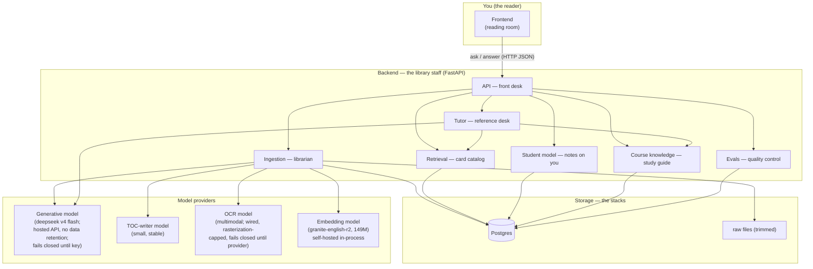
```mermaid
flowchart TB
    subgraph User["You (the reader)"]
        B["Frontend<br/>(reading room)"]
    end

    subgraph Backend["Backend — the library staff (FastAPI)"]
        API["API — front desk"]
        ING["Ingestion — librarian"]
        RET["Retrieval — card catalog"]
        MEM["Course knowledge — study guide"]
        SM["Student model — notes on you"]
        TUT["Tutor — reference desk"]
        EV["Evals — quality control"]
    end

    subgraph Storage["Storage — the stacks"]
        PG[("Postgres")]
        FS["raw files (trimmed)"]
    end

    subgraph Models["Model providers"]
        GEN["Generative model<br/>(deepseek v4 flash;<br/>hosted API, no data retention;<br/>fails closed until key)"]
        TOCW["TOC-writer model<br/>(small, stable)"]
        OCR["OCR model<br/>(multimodal; wired, rasterization-<br/>capped, fails closed until provider)"]
        EMB["Embedding model<br/>(granite-english-r2, 149M)<br/>self-hosted in-process"]
    end

    B -->|"ask / answer (HTTP JSON)"| API
    API --> ING
    API --> RET
    API --> MEM
    API --> SM
    API --> TUT
    API --> EV
    ING --> PG
    ING --> FS
    ING --> GEN
    ING --> OCR
    ING --> TOCW
    ING --> EMB
    RET --> PG
    TUT --> GEN
    TUT --> RET
    TUT --> MEM
    SM --> PG
    MEM --> PG
    EV --> PG
```

### 1.2 Layer 1 — Ingestion (the librarian)

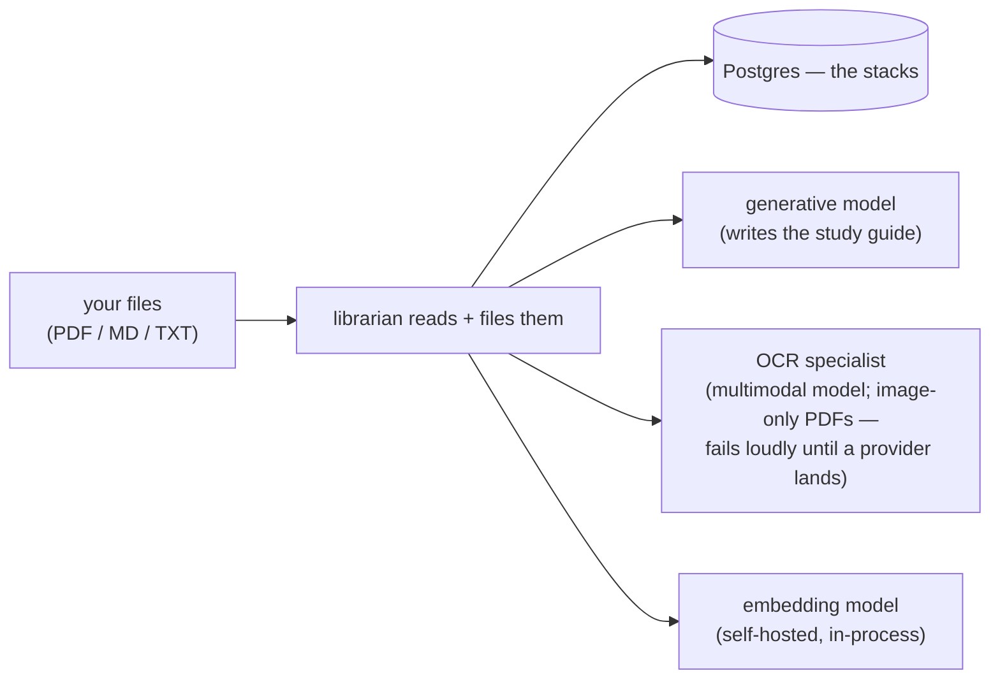
```mermaid
flowchart LR
    F["your files<br/>(PDF / MD / TXT)"] --> ING["librarian reads + files them"]
    ING --> PG[("Postgres — the stacks")]
    ING --> GEN["generative model<br/>(writes the study guide)"]
    ING --> OCR["OCR specialist<br/>(multimodal model; image-only PDFs —<br/>fails loudly until a provider lands)"]
    ING --> EMB["embedding model<br/>(self-hosted, in-process)"]
```

**Analogy:** you hand the librarian a stack of papers. They read each one, note the
page numbers, and file the text onto the shelves. For scanned pages they call in an
OCR specialist to read the handwriting (the specialist is wired but has no employer
yet — with no provider configured, image-only sources fail with a clear error rather
than a silent empty base). They also draft a study guide (course
knowledge — the study guide is course content, not memory) as they go.

### 1.3 Layer 2 — Retrieval (the card catalog)

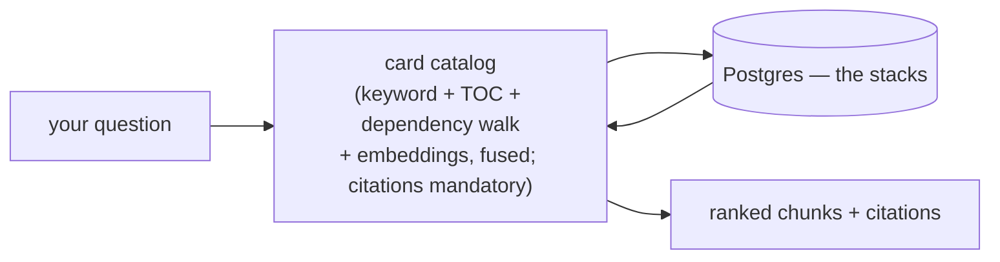
```mermaid
flowchart LR
    Q["your question"] --> RET["card catalog<br/>(keyword + TOC + dependency walk<br/>+ embeddings, fused; citations mandatory)"]
    RET --> PG[("Postgres — the stacks")]
    PG --> RET
    RET --> A["ranked chunks + citations"]
```

**Analogy:** you ask "what's the factorization condition?" The catalog sweeps the
shelves for the words (keyword — where it's *used*), checks the index (TOC —
where the topic is *taught*), pulls what the topic builds on (dependency walk —
what you need *first*), and asks a specialist who thinks in meanings (embeddings
— where it's *implied*). Each hands over candidate pages; the desk merges them,
keeps the best, and every page it hands you has its page number. (Decision 008:
each seam runs as soon as its data exists; fusion must beat any single one on
the eval set.)

### 1.4 Layer 3 — Course knowledge (the study guide)

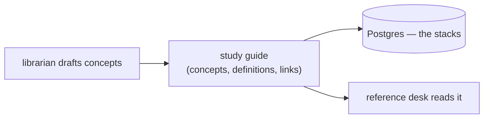
```mermaid
flowchart LR
    ING["librarian drafts concepts"] --> MEM["study guide<br/>(concepts, definitions, links)"]
    MEM --> PG[("Postgres — the stacks")]
    MEM --> TUT["reference desk reads it"]
```

**Analogy:** the librarian's study guide lists each concept, its course-specific
definition, and how concepts depend on each other — every entry with a page number
so you can verify it. It's small enough to read and correct.

### 1.5 Layer 4 — Student model (notes on you)

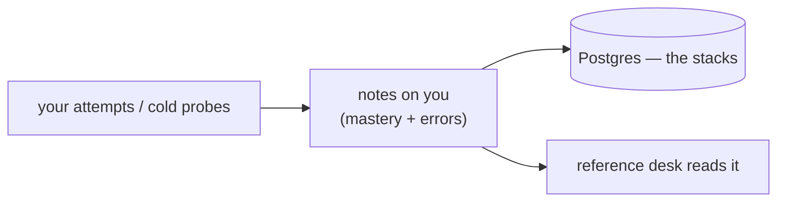
```mermaid
flowchart LR
    A["your attempts / cold probes"] --> SM["notes on you<br/>(mastery + errors)"]
    SM --> PG[("Postgres — the stacks")]
    SM --> TUT["reference desk reads it"]
```

**Analogy:** every time you answer a practice question, the librarian jots a note:
which concept, whether you got it, what kind of mistake, how confident you were.
Over time these notes become a picture of what you actually understand.

### 1.6 Layer 5 — Tutor (the reference desk)

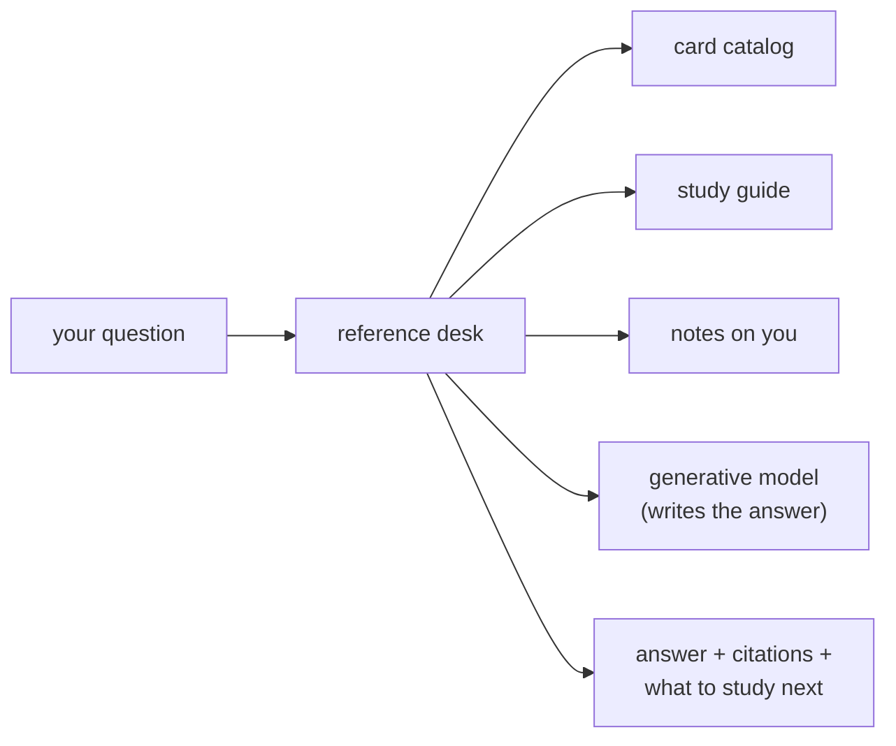
```mermaid
flowchart LR
    Q["your question"] --> TUT["reference desk"]
    TUT --> RET["card catalog"]
    TUT --> MEM["study guide"]
    TUT --> SM["notes on you"]
    TUT --> GEN["generative model<br/>(writes the answer)"]
    TUT --> A["answer + citations +<br/>what to study next"]
```

**Analogy:** you ask the reference desk a question. They pull the relevant pages
(catalog), check the study guide (course knowledge), glance at their notes on you (student
model), and write you a clear answer — always pointing to the exact page it came
from, and telling you what to practice next.

### 1.6a The workspace harness (decision 011)

The tutor can also **make things, not just say things**. Alongside the chat
body, an answer may carry a workspace item — a multiple-choice quiz, an
editable markdown document, a rendered HTML/SVG visualization, a code
listing, an editable sheet, or a markdown slide deck. These open in a
tabbed canvas pane beside the chat; tabs accumulate across turns and live
only in the browser (nothing is persisted; saving is the Milestone 5
`user_artifacts` path).

The contract is owned by the backend, in code rather than in the prompt:

1. The tutor prompt teaches fenced ` ```workspace ` JSON blocks (one per
   answer; `configs/prompts.toml`).
2. `src/backend/tutor/workspace.py` extracts each block, validates it
   against the pydantic union, and applies decision 009's citation gate —
   every item must cite the numbered material it rests on, inline `[n]`
   included. Uncited or malformed blocks are **withheld**: removed from the
   chat body (so a rejected quiz never leaks its answer key as raw JSON)
   and replaced by a named reason shown inline in the chat.
3. The `/ask` response carries the chat body as `text`, validated items as
   `workspace`, and the withhold reasons as `withheld`.
4. The frontend only renders validated payloads: `RichText` (markdown →
   KaTeX math → DOMPurify-sanitized HTML) for text, per-type views for the
   rest. Scripts never execute; code is highlighted, never run.

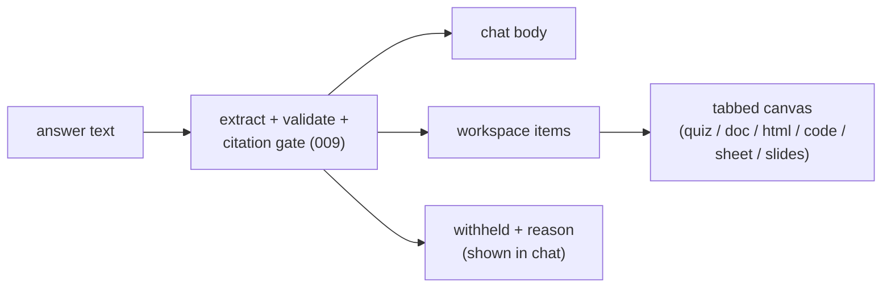
```mermaid
flowchart LR
    A["answer text"] --> EXT["extract + validate +<br/>citation gate (009)"]
    EXT --> BODY["chat body"]
    EXT --> OK["workspace items"]
    EXT --> NO["withheld + reason<br/>(shown in chat)"]
    OK --> CANVAS["tabbed canvas<br/>(quiz / doc / html / code /<br/>sheet / slides)"]
```

### 1.7 How the layers fit together

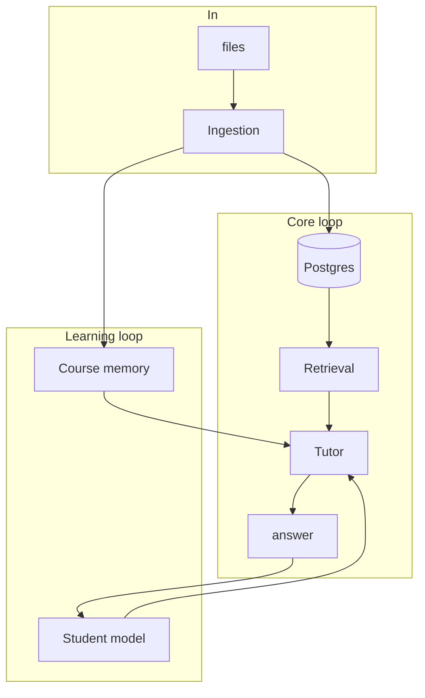
```mermaid
flowchart TB
    subgraph In["In"]
        F["files"] --> ING["Ingestion"]
    end
    subgraph Core["Core loop"]
        ING --> PG[("Postgres")]
        PG --> RET["Retrieval"]
        RET --> TUT["Tutor"]
        TUT --> A["answer"]
    end
    subgraph Learn["Learning loop"]
        A --> SM["Student model"]
        SM --> TUT
        MEM["Course memory"] --> TUT
        ING --> MEM
    end
```

**Data flow at a glance:** files enter through ingestion → parsed to text →
stored in Postgres (source of truth) → retrieval answers questions by searching
that text → tutor generates responses grounded in retrieved passages + course
knowledge + the user's memory (root + course node) + student model.

---

## 2. Storage model

The schema is broken into **six layers** so each diagram stays readable. Read
them in order; each layer builds on the previous. These map to the modules in
`src/backend/common/schemas/`.

### 2.1 Identity & course structure

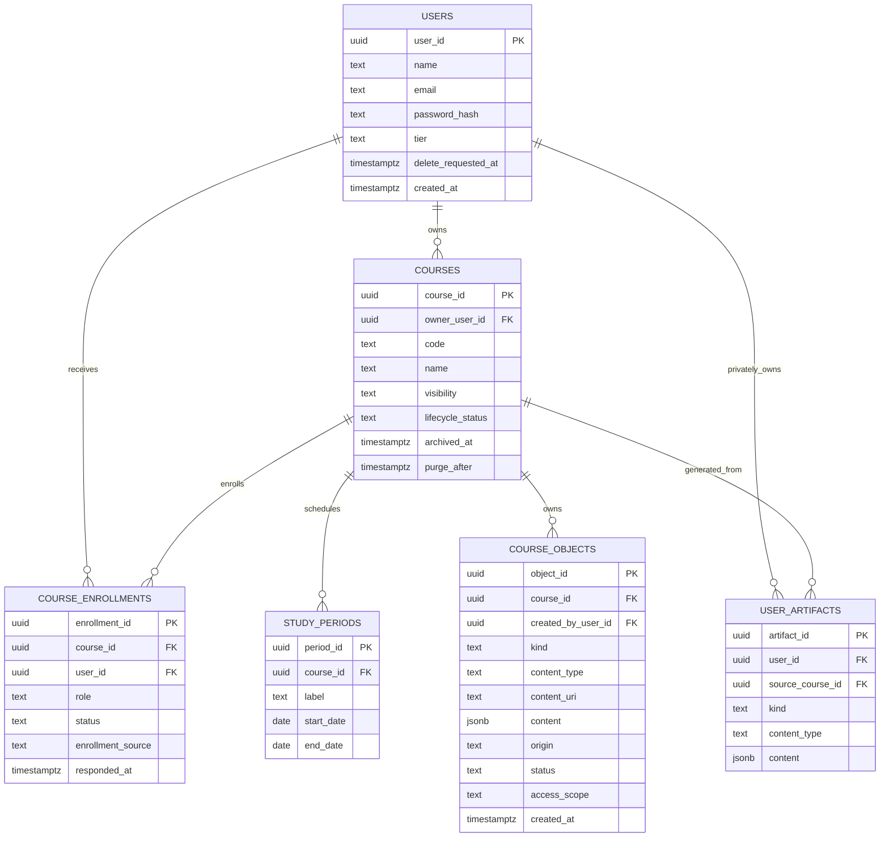
```mermaid
erDiagram
    USERS ||--o{ COURSES : owns
    USERS ||--o{ COURSE_ENROLLMENTS : receives
    COURSES ||--o{ COURSE_ENROLLMENTS : enrolls
    COURSES ||--o{ STUDY_PERIODS : schedules
    COURSES ||--o{ COURSE_OBJECTS : owns
    USERS ||--o{ USER_ARTIFACTS : privately_owns
    COURSES ||--o{ USER_ARTIFACTS : generated_from

    USERS {
        uuid user_id PK
        text name
        text email
        text password_hash
        text tier
        timestamptz delete_requested_at
        timestamptz created_at
    }
    COURSES {
        uuid course_id PK
        uuid owner_user_id FK
        text code
        text name
        text visibility
        text lifecycle_status
        timestamptz archived_at
        timestamptz purge_after
    }
    COURSE_ENROLLMENTS {
        uuid enrollment_id PK
        uuid course_id FK
        uuid user_id FK
        text role
        text status
        text enrollment_source
        timestamptz responded_at
    }
    USER_ARTIFACTS {
        uuid artifact_id PK
        uuid user_id FK
        uuid source_course_id FK
        text kind
        text content_type
        jsonb content
    }
    STUDY_PERIODS {
        uuid period_id PK
        uuid course_id FK
        text label
        date start_date
        date end_date
    }
    COURSE_OBJECTS {
        uuid object_id PK
        uuid course_id FK
        uuid created_by_user_id FK
        text kind
        text content_type
        text content_uri
        jsonb content
        text origin
        text status
        text access_scope
        timestamptz created_at
    }
```

- **`USERS`** carries auth (unique `email`, `password_hash`), account
  lifecycle (`delete_requested_at` — soft delete with a 7-day grace period),
  and the current **tier** (`free` default / `paid`), synced from the
  append-only `user_subscriptions` history by a trigger. Tier gates the
  weekly generation budget and model routing (see §6a).
- **`COURSES`** has one owner and is in exactly one of **three shapes —
  private, invite_only, public** (decision
  `docs/decisions/006_three_course_shapes.md`; the closed set). Public
  courses are anonymously viewable (published objects +
  join code) and self-enrollable; invite_only courses are invisible except
  through their owner-held join code; private courses are reachable only by
  owner invitation. The join code (`courses.code`) is a server-generated
  **canonical code**: 16 chars from a look-alike-free alphabet, DB CHECK
  constrained, displayed grouped as `XXXX-XXXX-XXXX-XXXX` (common/codes.py).
  Course lifecycle (`active`/`archived` + `archived_at`/`purge_after`)
  implements the 90-day archive. Public→restricted transitions are versioned
  lifecycle events; restricted→public is a plain owner update.
- **`COURSE_ENROLLMENTS`** grants an authenticated learner source use and
  generation without canonical-content mutation. Status lifecycle:
  `invited` → `active`, with `declined` and `revoked` retained rows (history
  preserved; a revoked learner may re-enroll via the validated DB path —
  migration 011). Enrollment policy is enforced twice: API pre-checks in
  `permissions.py` and the DB trigger — both must change together.
- **`USER_ARTIFACTS`** stores learner-generated materials outside the canonical
  course object collection. They remain visible only to their user, including
  after enrollment revocation; neither the course owner nor other learners
  inherit access.
- **`STUDY_PERIODS`** replaces the rigid `week`: a user-definable sliding window
  (a lecture, a month, a semester, the stretch before an exam). Granularity is
  set by the user, never hardcoded.
- **`COURSE_OBJECTS`** stores any course-owned object — uploaded source or
  generated artifact. `kind` is the semantic purpose (a **free string**, so new
  kinds need no schema change), `content_type` is the format, and `content_uri`
  points to where the content actually lives (file for binaries, jsonb for
  structured data, text for markdown). Format routes storage and serving. A
  check constraint requires `content_uri` or `content`.

### 2.2 Source content (uploaded material)

```mermaid
```mermaid
erDiagram
    USERS ||--o{ SOURCES : owns
    COURSES ||--o{ SOURCES : contains
    COURSE_OBJECTS ||--|| SOURCES : specializes_as
    SOURCES ||--o{ LOCATORS : indexed_by
    SOURCES ||--o{ CHUNKS : chunked_into
    LOCATORS ||--o{ CHUNK_LOCATORS : maps
    CHUNKS ||--o{ CHUNK_LOCATORS : cited_via

    SOURCES {
        uuid source_id PK
        uuid object_id FK
        uuid uploaded_by_user_id FK
        uuid course_id FK
        text filename
        text mime_type
        text source_type
        text version
        text uri
        text status
        text file_hash
        bigint size_bytes
        text stored_encoding
        text error_message
        timestamptz created_at
    }
    LOCATORS {
        uuid locator_id PK
        uuid source_id FK
        text locator_type
        text start
        text end_value
        text label
        text description
    }
    CHUNKS {
        uuid chunk_id PK
        uuid source_id FK
        uuid locator_id FK
        int chunk_index
        text text
    }
    CHUNK_LOCATORS {
        uuid chunk_id PKFK
        uuid locator_id PK
    }
```

- **Objects are stored whole**; nothing is destroyed at ingest. `file_hash`
  dedups uploads (a re-upload of the same bytes is detected regardless of
  filename); `error_message` records why a `failed` ingest failed.
  `size_bytes` records post-compression stored bytes (the storage-gate
  accounting truth). Uploads stream to disk under a hard byte ceiling —
  oversized bodies are cut mid-stream and never fully enter memory — under
  server-generated names (`source_id`), so path traversal is structurally
  impossible. `stored_encoding` (`identity` / `gzip`, DB CHECK constrained)
  records whether bytes were gzipped; compression applies only when the mime
  type allows and saves ≥10% (PDFs/images/video are skipped).
- Every `SOURCE` is also a canonical `COURSE_OBJECT`. The generic row carries
  ownership, storage, access, and creator information; the source row carries
  upload and parsing details. Raw sources use enrolled scope, so public course
  visibility does not publish uploaded originals.
- **`LOCATORS`** is the per-format "table of contents": `locator_type` is a free
  string (page, slide, section, timestamp, line_range, cell_range, ...), so each
  format keeps its natural unit and new formats need no schema change. Citations
  use the locator label (e.g. "slide 7", "timestamp 12:30"). The SQL column is
  `end_value` (reserved word); the data layer maps it to the Pydantic field `end`.
- **`CHUNKS`** are **token-bounded** retrieval slices sized to fit the model's
  context window (not arbitrary lines), each pointing back to the locators it
  spans. A chunk is stored ONCE with its locator set in the
  `chunk_locators` join table (migration 031 — the review catch: storing one
  row per locator tripled identical chunks, making retrieval hits scale with
  locator grain and would have embedded the same text N times). Each chunk
  optionally carries an **embedding row** (see §4a): the schema is live
  (`chunk_embeddings`, migrations 025/027), and rows are written by the
  self-hosted `embed_chunks` stage (live — granite R2, in-process). Kept
  only if fusion measurably helps.

### 2.3 Course knowledge (concepts, evidence & TOC)

> Terminology (decision 007): this layer is course KNOWLEDGE, not memory.
> It is shared per-course state — what the course SAYS plus the TOC index
> for FINDING it. The per-user "course memory" node is §2.1's
> `COURSE_MEMORIES` and `common/course_memory.py`.

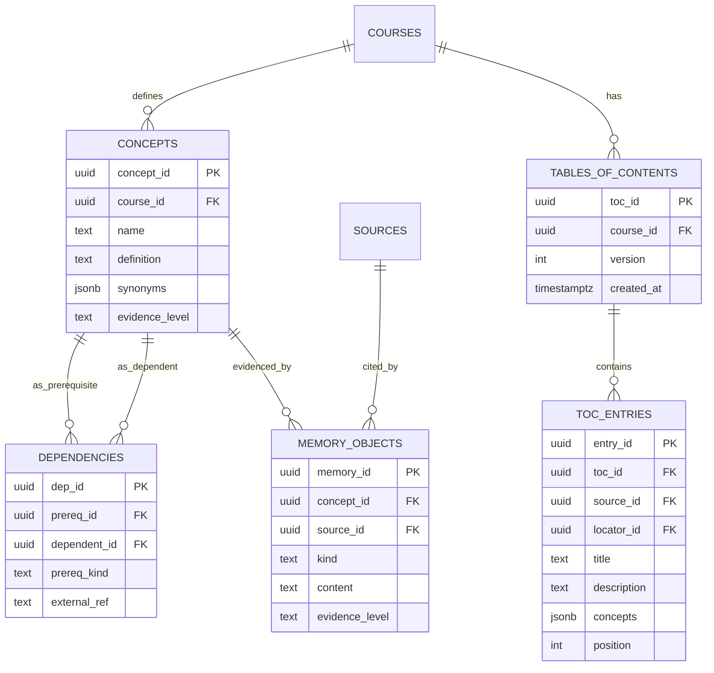
```mermaid
erDiagram
    COURSES ||--o{ CONCEPTS : defines
    CONCEPTS ||--o{ DEPENDENCIES : as_prerequisite
    CONCEPTS ||--o{ DEPENDENCIES : as_dependent
    CONCEPTS ||--o{ MEMORY_OBJECTS : evidenced_by
    SOURCES ||--o{ MEMORY_OBJECTS : cited_by
    COURSES ||--o{ TABLES_OF_CONTENTS : has
    TABLES_OF_CONTENTS ||--o{ TOC_ENTRIES : contains

    CONCEPTS {
        uuid concept_id PK
        uuid course_id FK
        text name
        text definition
        jsonb synonyms
        text evidence_level
    }
    DEPENDENCIES {
        uuid dep_id PK
        uuid prereq_id FK
        uuid dependent_id FK
        text prereq_kind
        text external_ref
    }
    MEMORY_OBJECTS {
        uuid memory_id PK
        uuid concept_id FK
        uuid source_id FK
        text kind
        text content
        text evidence_level
    }
    TABLES_OF_CONTENTS {
        uuid toc_id PK
        uuid course_id FK
        int version
        timestamptz created_at
    }
    TOC_ENTRIES {
        uuid entry_id PK
        uuid toc_id FK
        uuid source_id FK
        uuid locator_id FK
        text title
        text description
        jsonb concepts
        int position
    }
```

- **`DEPENDENCIES`**: `prereq_id` is **nullable** (a concept may have no prereq),
  and `prereq_kind` (`in_course` / `external`) + `external_ref` represent
  out-of-course prereqs (e.g. Calc 2 integrals depend on Calc 1 integration).
- **`TABLES_OF_CONTENTS`** + **`TOC_ENTRIES`** are the model-written, per-course
  index describing what's in the course and where. It is the coarse layer of
  hybrid retrieval (decision 008): the canonical-location signal among three
  candidate generators. Written by a small, stable TOC model so descriptions
  stay consistent over time. Versioned, so the current version is knowable
  and previous versions recoverable.
- **`evidence_level`** on memory objects: `direct` / `derived` / `hypothesis`.
- Legacy naming note (decision 007): `memory_objects` / `memory_id` /
  `MEMORY_OBJECT_EVIDENCE` predate the memory vocabulary. They are course-
  KNOWLEDGE objects (formula, theorem, example, misconception — what the
  course says, tied to concepts and sources), not user memory.

### 2.4 Student model (attempts, mastery & recommendations)

> Status: schema designed and migrated; the probe/recommendation
> subsystems that write it are Milestones 3–4.

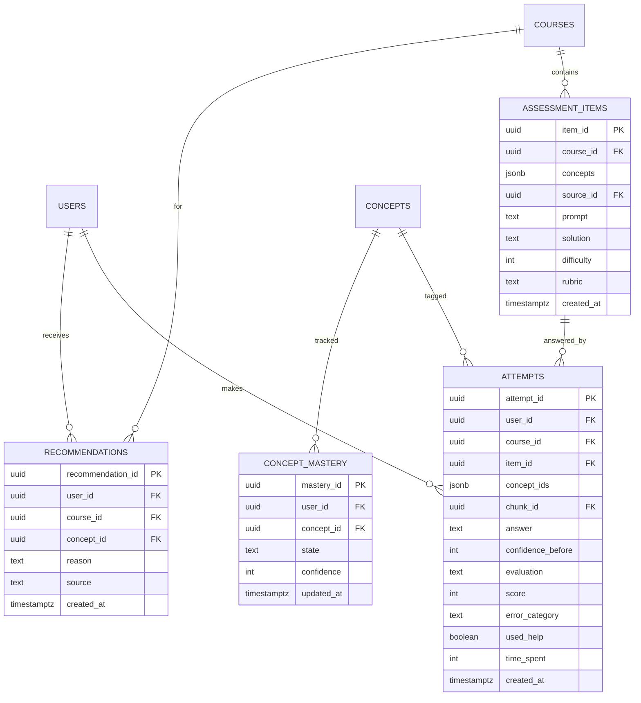
```mermaid
erDiagram
    USERS ||--o{ ATTEMPTS : makes
    COURSES ||--o{ ASSESSMENT_ITEMS : contains
    ASSESSMENT_ITEMS ||--o{ ATTEMPTS : answered_by
    CONCEPTS ||--o{ ATTEMPTS : tagged
    CONCEPTS ||--o{ CONCEPT_MASTERY : tracked
    USERS ||--o{ RECOMMENDATIONS : receives
    COURSES ||--o{ RECOMMENDATIONS : for

    ASSESSMENT_ITEMS {
        uuid item_id PK
        uuid course_id FK
        jsonb concepts
        uuid source_id FK
        text prompt
        text solution
        int difficulty
        text rubric
        timestamptz created_at
    }
    ATTEMPTS {
        uuid attempt_id PK
        uuid user_id FK
        uuid course_id FK
        uuid item_id FK
        jsonb concept_ids
        uuid chunk_id FK
        text answer
        int confidence_before
        text evaluation
        int score
        text error_category
        boolean used_help
        int time_spent
        timestamptz created_at
    }
    CONCEPT_MASTERY {
        uuid mastery_id PK
        uuid user_id FK
        uuid concept_id FK
        text state
        int confidence
        timestamptz updated_at
    }
    RECOMMENDATIONS {
        uuid recommendation_id PK
        uuid user_id FK
        uuid course_id FK
        uuid concept_id FK
        text reason
        text source
        timestamptz created_at
    }
```

- **`ASSESSMENT_ITEMS`** are the unit a cold probe uses: prompt, concepts tested,
  difficulty, rubric.
- **`ATTEMPTS`** are multi-concept (`concept_ids` jsonb) — an item may test
  several concepts and the attempt records against all of them. `score` is a
  0–100 sliding scale (letter grades are a display-layer conversion, not a
  schema decision); `evaluation` stays narrative.
- **`CONCEPT_MASTERY`** holds the current mastery **state** per user per concept
  (UNIQUE `(user_id, concept_id)`) — a ladder (`unseen` → ... → `transfer`), not
  a single fake-precise score.
- **`RECOMMENDATIONS`** are the "what to study next" output, traceable to a
  concept, a reason, and the source (attempt, TOC, etc.).

### 2.5 Chat history (raw + compressed)

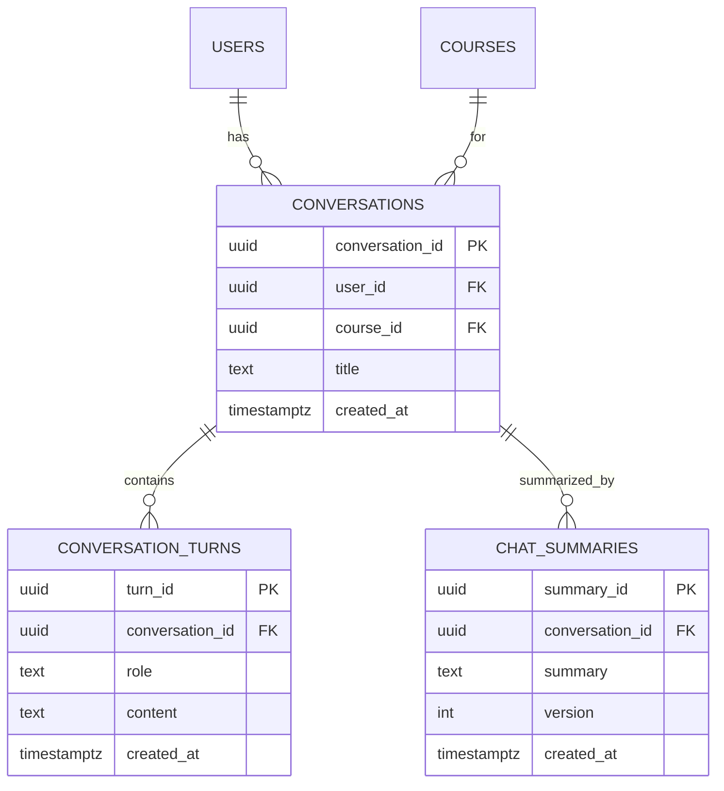
```mermaid
erDiagram
    USERS ||--o{ CONVERSATIONS : has
    COURSES ||--o{ CONVERSATIONS : for
    CONVERSATIONS ||--o{ CONVERSATION_TURNS : contains
    CONVERSATIONS ||--o{ CHAT_SUMMARIES : summarized_by

    CONVERSATIONS {
        uuid conversation_id PK
        uuid user_id FK
        uuid course_id FK
        text title
        timestamptz created_at
    }
    CONVERSATION_TURNS {
        uuid turn_id PK
        uuid conversation_id FK
        text role
        text content
        timestamptz created_at
    }
    CHAT_SUMMARIES {
        uuid summary_id PK
        uuid conversation_id FK
        text summary
        int version
        timestamptz created_at
    }
```

- Chat is stored in **two forms** for two audiences: the raw `CONVERSATION_TURNS`
  (what the user sees), and a compressed `CHAT_SUMMARIES` (what the LLM uses as
  context on the next prompt). Summaries are regenerated when the conversation
  grows past a threshold so the model always prompts against current context.
  Multi-turn chat is Milestone 2+; the live tutor flow is single-turn `ask`
  (its trace + citations endpoint are §4/§2.6).

### 2.6 Evidence & grounding

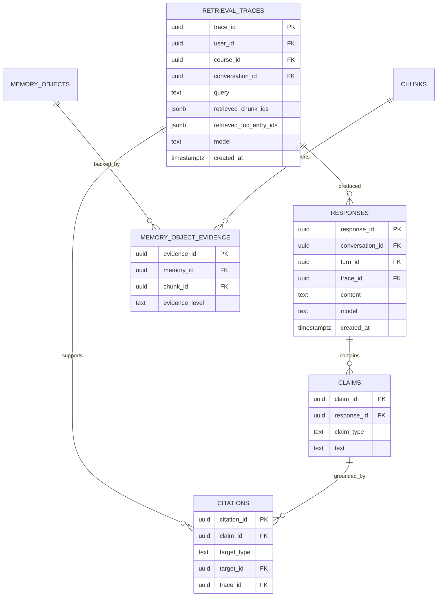
```mermaid
erDiagram
    RETRIEVAL_TRACES ||--o{ CITATIONS : supports
    RETRIEVAL_TRACES ||--o{ RESPONSES : produced
    RESPONSES ||--o{ CLAIMS : contains
    CLAIMS ||--o{ CITATIONS : grounded_by
    MEMORY_OBJECTS ||--o{ MEMORY_OBJECT_EVIDENCE : backed_by
    CHUNKS ||--o{ MEMORY_OBJECT_EVIDENCE : supports

    RETRIEVAL_TRACES {
        uuid trace_id PK
        uuid user_id FK
        uuid course_id FK
        uuid conversation_id FK
        text query
        jsonb retrieved_chunk_ids
        jsonb retrieved_toc_entry_ids
        text model
        timestamptz created_at
    }
    RESPONSES {
        uuid response_id PK
        uuid conversation_id FK
        uuid turn_id FK
        uuid trace_id FK
        text content
        text model
        timestamptz created_at
    }
    CLAIMS {
        uuid claim_id PK
        uuid response_id FK
        text claim_type
        text text
    }
    CITATIONS {
        uuid citation_id PK
        uuid claim_id FK
        text target_type
        uuid target_id FK
        uuid trace_id FK
    }
    MEMORY_OBJECT_EVIDENCE {
        uuid evidence_id PK
        uuid memory_id FK
        uuid chunk_id FK
        text evidence_level
    }
```

- **`RESPONSES`** are the tutor's answers — the object claims attach to. A
  response links to its conversation, turn, and retrieval trace. The grounding
  chain is `Response → Claim → Citation → RetrievalTrace`.
- **`RETRIEVAL_TRACES`** record what the tutor retrieved and used to produce an
  answer, enabling audit of whether a citation actually supported the answer.
  The live shape: `retrieved_chunk_ids` jsonb carries
  `{chunk_ids, per_chunk_layers, layer_contribution, matched_concept_ids}`;
  the citations endpoint reads it plus `chunks_with_locators_by_ids` to
  resolve a trace into readable evidence (chunk text + locator label +
  filename). Full claim-level decomposition (RESPONSES/CLAIMS/CITATIONS) is
  the citation-snapshot design (Fork C) — the single-turn `ask` records the
  trace; per-claim rows land with Milestone 2.
- **`CLAIMS`** + **`CITATIONS`** ground each claim in evidence (a chunk, memory
  object, or TOC entry), with the trace that produced it. `claim_type` and
  `target_type` are free strings; known values live in `schemas/base.py`
  (`KNOWN_CLAIM_TYPES`, `KNOWN_CITATION_TARGETS`).
- **`MEMORY_OBJECT_EVIDENCE`** links a memory object directly to the chunk that
  supports it, so a citation on a memory object can resolve to a chunk within
  two hops.
- **`ARTIFACT_ORIGINS`** (not shown) records how a generated artifact was
  produced — its sources, concepts, and model — so origin is auditable and
  regenerable. **`MODEL_DECISIONS`** (not shown) records the model's
  storage/description decisions for the same reason.

### 2.7 Deletion & lifecycle (distilled records)

Unifying principle: **destruction leaves a distilled record.**

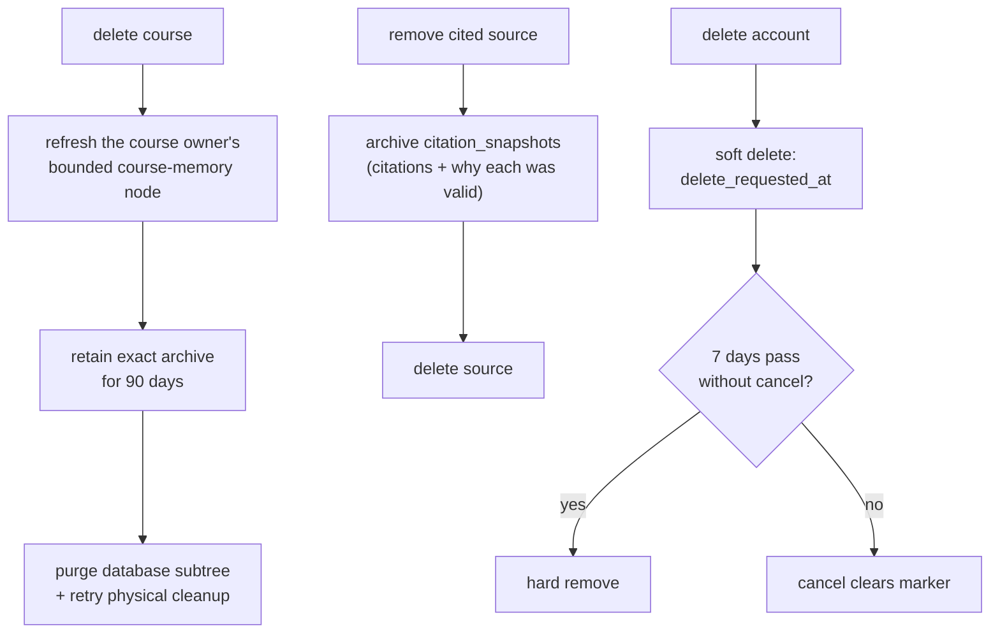
```mermaid
flowchart TB
    DC["delete course"] --> CM["refresh the course owner's<br/>bounded course-memory node"]
    CM --> A90["retain exact archive<br/>for 90 days"]
    A90 --> DEL["purge database subtree<br/>+ retry physical cleanup"]
    DS["remove cited source"] --> CS["archive citation_snapshots<br/>(citations + why each was valid)"]
    CS --> DEL2["delete source"]
    DU["delete account"] --> GR["soft delete:<br/>delete_requested_at"]
    GR --> D7{"7 days pass<br/>without cancel?"}
    D7 -->|yes| HARD["hard remove"]
    D7 -->|no| CANCEL["cancel clears marker"]
```

- **`COURSE_MEMORIES`** — the course-memory node (decision 007): a per-user,
  per-course focus record stored ONLY for the course's main user (its
  owner) — a bounded summary (course reference, name, key concepts, and a
  compact evidence snapshot), refreshed via the single write seam
  `course_memory.refresh_for_owner` (called by the worker once per
  successful batch — not per upload — and by terminal paths on canonical
  mutations). `course_id` is stored without a hard FK so the memory
  outlives the course row. Enrolled learners never get a node (see
  decision 007).
- **`CITATION_SNAPSHOTS`** — before a source's citations are removed, a
  compressed record of the citations and why each was valid is written, so
  grounding evidence survives the source.
- **Account deletion** is soft (`users.delete_requested_at`) with a 7-day grace
  period; canceling clears the marker.
- **Implemented course delete policy:** normal access ends immediately, current
  participants may copy the exact archive for 90 days, and expiry removes the
  foreign-key tree atomically while enqueueing durable physical cleanup.
  Cleanup jobs retry under a lease up to a configured attempt cap, then go
  dead for operator inspection; a periodic sweep also removes orphaned course
  directories. Course-specific citation snapshots and learner artifacts are
  removed at expiry; the owner's course-memory node is the sole
  course-derived retention exception.

**Key decisions:**

- **Objects are stored whole; extracted, token-bounded chunks are the retrieval
  unit.** Raw files are kept only while cheap, then trimmed (see §5).
- **Access isolation:** public visibility grants anonymous access only to
  published canonical objects. Enrollment grants source use and generation,
  never canonical mutation. Learner generations are private user artifacts;
  student history and tutor preferences also stay private per user.
- **Hybrid retrieval (decision 008).** TOC, keyword, dependency-walk, and
  embeddings are candidate generators fused at query time; the citation
  contract keeps every strategy accountable. Embeddings are LIVE (self-hosted
  granite R2, in-process — see §4a) and stay only if the fusion measurably
  helps on the eval set. The TOC itself is written by a small, stable TOC
  model so its index vocabulary stays consistent over time.
- **No rigid type system.** `kind` (course objects), `locator_type`,
  `content_type`, `claim_type`, and `target_type` are free strings, so new kinds
  and formats insert without a schema migration.
- **Evidence is first-class.** Every claim, artifact, and model decision is
  traceable to evidence, so source grounding is enforceable and auditable.
- **Learning over completion (decision
  `docs/decisions/009_three_zone_assistance_policy.md`).** Three-zone
  behavior policy: green (grounded help) / yellow (steer homework-fill
  requests into explain + practice) / red (decline submission-shaped
  artifacts). Hard gates (citation-validated artifacts, budgeted
  generation) plus a prompt-level steer measured by the answer harness.

---

## 3. Ingestion pipeline

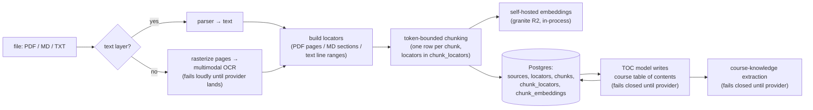
```mermaid
flowchart LR
    F["file: PDF / MD / TXT"] --> TYPE{text layer?}
    TYPE -->|yes| PARSE["parser → text"]
    TYPE -->|no| OCR["rasterize pages →<br/>multimodal OCR<br/>(fails loudly until provider lands)"]
    PARSE --> LOC["build locators<br/>(PDF pages / MD sections /<br/>text line ranges)"]
    OCR --> LOC
    LOC --> CHUNK["token-bounded chunking<br/>(one row per chunk,<br/>locators in chunk_locators)"]
    CHUNK --> EMB["self-hosted embeddings<br/>(granite R2, in-process)"]
    CHUNK --> DB[("Postgres:<br/>sources, locators, chunks,<br/>chunk_locators, chunk_embeddings")]
    DB --> TOC["TOC model writes<br/>course table of contents<br/>(fails closed until provider)"]
    TOC --> KNOW["course-knowledge extraction<br/>(fails closed until provider)"]
    TOC --> DB
```

**Steps:** accept file (streamed, deduped by hash) → dispatch on the
supported-mime whitelist → extract text with structure
offsets (PDF pages via pypdf, markdown sections fence-aware, plain-text
line ranges; UTF-8 with BOM stripping, cp1252 fallback) → **if a PDF has
no text layer, route to the `ocr` stage: rasterize its pages (pypdfium2,
capped by `[ocr] max_pages` in `configs/ingestion.toml`) and send pages to
the multimodal model through the provider seam, billed to the ingestion
pool** (page alignment is preserved — the model's output is split back
into per-page texts by a sentinel separator, with honest degradation when
it does not comply) → build **locators** (the per-format table of
contents, separator-aligned with the joined text) → split into
**token-bounded chunks**, one row per logical chunk with the full locator
span in `chunk_locators` → **embed every chunk with the self-hosted model**
(`embed_chunks` — no API, no billing, no tier gate; course text never
leaves the machine) → write sources, locators, chunks, chunk_locators,
chunk_embeddings to Postgres → a small **TOC model** writes the course
table of contents → course-knowledge extraction. The two model stages fail
loudly until the chat provider lands; the embedding stage is already live.

**Queueing:** every uploaded or copied source lands in `pending_ingestion`;
a worker claims rows by a persistent state transition (`claimed_at` —
not a row lock, which would evaporate at the pipeline's first commit) and
runs the pipeline. Every stage transition heartbeats
`pending_ingestion.heartbeat_at` — the stale-claim sweep judges
heartbeat freshness, so a slow-but-alive run is never re-claimed mid-flight
while a genuinely dead claim ages out on `claimed_at`. A source that
repeatedly kills runs dead-letters after `claimed_runs_max` attempts and
returns to service only via the requeue API. Failure clears the queue row
and marks the source `failed` with the reason; `requeue_failed_source` is
the deliberate failed → uploaded retry path. The worker also refreshes the
owner's course-memory node once per batch (not per upload) at the end of a
successful batch.

**Rules:** block solution documents from cold-probe context; prefer instructor
sources over student notes; store a retrieval trace for every query.

The persisted pipeline order is text extraction → OCR (only for
image-only PDFs) → locators → chunks → chunk embeddings → cascading TOC
update → course-knowledge extraction. Each stage depends on the previous
successful stage. Stage attempts and handler/configuration versions are
recorded; the MVP configuration allows two total attempts, after which the
run becomes failed and later stages remain unstarted. Handlers are
idempotent (each clears its own derived rows first) so a retry re-executes
from the top safely. Each attempt runs inside a SAVEPOINT so a DB-level
failure never escapes as a poisoned transaction. The run ledger commits per
stage: completed stage output survives a later stage's failure, and the
audit trail (run, stage rows, error messages) is always queryable.

---

## 4. Retrieval & answer flow

Retrieval is a **four-seam funnel** (decision 008): candidate generation,
then normalization, then relevance allocation. Each seam is a candidate
generator answering a different question; fusion unions their output,
normalizes each seam's ranks to a common 0..1 scale (seam-locally — raw
units were incomparable), then splits the final cited set across sources
by relevance (best chunk score per source, proportional with largest
remainder, a one-slot floor, availability clamping). Every surviving
chunk carries its locator; citations are layer-agnostic — the same
contract no matter which seam surfaced the chunk — so retrieval strategy
is an internal, swappable detail and trust lives at the citation
boundary.

- **Keyword** (fine, day one): tsvector OR-match over chunks. Catches exact
  phrasing and scattered mentions ("when did we *use* linearity" → chapters
  5–6). Works with zero model dependency.
- **TOC routing** (coarse): static matching of the query against entry
  titles/descriptions → chunks under matched entries' locators. Catches
  where a topic is *primarily taught*. Dormant until entries exist;
  model-routed matching is a measured upgrade option.
- **Dependency walk** (expansion): matched concepts → 1-hop prereq/dependent
  chunks via the `dependencies` graph. Built as a seam, **dormant until
  model-extracted edges pass the evidence bar** — a wrong edge misdirects
  silently, so dormant-until-trustworthy is the design. A seam with no data
  contributes nothing and breaks nothing.
- **Embeddings** (meaning): ingestion-time chunk embeddings via the
  self-hosted granite R2 model — **live now** (the `embed_chunks` stage),
  participates in fusion like any other seam. See §4a for the full
  embedding architecture.

**Trace:** every query stores a retrieval trace recording the cited chunk
ids, which layers contributed each, and matched concept ids — auditors see
WHY a chunk was retrieved, not just that it was. The citations endpoint
(`GET /courses/{course_id}/traces/{trace_id}/citations`) resolves a
trace's chunk ids into readable evidence — chunk text, locator label,
source filename — which the frontend renders as the "sources used" panel
under every answer (golden rule 1, honored in the UI).

### 4a. Embedding architecture (decision 008, revised 2026-09-16; live 2026-09-21)

The embedding subsystem end to end — what exists (all of it except the
pgvector swap), and what never changes:

**Storage (live, migration 025 + 027).**
- `chunk_embeddings(chunk_id PK, model TEXT, embedding FLOAT8[], created_at)`
  — one row per embedded chunk, keyed by the model that produced it. A
  course can hold rows from more than one model across a model swap; every
  query filters by exact `model`, so a model swap never mixes vectors.
- `model` is indexed (migration 027) — the seam filters on it every query.
- Chunks without an embedding row simply don't participate in the
  embedding seam; absence is not an error, it's dormancy.

**Ingestion-time embedding (LIVE — self-hosted).** The `embed_chunks`
stage runs after chunking: each chunk's text is embedded in-process by
`sentence-transformers` with
`ibm-granite/granite-embedding-english-r2` (149M ModernBERT, 768 dims,
8192-token context, no query/document prefixes, Apache 2.0) and stored
under the model name. The contract lives in `configs/embeddings.toml`:
the model name is the row key, the configured dimension is enforced
loudly at load AND per call (a model swap that changes dimensionality is
a hard error, never silent garbage ranks), vectors are normalized at
write (the model ships unnormalized; the seam computes dot products, so
dot = cosine requires unit length). No API, no key, no spend gate, no
tier: course text never leaves the machine, so the no-retention vendor
check does not apply to embeddings by construction. Re-ingestion under a
new model writes new rows alongside old ones; the query-time model
filter is what makes a swap safe without a mass rewrite.

**Query-time seam (live).** `embed_query` embeds the ask-time question
(query prefix from config — empty for granite R2) and the seam returns
the top-`embedding_limit` chunks by dot product. The SQL computes dot
products natively (`unnest` zip + `SUM` over float8[] — no pgvector yet),
with a `cardinality()` equality guard: a mismatched-dimension row is
excluded, never silently truncated into a garbage score (a model swap
must not rank garbage). The pgvector swap is a mechanical later migration
— same seam, `<=>` cosine distance instead of the zip.

**Normalization & direction.** Every seam's seam-local rank is already
"higher is better" (keyword is ts_rank, embedding is the dot product,
toc/dependency use arrival position as `-position`), so normalization
preserves direction for ALL seams uniformly — the earlier per-seam sign
flip inverted keyword/dependency evidence (the best keyword chunk
normalized to 0.0 and sank; fixed 2026-09-22). After normalization all
seams compete on equal footing — the source-relevance allocation (§4)
reads them all as one currency.

**Quota semantics.** `embedding_only_quota` (config v2) bounds chunks
found ONLY by embeddings when grounded seams (keyword/toc/dependency)
also matched — semantic expansion must not displace grounded hits. When
no grounded seam matched anything, the quota does not apply: embeddings
are the only evidence there is.

**Dimension guard & determinism.** The seam never compares vectors of
different dimensionality (SQL-level guard, tested); ordering is stable
(dot DESC, chunk_index, chunk_id).

**The kill switch.** The embedding seam earns its keep on the eval set
like everything else: if the funnel without embeddings matches or beats
the funnel with them (recall@k per §4's "measured, not assumed"), the
seam is turned off via config, not code deletion.

**Measured, not assumed:** recall@k per seam AND fused, over a hand-written
eval set in students' voice (`data/eval/retrieval/`). Fusion must beat the
best single seam or it is simplified; each seam must beat the funnel
without it or it is turned off. Funnel quotas/k live in
`configs/retrieval.toml` (versioned, v2 — allocation replaced the
per-source cap), never hardcoded.

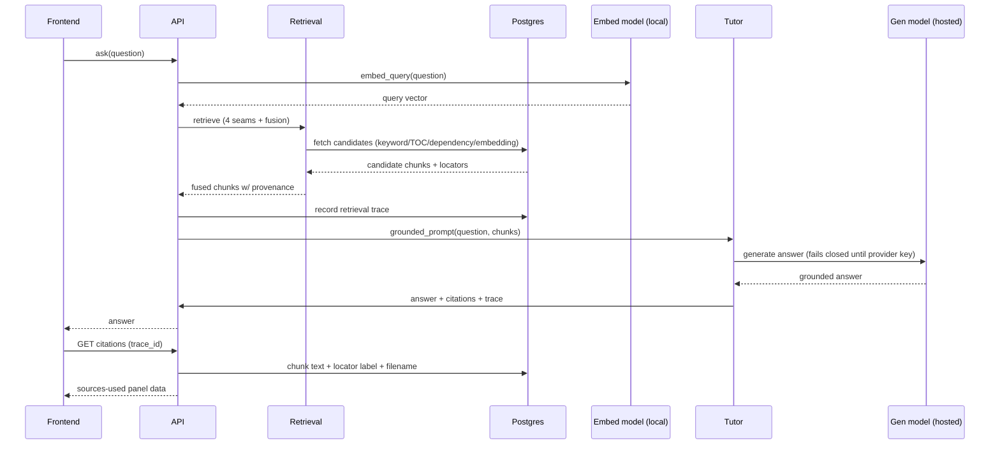
```mermaid
sequenceDiagram
    participant F as Frontend
    participant A as API
    participant R as Retrieval
    participant P as Postgres
    participant E as Embed model (local)
    participant T as Tutor
    participant G as Gen model (hosted)

    F->>A: ask(question)
    A->>E: embed_query(question)
    E-->>A: query vector
    A->>R: retrieve (4 seams + fusion)
    R->>P: fetch candidates (keyword/TOC/dependency/embedding)
    P-->>R: candidate chunks + locators
    R-->>A: fused chunks w/ provenance
    A->>P: record retrieval trace
    A->>T: grounded_prompt(question, chunks)
    T->>G: generate answer (fails closed until provider key)
    G-->>T: grounded answer
    T->>A: answer + citations + trace
    A-->>F: answer
    F->>A: GET citations (trace_id)
    A->>P: chunk text + locator label + filename
    A-->>F: sources-used panel data
```

**Retrieval evolution (measured, not assumed):**

1. **Ship order:** keyword baseline → static TOC layer → fusion (decision
   008) → measured upgrades (model-routed TOC, `pgvector`, reranker).
2. **Each step must beat the previous on the eval set** — recall@k per layer
   and fused. Fusion that cannot beat the best single layer is dropped;
   embeddings that do not measurably add are dropped. "Always-on" means
   *candidates*, not *cargo*.


**Never** answer an uploaded-material question without showing sources.

---

## 5. Storage of originals (the trim policy)

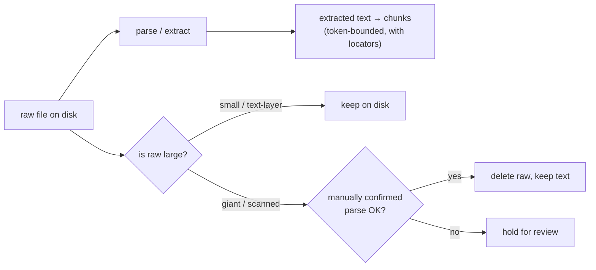
```mermaid
flowchart LR
    RAW["raw file on disk"] --> PARSE["parse / extract"]
    PARSE --> TXT["extracted text → chunks<br/>(token-bounded, with locators)"]
    RAW --> SIZE{is raw large?}
    SIZE -->|small / text-layer| KEEP["keep on disk"]
    SIZE -->|giant / scanned| CONFIRM{"manually confirmed<br/>parse OK?"}
    CONFIRM -->|yes| DEL["delete raw, keep text"]
    CONFIRM -->|no| HOLD["hold for review"]
```

- Extracted text persists as **token-bounded chunks** in Postgres (ground truth
  for retrieval, each mapped to its locator); raw objects are stored whole on
  disk under server-generated names, never inlined into Postgres row values.
- Raw originals trimmed when large/scanned, only after a successful confirmed parse.
- Text-layer PDFs are small → usually kept; they cost nothing and let you re-parse.

---

## 6. Model strategy

Inference is split across **two seams**, both in `common/provider.py`.
Every prompt comes from the versioned prompt registry
(`configs/prompts.toml` via `common/prompt_registry.py`) — prompt text
never lives in code, and uploaded course material is fenced between
`UNTRUSTED_COURSE_MATERIAL` markers (input marking, the prompt-injection
mitigation; the fence markers themselves are neutralized inside content so
an upload cannot close its own fence).

Inference is split across **two seams**, both in `common/provider.py`:

1. **`generate` — hosted chat APIs.** Generative tasks go through a hosted
   OpenAI-style API provider that does not retain data (contract, not
   implementation: verify the retention policy for whichever provider is
   chosen — that check is the go-live gate for generation). This keeps costs
   low (a provider-served DeepSeek v4 flash is cheaper than self-hosting) and
   pushes the privacy requirement onto a *contract*: the provider must not
   retain prompts or responses. The seam is fully wired (tier verification,
   pool gating, ledger with real token counts) and **fails closed** until the
   operator's key lands. Xiaomi MiMo 2.6 Flash is the current lean: an
   OpenAI-style API slots in with config only, and its native multimodality
   would later serve the OCR stage (and image descriptions) from the same
   key.
2. **`embed` / `embed_query` / `embed_chunks` — self-hosted, in-process**
   (`sentence-transformers` + IBM granite-embedding-english-r2). No key, no
   spend gate, no tier: course text never leaves the machine, so the
   no-retention check does not apply to embeddings by construction. Model
   choice is a pencil mark (`configs/embeddings.toml`); rows are keyed by
   model name, so a swap is pull + re-ingest.

**Single seam rule:** every model call in the backend goes through
`common/provider.py` — no SDK objects, keys, or HTTP clients leak past
this module. No call site supplies token counts, pools, or tiers.

| Task | Model | In MVP? | Note |
|---|---|---|---|
| Generative answer / extraction / classification | DeepSeek v4 flash (hosted) | **Yes, seam live; fails closed until key** | generative model, OpenAI-style API contract |
| Table-of-contents writer/updater | **small, stable** model | **Yes, seam live** | keeps TOC descriptions consistent over time |
| Embeddings (retrieval) | granite-embedding-english-r2 (self-hosted) | **Yes — LIVE** | in-process, unbilled, no data leaves; dimension enforced loudly; kept only if fusion measurably helps |
| OCR (scanned/image slides) | multimodal model (hosted) | Yes — wired, fails closed until provider | the `ocr` ingestion stage rasterizes image-only PDFs (pypdfium2, capped at `[ocr] max_pages`) and sends pages to the multimodal model through the provider seam, billed to the ingestion pool; no text layer → this stage, not a hard failure |
| Reranker | separate reranker | No | later, if retrieval precision suffers |

**"ML earns its role":** add models/rerankers/fine-tuning only for a
documented, versioned baseline failure on a measured eval task. Decision 008
extends this to combinations: the fusion itself is measured, and any layer
that stops paying for its complexity is dropped.

> Why a dedicated TOC model? A small, stable model keeps course descriptions
> consistent over time, which is what makes both static matching and
> model-routed matching against the TOC reliable. Retrieval also fuses a
> keyword and an embedding signal (decision 008), so the TOC no longer
> carries retrieval alone — but its stability still anchors the
> canonical-location signal.

---

## 6a. Tiers and spend control

Model compute is metered and tier-routed. Every user has a tier (`free`
default, `paid` via an active subscription; history in `user_subscriptions`,
synced to `users.tier` by a trigger). Every model call writes one append-only
row to `generation_ledger` (user, course, task, model, tokens).

- **Weekly budget:** rolling Monday 00:00 UTC window; each tier's
  `weekly_token_budget` (input + output tokens) lives in the versioned
  `configs/tiers.toml`. Generation paths call `budget.check_budget` before
  compute; exceeded budgets raise at the boundary. The check returns an
  inspectable state (spent / budget / remaining / week start) — no opaque
  scores. It gates but does not reserve; brief overshoot under concurrency is
  accepted at this scale.
- **Two pools:** the weekly budget is split into independent pools per
  `SpendKind` — `generation` (interactive: tutor answers, probes, artifacts)
  and `ingestion` (bulk: `toc_update`, `course_knowledge_extraction`), the
  latter capped by `ingestion_token_budget` in the same config. Pools never
  cross: a large upload can drain the ingestion pool only, never the budget a
  user needs for answers. Task→pool routing is derived from
  `INGESTION_TASKS` in `schemas/base.py` (single source of truth) and
  enforced inside the provider seam — no call site can silently bill the
  wrong pool.
- **Course limits:** each tier also caps owned courses (`max_owned_courses`:
  free 2, paid 20) via `budget.check_course_limit`; enrollment is not capped,
  and deleted courses free their slot. Per-course storage is capped
  (`max_course_storage_bytes`: free 100 MB, paid 1 GB) via
  `budget.check_course_storage`, and aggregate storage across all owned
  courses is capped (`max_total_storage_bytes`: free 1 GB, paid 10 GB) via
  `budget.check_total_storage` — so storage cannot be multiplied by making
  more courses. Both enforced pre-upload against recorded `sources.size_bytes`
  (stored, post-compression bytes).
- **Free-tier overhead:** free users pay an extra 5% of each generation's
  tokens (`overhead_tokens` in the ledger, counted toward the weekly budget).
  Applied at record time, never mid-generation — in-flight answers are never
  cut off; the overhead only tightens the next gate.
- **Downgrade grace:** downgraded users keep over-cap data, blocked from new
  creation only; a 60-day deadline (`users.downgrade_grace_deadline`) bounds
  the soft landing. Tier is double-verified (`budget.verify_tier`) against
  `users.tier` at the limit gates.
- **Model routing:** the same config maps each generation task
  (`KNOWN_GENERATION_TASKS` — `tutor_answer`, `toc_update`,
  `probe_generation`, `probe_evaluation`, `course_knowledge_extraction`,
  `artifact_generation`, `ocr`) to a model per tier — free gets the cheap
  generative model, paid gets the newer one, the small stable TOC-writer is
  shared. The loader rejects a config that omits a task for any tier.
- **Charging:** ingestion model calls (`toc_update`, `course_knowledge_extraction`, `ocr`) are
  charged to the uploading owner's ingestion pool. The provider seam is the
  single model-call path: it resolves + verifies the tier from the account,
  gates the caller's pool, calls, then records the ledger row with the call's
  real token counts — no call site supplies token counts or pools. Payment
  processing is out of scope; subscriptions are operator-managed until a
  billing flow exists. The embedding seam is NOT in this ledger: it is
  self-hosted, in-process, and unbilled.
- Decision record: `docs/decisions/004_tiers_and_spend_control.md`.

---

## 7. Student model & tutor flow

> Status: designed, not yet implemented (Milestones 3–4). The storage
> schema exists (attempts, mastery, recommendations); the probe loop and
> recommendation engine are future work. The tutor flow that IS live is
> §4's ask → retrieve → cite (single-turn, Fork D scope).

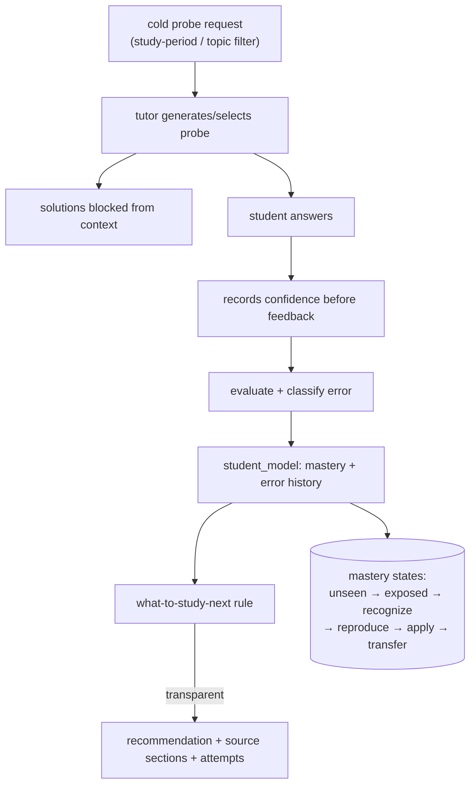
```mermaid
flowchart TB
    Q["cold probe request<br/>(study-period / topic filter)"] --> TUT["tutor generates/selects probe"]
    TUT --> SOL["solutions blocked from context"]
    TUT --> S["student answers"]
    S --> CF["records confidence before feedback"]
    CF --> EVAL["evaluate + classify error"]
    EVAL --> SM["student_model: mastery + error history"]
    SM --> REC["what-to-study-next rule"]
    REC -->|transparent| UI["recommendation + source sections + attempts"]

    SM --> M[("mastery states:<br/>unseen → exposed → recognize<br/>→ reproduce → apply → transfer")]
```

**Per-attempt record:** concept tags, question version, answer, evaluation,
confidence before feedback, correctness, error category, time, date, help used.

**Mastery is a ladder, not one fake-precise score.** Recommendations must be
traceable to specific attempts and concept evidence.

**Tutor presentation is requester-scoped.** Presentation is a user-memory
(root) concern (decision 007): the owner may use their own structured
profile for interactive responses; non-owners use the versioned generic
profile in `configs/tutor.toml` until the full user-memory root exists
(M2). Profiles control presentation only (verbosity, analogy use, response
structure, and source-quotation balance). They cannot change TOC
construction, retrieval, selected evidence, citation requirements,
correctness evaluation, or mastery state — behavior instructions live only
in the root, never in course memory or course knowledge. This keeps the
shared course knowledge neutral.

---

## 8. Deployment topology (local desktop)

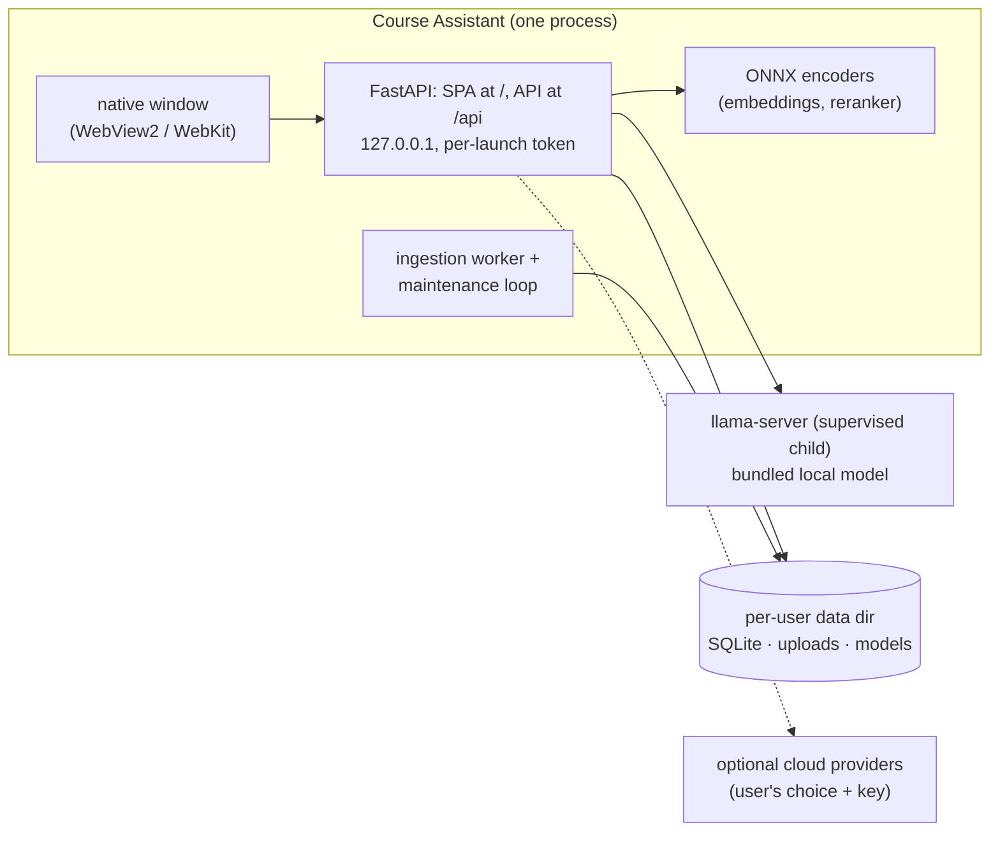
```mermaid
flowchart LR
    subgraph App["Course Assistant (one process)"]
        WIN["native window<br/>(WebView2 / WebKit)"]
        API["FastAPI: SPA at /, API at /api<br/>127.0.0.1, per-launch token"]
        ENC["ONNX encoders<br/>(embeddings, reranker)"]
        WRK["ingestion worker +<br/>maintenance loop"]
    end
    LLM["llama-server (supervised child)<br/>bundled local model"]
    DATA[("per-user data dir<br/>SQLite · uploads · models")]
    CLOUD["optional cloud providers<br/>(user's choice + key)"]

    WIN --> API
    API --> ENC
    API --> DATA
    WRK --> DATA
    API --> LLM
    API -.-> CLOUD
```

No server, no hosting bill. Model files and the llama.cpp runtime download
on first use (checksummed). Closing the window stops everything; on Windows
a job object guarantees the model server cannot outlive the app. Packaging:
`scripts/build_desktop.py` (PyInstaller, ~235 MB without models).

---

## 9. Cross-cutting concerns

- **DB access:** isolated in `src/backend/common/db.py` (the single Postgres
  seam); raw SQL queries in `src/backend/common/queries/*.sql`; schema via
  versioned migrations `src/backend/common/migrations/00X_*.sql`, applied by the
  runner `src/backend/common/migrate.py` (`python -m src.backend.common.migrate`)
  against a `schema_migrations` tracking table. Migrations are append-only.
- **Config:** `.env` credentials loaded via `common/config.py` (no
  python-dotenv dependency); tunable/versioned params in `configs/`, not
  hardcoded.
- **Validation:** Pydantic schemas at every boundary
  (`src/backend/common/schemas/`, one module per storage layer).
- **Auth:** public user responses are separate from internal credential records.
  Email is normalized, registration enforces bcrypt-safe password bounds
  (12–24 chars; 72-byte bcrypt truncation guard), JWTs validate
  issuer/audience/required claims AND the password stamp
  (`users.password_changed_at` in microseconds — a password change
  invalidates every pre-change session), pending-deletion accounts cannot log
  in, login attempts are throttled (`common/login_throttle.py`,
  `configs/auth.toml`), and production rejects the development signing
  secret.
- **Course access:** the three course shapes (`private` / `invite_only` /
  `public`) are the closed set — decision
  `docs/decisions/006_three_course_shapes.md`. Policy lives in both
  `common/permissions.py` (application) and the enrollment triggers
  (migrations 011/015); the two must change together. Public discovery,
  enrollment, canonical-content ownership, and private learner artifacts are
  separate authorization concerns (decision 003).
- **Canonical code format:** course join codes and premium/support codes share
  `common/codes.py` — 16 chars, look-alike-free alphabet, DB CHECK
  constrained, grouped display `XXXX-XXXX-XXXX-XXXX`. Codes are validated at
  the API boundary; premium hashes are stored (join codes are policy-gated
  instead, since they grant nothing by themselves).
- **Support/premium codes:** every account gets a personal code at
  registration; the operator flags codes as premium-granting. Redemption is
  transactional (row lock + active-subscription check) and flows through the
  standard subscription machinery so tier stays single-sourced in `users.tier`.
- **Evals:** every subsystem has a regression path under `src/backend/evals/`
  (answer harness live: `evals/answer.py` + `data/eval/answer/cases.json`,
  four mechanical scorers, prompt-version-stamped logs; retrieval harness in
  `retrieval/evals.py`). No feature ships without a way to measure
  regressions.
- **Logging/traces:** retrieval traces + eval logs under `runs/` (gitignored).
- **No secrets:** never log/commit keys, tokens, or classmates' work.
- **Quality gate:** `pytest`, `ruff check .`, `mypy src` must all pass before
  work is declared done. Frontend: `npm run check` + `npm run build` from
  `src/frontend/`.

---

## 10. Open decisions (record changes in `docs/decisions/`; log in `docs/notes.md`)

- Exact hosting target (VPS vs Railway/Render/Fly/Supabase) — affects local dev mirror.
- **Choose the hosted chat provider** (OpenAI-style API contract is settled;
  Xiaomi MiMo 2.6 Flash is the current lean — also covers the OCR stage's
  multimodal need); verify their data-retention policy before committing. This
  is the LAST blocker for the model stages and the tutor's real generation.
- Whether model-routed TOC matching (vs static) earns its per-query model
  call — measured against the static TOC layer.
- Token revocation policy before external deployment (login throttling is
  implemented — `configs/auth.toml`, `common/login_throttle.py`; revocation
  is the remaining half).
- The pgvector swap (mechanical migration; float8[] + cardinality guard works
  at current scale).

---

## 11. Definition of done (from project.md)

A student can create an account, upload one course's materials, ask
source-cited questions, take a short closed-notes diagnostic, review their
concept-linked mistakes, and receive a transparent recommendation for what to
study next. The system records provenance for every claim, archives a distilled
record on deletion (90-day archive, permanent course memory, account grace period), and
has a small regression/evaluation suite that prevents silent quality loss.
