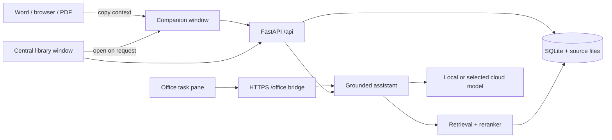

# System design

Updated 2026-09-30. This document describes the current local-first desktop
system. Hosted accounts, Postgres, enrollment, tiers, and shared courses were
retired and remain only in git history.

## 1. Product shape

Stacks is one desktop application for one user and one local data directory.
It has three user-facing surfaces:

1. **Library window**: the primary course and memory interface for sources,
   saved chats, artifacts, models, data controls, and setup.
2. **Companion window**: an optional movable and resizable native window. The
   library creates it only after the user presses **Open companion**; it accepts
   context copied from any application and can stay above other apps.
3. **Office task pane**: an optional Word, Excel, and PowerPoint bridge. Office
   reads and writes its own documents through Office.js; Stacks supplies cited
   answers.

The companion and library are SvelteKit routes in Tauri webviews.
They share one Python backend child process and one SQLite database.



## 2. Process topology

The Tauri shell starts first. It creates the visible `main` library window,
then launches `src.backend.serve`:

- Development uses the checkout virtualenv and `data/`.
- A packaged build uses the PyInstaller backend under Tauri resources and the
  per-user app-data directory.
- The backend binds a free loopback port and prints `STACKS_PORT=<port>`.
- The shell waits for `/api/health`, then gives the URL and a random per-launch
  token to its own webviews through `backend_info`.
- API requests carry the token in `X-App-Token`.
- Closing backend stdin requests a clean shutdown. The shell kills the child if
  it does not stop within the shutdown deadline.
- The single-instance plugin brings the existing library forward instead of
  starting a second backend on the same database.

The companion is created on demand and closing it destroys only that webview.
Closing the library exits Stacks and shuts down the backend. There is no tray
process.

## 3. Data and storage

SQLite is the source of truth. Connections enable WAL, foreign keys, and FTS5.
Raw SQL lives in `src/backend/common/queries/`; append-only migrations live in
`src/backend/common/migrations/`.

The data directory contains:

- `course_assistant.db`: courses, source metadata, chunks, locators, retrieval
  traces, settings, chats, artifacts, versions, and usage records.
- `raw/`: original course files under generated names.
- model/runtime downloads managed by the runtime subsystem.
- Office add-in certificate and manifest state after the user connects Office.

Original sources are retained whole. Derived text, chunks, embeddings, table of
contents entries, and course knowledge can be rebuilt. Deleting a course moves
it to a 30-day trash; a bounded course-memory keepsake survives purge.

Course export creates a `.course` archive containing source files and portable
history. Imports validate the archive before making it live.

Optional library backups live under `backups/` and are off by default. Settings
controls automatic backups while Stacks is running, interval, retained count,
retention tier, and compression strength. Manual backups work while scheduling
is disabled. Turning scheduling off preserves existing copies; tier changes
affect future copies only. Purging live data does not erase older backups.

| Tier | Retained academic data | Omitted data |
| --- | --- | --- |
| Full | Saved database and referenced source files, including trash | Runtime/model downloads, credentials, certificates, unfinished WebView drafts |
| Partial | Sources, generated materials/versions, saved work documents, COURSE/CORE memory and supporting learning evidence | Chats/summaries, companion replies, usage/retrieval logs, answer cache, vectors |
| Heavy | Sources, generated materials/versions, saved work documents, citation passages | Partial omissions plus learning evidence/memory, practice results and teaching preferences |

Fast/balanced/maximum ZIP compression preserves retained content exactly.
Reduced snapshots are compacted so deleted text does not remain in free database
pages. No lossy rewriting, image downsampling, or document flattening is applied.
The online SQLite snapshot and its referenced raw files are hashed and checked;
missing/changing files fail the backup. Archives publish atomically, and rotation
only follows a successful new backup. Compression runs off the async event loop.

Recovery validates archive paths, sizes, hashes, supported schema, integrity, and
foreign keys before publishing a separate new folder. It never replaces the live
database. Machine configuration is cleared; interrupted ingestion is reset.
Reduced restores preserve saved citation passages and queue active sources to
rebuild omitted search data. `scripts/restore_backup.py` provides offline folder
recovery. The installed desktop app cannot activate a recovered folder from
Settings yet (B-14); preparing files is not a completed desktop restore.

## 4. Ingestion

Uploads stream to a temporary file under a byte ceiling, then become a stored
source and a queued ingestion run. The pipeline is ordered and versioned:

```text
extract -> OCR when needed -> locators -> chunks -> embeddings
        -> table of contents -> course-knowledge extraction
```

The final course-knowledge extraction stage currently records an explicit skip;
successful indexing establishes searchable material, not a complete concept model.

PDF, Markdown, text, and Office package readers preserve natural locators such
as page, slide, heading, and cell range. Chunks are token bounded and can point
to several locators. The ingestion worker records stage state and errors in the
run ledger so failures are inspectable.

ONNX Runtime runs embeddings and reranking in process. The reference Torch
stack is a development-only parity check and is excluded from the desktop
bundle.

## 5. Retrieval and grounding

Retrieval uses four candidate seams:

1. SQLite FTS5 keyword matches.
2. Course table-of-contents routing.
3. Concept dependency expansion.
4. Dense embedding similarity.

The funnel normalizes and combines candidates, then a cross-encoder reranker
chooses the passages sent to generation. Retrieval traces record the candidate
path and selected chunks.

Substantive answers must cite the numbered material. Citation validation checks
evidence references and withholds invalid structured output; empty retrieval is
refused. Valid references do not prove that the generated claim follows from them. The assistance policy steers requests for graded work toward
learning help.

## 6. Tutor, conversations, and companion

The tutor frames a request, retrieves allowed course material, builds a fenced
prompt, calls the selected provider, validates citations, and returns text plus
citation metadata.

Saved conversations retain raw turns and a rolling summary for limited model
contexts. Workspace blocks can produce validated quizzes, documents, HTML,
code, sheets, and slide decks; the frontend renders them but never executes
model-authored code.

Task routing separates explanation from artifact requests. Empty or truncated
model output is rejected; malformed non-quiz artifacts get one bounded repair
attempt, quizzes up to two. Placeholder output is withheld. Python artifacts
are compiled for syntax without execution. These gates do not prove factual
or functional correctness; independently reviewed acceptance remains B-06.

`POST /api/companion/assist` reuses the Office assistant request and response
contract. The companion therefore shares the same source-grounding and graded
work rules as the Office pane. Saved document assistance uses work sessions described in section 13.
The legacy selection-assistance endpoint remains separate.

## 7. Artifacts

Course artifacts are typed JSON objects: notes, schedules, study decks,
quizzes, flashcards, code, charts, and mind maps. Every save creates a version and checks
that cited chunk IDs belong to the course. Model edits arrive as proposals;
accepting one becomes a normal versioned save.

Exports create Markdown, CSV, text, Word, Excel, PowerPoint, or chart HTML as
appropriate. Exported content carries a Sources section. Model-authored chart
HTML is placed in a sandboxed iframe with a restrictive content security policy
before it leaves the app.

Saving a generated workspace sends the visible edited draft, preserving its
original kind, title, source identity, and chat provenance. Student edits become
student-authored artifact content; the original chat response remains intact.
The first save adopts one persistent artifact per course/message/item. Identical
retries return that artifact; a differing retry directs the user to its editor
or explicit Save a copy. Migration 010 enforces this identity; old artifacts
without the new identity are not guessed into it. Course export/import remaps
message IDs to preserve adopted identity. Later edits create versions of the
same material. Explicit copies retain provenance and cite the captured version.

Autosaves serialize. Flush waits for active saves and then any newer edits;
failures stop automatic retry, preserve the draft, and block dependent actions
or in-app navigation. Export/propose/restore/copy require successful flush.
Model proposals are tied to the source version and local revision. Failed
acceptance retains source metadata and model-save intent for explicit retry.
Optimistic version conflicts retain the local draft for inspection/copy rather
than overwriting newer server content.

IndexedDB preserves unfinished generated documents/tables/slides before first
save and dirty persistent material edits. Records are isolated by writer;
cleanup matches revision/writer, and a delayed read cannot replace newer typing.
Recovery uses the saved base version and exposes conflicting drafts. Permanent
course purge clears its local drafts; startup reconciliation clears records for
missing courses/material/messages only after successful server reads.
This recovery storage belongs to the browser/WebView, not the backend archive:
clearing browser data can erase drafts, and library backups include saved work
only. Persistence failures are visible. Disposal cancels timers/listeners.
Browser unload can warn before a draft is durable but cannot await HTTP saves;
native window-close/crash behavior remains an installed-platform gate.

### Interactive mind maps

`MindMapContent` is shared by workspace generation, saved artifacts, model-edit
proposals, Markdown export, and portable archives. Nonempty maps require unique
named nodes, cited connections, a branch forest with at most one parent per node,
and no missing endpoints, cycles, self-links, duplicate pairs, or isolated nodes.
Saved content is bounded to 24 nodes/36 edges; generation asks for at most 12/18.
Migration 012 extends the old artifact kind constraint while preserving versions,
foreign-key cascades, and adopted identity; generated quiz request IDs are unique.

`MindMapView.svelte` uses positioned HTML buttons and SVG paths without embedded
model-authored HTML. Colors identify root branches. Topic selection, progressive
expansion, focus/show-all, comparison toggle, scrolling, zoom, and Fit share one
deterministic layout. Visible connection buttons and named-connection lists open
details/evidence. Similarity adjacency influences root ordering; distance is a
layout heuristic, not an embedding score. Focus and practice membership traverse
branch edges only. Source slots retain their original numbering when unavailable.
Opening a chat workspace automatically loads its cited passages.

Generated node descriptions and edge evidence are literal excerpts selected by
the application from cited material naming the topic or both endpoints. Edge
captions are neutral. Original model citation numbers are checked before excerpts
are attached, and unusable maps receive bounded repair before being withheld.
Co-occurrence and exact quotes cannot establish the inferred relationship or
branch direction. Proposed model edits must also retain literal supporting
excerpts; the student reviews them before saving. This is a conservative passage
map, not an exhaustive knowledge graph or verified semantic classification.

`POST /courses/{course_id}/mind-map/study` resolves a saved assistant message/item
or exact artifact version. Explain uses the selected node's passages; Quiz uses
its branch and descendants, with exact topic labels and existing fresh-question
allocation. Similarity neighbors cannot expand that scope. Missing or currently
excluded sources block generation. Live originating chat model choices apply to
both actions and to later quiz help. Inference holds no SQLite writer transaction;
the origin/source context is checked again before delivery or saving.

Explain remains transient. Quiz creates a normal versioned course artifact and
uses the existing complete-suite assessment, Hint/Explain, ratings, and restored
attempts. A failed response retries its request UUID without creating duplicates;
replay returns the current saved quiz version. Changed map/topic selection clears
visible help and rejects late replies. Unsaved conflicting maps block study.
Map generation/exploration/Explain write no capability, experiment, teaching,
or CORE evidence. Only deliberate quiz submissions use the normal learning path.
Archives remap map/quiz/message provenance and request IDs; Markdown export carries
topics, relationship kinds, and Sources. Interactive HTML export is not provided.

Real local checks found undercoverage, unsourced explanatory paraphrases, and
potentially ambiguous quiz alternatives after source anchoring. Structural and
literal-evidence checks do not establish generated pedagogical quality (B-06).

## 8. Models and privacy

All generation goes through `src/backend/common/provider.py`. Task classes map
to a provider choice stored in local settings:

- bundled llama.cpp runtime and a downloaded GGUF model;
- OpenRouter;
- OpenAI;
- another OpenAI-compatible endpoint.

API keys live in the OS keychain. A cloud provider is used only after the user
selects it and sees the disclosure. Usage is written to a local ledger and can
be limited by a monthly token budget.

Uploaded material is untrusted data. It is fenced by
`prompt_registry.grounded_prompt` and cannot supply system instructions.

## 9. Office bridge

On Windows and macOS, connecting Office performs per-user setup:

1. Create a localhost certificate from a throwaway local CA.
2. Ask the platform to trust the CA (Windows roots or Mac login keychain).
3. Render and register the add-in manifest for the fixed Office HTTPS port.
4. Start the pane host alongside the desktop backend.

The pane calls `/office/courses`, `/office/assist`, and `/office/read` on the
same HTTPS origin. Host adapters use Word, Excel, or PowerPoint APIs with the
Office Common API as fallback. Document mutations always go through Office.js;
the backend never rewrites a `.docx`, `.xlsx`, or `.pptx`.

Direct document readers and the process-local live broker connect Office to saved
companion work sessions. Typing a message requests a bounded document refresh;
the pane polls commands and publishes text only on request. Connections are
ephemeral, identity-scoped, and outside learning memory. Mac setup has mocked
coverage but awaits native smoke tests. Section 14 defines the live-reader contract.

## 10. Frontend and desktop security

- The static SvelteKit build is embedded in Tauri.
- The library and companion have separate Tauri capability files. Only the
  library receives file dialogs and external URL/file reveal permissions.
- External links open through the OS browser and are scoped to Tauri's default
  HTTP, HTTPS, mail, and telephone URL set.
- Model Markdown and workspace HTML are sanitized with DOMPurify before render.
- The desktop API binds to loopback and expects the per-launch token in packaged
  operation.
- The Tauri content security policy allows only embedded assets, IPC, and the
  loopback backend.

## 11. Build and release

`scripts/build_desktop.py` is the supported installer path:

1. PyInstaller freezes the backend, configs, SQL, encoders, and Office pane.
2. Tauri builds the static frontend and Rust shell with the locked Cargo graph.
3. Tauri creates the native installer set: NSIS on Windows, DMG on Apple
   Silicon macOS, and AppImage plus deb on x64 Linux.
4. The script fails unless every expected installer appears exactly once.

`scripts/set_version.py` updates the backend, Python package, frontend package
and lockfile, Rust package and Cargo.lock. `tests/test_version.py` verifies the
manifests agree and the changelog has the version.

CI runs Python tests, Ruff, mypy, generated API types, Svelte diagnostics, the
Office.js type and logic checks, the production frontend build, and Rust clippy
on Windows x64, Apple Silicon macOS, and Linux x64. Version tags trigger native
build jobs and attach each platform's installers to the same release.

## 12. Adaptive practice and student memory

Migration 008 stores immutable suites, complete sessions, answer-key corrections,
distilled COURSE observations, experiments, teaching events, and CORE method
observations. `student_model/learning.py` and `common/queries/learning.sql` own
assessment and selection; `configs/learning.toml` versions the policy.
`course_memory.refresh` remains the only writer of the COURSE focus node.
`student_model/research.py` proposes tentative checks through the chosen provider.
`PracticeSession` and `Quiz.svelte` handle library and artifact tests.

Migration 011 adds cached question help and editable content feedback.
`student_model/practice_support.py` owns these independently of capability and
CORE writes. Help uses the quiz's saved question/source snapshot and follows
its live originating chat's model choice when available, otherwise the default
interactive provider. Saved help retains model/prompt identity.

### Student experience

A generated or saved multiple-choice quiz opens a server-owned test suite.
Every question must be answered before submission. A single transaction stores
all answers, help flags, source snapshots, and observations. A retry reuses the
same submission ID; conflicting responses cannot overwrite the original attempt.
If saving cannot be confirmed, answers stay available for retry and results are
not announced as persisted. Reloading and reopening the same test restores its
latest completed session. The Memory tab can reopen any historical session.

Seeing answers changes the evidence: a retake is recorded, but previously
revealed questions cannot raise proficiency. The backend detects repetition even
if the page reloads or the student unchecks the help box. A fresh independent
problem supplies new evidence. Fingerprints ignore option order and answer keys.
They detect exact question reuse, not every semantic paraphrase.

The tutor adapts quietly. Students can optionally inspect COURSE capabilities,
tentative experiments, complete sessions, and CORE teaching observations. An
incorrect or ambiguous question can be excluded immediately, then its key
reviewed against the stored source text. Corrections re-evaluate observations
and existing CORE outcomes without rewriting original answers or suite content.
Experiments that depended on the changed key reopen for a fresh check.

**Hint** is available before complete-test submission. Its versioned prompt
receives the question and cited passages, without options or the answer key,
and asks for a short reasoning question. Exact multiword option echoes are
withheld; semantic answer leakage still requires evaluation. Successful help
is committed before delivery. Its question fingerprint marks subsequent answers
assisted even after reload, a new attempt ID, or an unchecked help box. Generating
help does not itself create a capability observation or teaching-method success.
Submission waits for an active hint; expired claims cannot deliver a late hint
after submission. Failed/withheld help can be retried and creates no help evidence.

**Explain** requires a completed session and uses its selected answer plus the
current corrected key. Excluded questions get a separate concept-explanation
prompt with the key withheld. Cache identity includes the current assessment;
a key changed during generation invalidates that reply. Both help types cite
only that question's saved passages. Valid declared source numbers receive
visible citation markers when the model omits inline markers; invalid numbers
remain rejected. Source text is inspectable beside the reply. Neither citations
nor option-echo checks prove factual or pedagogical quality.

**Good content / Bad content** rates each question, hint, or explanation
separately, with an optional reason. One editable vote per suite/question/target
prevents repeated clicks accumulating weight; generated-help votes retain the
specific output identity. Votes can be removed and survive reload. They never
change scores, correct a key, create a student weakness, or update CORE methods.
Flagging an incorrect/ambiguous question remains a distinct assessment action.
Future library quiz prompts receive at most six recent course-scoped opinions
in a bounded, untrusted context, excluded when their cited sources fall outside
the selected material. Opinions are weak clarity/quality signals, not truth or
instructions; no numerical preference score or global promotion is inferred.

Deleting a raw session retains distilled observations and their evidence.
Forgetting a capability removes its COURSE observations and associated experiments;
forgetting a teaching method removes its CORE observations. These are distinct
controls. Future practice can supply new observations. Purging a course preserves
its course-memory keepsake and shared CORE observations. Course export/import
includes suites, sessions, corrections, experiments, distilled observations,
ready help, and content ratings,
with remapped source/suite/run links. It does not export global CORE preferences
or count imported outcomes again toward CORE.
Help/feedback IDs are remapped on import. Full and partial backups retain these
records; heavy backups omit help history and ratings along with learning memory.

### COURSE estimates and practice policy

Each known topic has five separate capability records: recognition, explanation,
application, counterexample, and transfer. Untested capabilities are **Unknown**,
not 0. Multiple-choice questions tagged explanation or transfer are still
multiple-choice evidence, not proof of independent explanation or transfer.

`configs/learning.toml` versions the baseline. Scores use weighted accuracy on
fresh questions: independent evidence has weight 1, assisted evidence 0.25, and
revealed repeats have no effect on the estimate. Evidence caps limit unsupported
certainty: assisted-only success caps at 40; 1 independent item at 60; 2 at 75;
3–4 at 85; 5–7 at 95; 8 or more can reach 100. A score of 100 therefore requires
both adequate independent evidence and perfect weighted accuracy. These numbers
are provisional policy choices, not calibrated probabilities or grade predictions.
Counts, dates, answer outcomes, and source snapshots remain inspectable.

Automatic broad practice has at most two weak-area/experiment questions and one
strong-area maintenance question. Weak areas below 60 have a one-day cooldown;
areas at 90 or above become eligible for maintenance after fourteen days. Fresh
questions about other supported topics provide coverage. Explicitly requesting a
named topic overrides the automatic focus restrictions; revealed duplicates
remain filtered. The selection code enforces these limits after generation, so
a model ignoring the requested quota cannot silently drill the same weakness.
If no fresh supported questions remain, generation declines honestly.

Course focus follows the student through source changes, but selected sources
control eligibility and factual claims. Old evidence does not license facts
from an excluded source. Focus is fenced as student observations, never supplied
as authoritative course material or behavior instructions.

### CORE observations and experiments

CORE uses four fixed presentation approaches: step by step, worked examples,
analogies, and diagrams/comparisons. An explicit preference wins. Otherwise the
baseline compares fresh unassisted outcomes and periodically tries a less-tested
approach. Evidence includes the preceding teaching context when available.
Success after a method is an observation, not proof of causation; unequal
question difficulty and sparse samples remain unresolved. The library, companion,
and Office answer paths apply the presentation preference. Recorded interactive
test sessions currently live in the library and saved-artifact practice UI.

Eligible saved chat exchanges can propose up to two tentative checks. Short
ordinary questions are skipped; longer messages or expressed confusion are
eligible for background research. The researcher uses the conversation's chosen
provider, the ordinary model-call seam, and fenced student/source text. The app
requires an exact student quote and valid cited passage numbers. Chat alone never
assigns a capability score or establishes a teaching preference.

A course has at most twelve active experiments, with one per topic/capability.
They expire after forty-two days. Only a fresh unassisted answer can check one;
a successful check resolves the scheduled experiment, while a miss imposes a
one-day cooldown and three unsuccessful checks retire it. Resolving an experiment
is not declaring mastery. Correcting its supporting question reopens it. Research
failure leaves the already saved reply and practice records intact.

## 13. Companion document assistance

The companion assists work in another application using course evidence. Its
primary object is a saved work session, rather than a smaller course chat.
`/api/companion/courses/{course_id}/work` and migration 009 own these records.

### Connections and scope

Create a session in a course and classify it as a paper, slides, practice
material, or a reference. Connect a document file, paste its text, choose a
Windows application window, or publish a snapshot from the Office task pane.
Documents and conversations persist in SQLite and travel in `.course` archives.
Office connections now refresh when message composition begins; files and pasted
text refresh explicitly. Section 14 describes direct readers and platform setup. Every reply names the
snapshot revision it used; refreshing does not retroactively rewrite replies.

The Office action shares live Word body text, worksheet cells/formulas, or slide
text frames across the document, with declared omissions. Compressed packages are
a capability-gated fallback for Word/PowerPoint. File reads
support PDF, DOCX, PPTX, XLSX, Markdown, CSV, and UTF-8 text, with a 20 MB limit.
Image-only PDFs are declined rather than represented by empty page labels.
Explicit PNG/JPEG screenshot upload provides a partial OCR fallback on both
Windows and Mac with the configured image-capable provider.

Windows capture enumerates visible, non-minimized external windows. The student
chooses one; the reader verifies its handle, process, and title before reading.
It reads accessibility document text where exposed. Otherwise it asks the
application to render its window and uses the configured image-capable model
for OCR. It does not sweep the whole desktop or continuously observe apps.
Timeouts run in a separate hidden process; the capture helper is bundled with
the backend. Unsupported platforms use Office, files, or paste.

Accessibility and window pixels cannot prove that all off-screen pages were
read. Those captures are marked partial and their text can be inspected. This
is not yet a universal live Google Docs integration. A canvas editor may expose
little text or fail to render. A file export is the reliable fallback.

### Memory contract

Working documents are untrusted student material, not course evidence. An
incorrect assertion in a paper, a quotation, or a question inside a worksheet
must not become course knowledge or an observation about student capability.

All four session purposes save raw work only. Review, explanation, source lookup,
summary, and proposed edits write no learning observations, experiments,
teaching-effectiveness records, preferences, or practice scores. CORE preferences
may guide presentation; they are read without being inferred from the document.
Formal scored attempts continue through the separate complete-suite practice
API. A practice worksheet is not automatically an independent test attempt.

This intentionally conservative first version does not infer what is important
enough for permanent memory. Future explicit feedback or assessment events need
their own evidence contract; switching a session purpose must never implicitly
promote its contents into memory.

### Assistance and evidence

Find references returns exact stored course passages with their filename and
locator, without asking a model to invent a quote. Copying the passage is
separate from copying the response. Other actions use a fenced prompt that
separates the draft, selected passage, prior conversation, and current course
evidence. Source numbers are validated. Course-based reviews, revisions, and
explanations must cite at least one provided source. This checks references,
not the truth of every generated inference.

The entire extracted text is retained. For long documents, bounded sections
are selected by overlap with the request, including relevant material at the
end of the document. The response exposes included section numbers and whether
all captured text fit. A partial context is not a whole-document review.
Multi-pass whole-document analysis and semantic section selection remain open.

Proposed edits are shown for inspection and copying. This baseline does not
apply companion edits directly to arbitrary external applications. Existing
Office insertion controls are separate from the new connection action.
Reviews must identify exact passages from the supplied draft. Revisions must
return an exact original passage, replacement wording, and an explanation;
critique alone, invented passages, empty replacements, and unchanged wording
are rejected. A selected passage limits both actions to that passage. The
replacement can be copied separately. These checks establish what the model
is reviewing or editing, not whether every judgment is correct.

### Persistence and concurrency

Migration 009 adds `work_sessions`, immutable `work_documents` revisions, and
idempotent `work_turns`. Document updates require the expected revision. Model
calls run outside write transactions; saving rechecks the revision under the
SQLite writer lock. A changed document yields a conflict rather than an answer
silently attached to the wrong snapshot. Request IDs make confirmed retries
idempotent. Pending requests are retained locally for retry; failures do not
pretend a response was saved.

Course changes isolate drafts, selections, and visible answers. The companion
refreshes course and session metadata on focus and every ten seconds while
visible. It fetches the active session again only when its update timestamp
changes. Closing the window loses neither saved snapshots nor confirmed turns.
Unsubmitted question drafts and paste forms are not yet durable.

Deleting a work session removes its snapshots and turns. Course sources and
learning memory are independent. Course purge cascades work records. Import
remaps session and request IDs and citation links, and clears external window
identities so an archive cannot reconnect itself to an unrelated application.
Missing source mappings preserve the embedded quote but clear its live source
link and assign new snapshot IDs. The interface labels these archived passages.
Missing retrieval traces are cleared instead of inventing a trace that does
not exist. Imported replies must match their recorded document revision.

## 14. Live Office document readers

`office_addin/live.py` owns the broker; `common/schemas/office_live.py` validates
its API contracts. The pane's `public/live-pane.js` and `public/readers/` connect
to `WorkCompanion.svelte` through the Office and companion APIs. Platform setup
uses `office_addin/windows.py` or `office_addin/macos.py`.

### Student flow

Connect Office in Settings, open the Stacks pane in the document, select a course,
and press **Connect whole document to companion**. Select that saved work session
in the companion and keep the Office pane open. The first nonempty input in the
question or focused-passage field requests the current document. Further typing
shares that request. Action buttons wait for it before constructing the question
and its snapshot revision. Actions without typed text also request a refresh.

Refresh runs once per composing cycle, not on every keystroke. **Refresh from
Office** explicitly starts another check. Replies retain their original revision.
Identical document text and metadata preserve revision, capture time, and session
update time; changes append one immutable snapshot. A focused passage that changed
is flagged. There is no automatic edit application to the external file.

If the pane closes, reading fails, or the deadline expires, the typed message stays
in place and no model question is sent. The student can retry or explicitly use
the saved snapshot. That choice is shown and resets after the answer. Saved pending
answer requests retry their original revision without requesting another document.
Switching courses or work sessions prevents old refreshes altering the visible
session. A manual reconnect fetches the current saved revision; a deleted session
or a different connected identity starts a new session instead of overwriting it.
Untitled Office documents have a distinct in-memory identity per pane lifetime.
Reopening an untitled pane needs a new connection; saved URLs retain session lookup.

### Reader scope

| Host | Direct read | Explicit omissions |
| --- | --- | --- |
| Word | Main body through WordApi 1.1, including text outside the visible page and table text exposed in the body | Headers, footers, notes, comments, images, non-body regions |
| Excel | All worksheets in order through ExcelApi 1.4, including hidden sheets; absolute cell addresses, raw values, displayed text, and formulas | Charts, images, pivot semantics, formatting, content beyond configured cell/sheet/character limits |
| PowerPoint | All slides in order through PowerPointApi 1.4; slide IDs/numbers and supported text frames with shape IDs/names | Speaker notes, groups, tables, charts, SmartArt, images, unsupported content and configured limits |

All three direct captures are marked partial. They traverse the document rather
than just the active selection, but do not claim to extract every document object.
Excel reads values-only used-range bounds to avoid formatting-inflated grids and
fetches bounded rectangles; each failed batch is isolated so later sheets can still
be read. PowerPoint isolates shape and slide failures. Repeated warnings are bounded
and aggregated, with scope/limit warnings retained. Labels alone cannot constitute
a readable deck or workbook. The readers never write through Office APIs.

Policy lives in version 2 of `configs/companion.toml`: 300,000 characters,
20,000 rectangular cell reads, 100 worksheets, 500 slides, and 5,000 shapes;
Excel chunks are at most 100 by 20 cells. A refresh has a 25-second deadline.
Large documents or slow hosts may need smaller sessions or exported files.
Excel and PowerPoint take several host reads, not an atomic Office save/version.
Editing the document during capture may produce mixed-time content; the snapshot
is inspectable. Native document-change events/atomic-version checks remain open.

If direct reading is unavailable, Word/PowerPoint may use the existing compressed
package reader when the host advertises that requirement. Excel does not depend
on compressed-file support. Files/paste remain available on both platforms.
Explicit PNG/JPEG screenshot upload validates size and pixels, uses the configured
OCR provider only on upload, and marks all results partial. Off-screen content and
image transcription accuracy are never implied. Existing Windows window capture
is still available; automated Mac window capture is not implemented.

Google Docs, Sheets, and Slides can be loaded through their exported DOCX, XLSX,
PPTX, PDF, CSV, or text files. A live Google connection is not implemented; it
requires a separate browser/API authentication and document-identity design.

### Connection and storage boundaries

`office_addin/live.py` holds an in-process locked broker shared by the desktop API
and local Office HTTPS host. Connection UUIDs bind course, saved work session,
host, and explicit external identity. The Office pane polls lightweight commands
every second; it does not continuously send document contents. Heartbeats expire
after 15 seconds unless a refresh is still within its read deadline. Connections
are bounded, replaced when another pane connects to the same session, and cleared
on Office disconnect/backend shutdown. They are never exported or imported.

Repeated refresh requests coalesce. Completions validate request/pane/document
identity and the expected saved revision under the SQLite writer lock. Timed-out,
replaced, wrong-course, and stale completions cannot change the document. Reading
and OCR happen outside write transactions. `/office` endpoints require the existing
Office token when configured; desktop endpoints require the desktop app token.
Completed refreshes are idempotent and held briefly for polling/retry.

Document reads create only raw work snapshots. No source ingestion, capability
observations, experiments, CORE preferences, practice runs, or scores are written.
The existing tutor evidence boundary still fences student text separately from
course sources. This change does not fix the previously documented generated-advice
quality problems; no generation prompts changed.

### Mac setup and verification limits

Windows uses the existing per-user registration and certificate paths. Mac detects
installed Office apps, copies only Stacks' manifest into each app's user `wef`
directory, and manages its certificate in the user's login keychain. Commands use
argument arrays and deadlines, validate IDs/thumbprints, and never use sudo or
the system keychain. Disconnect removes only Stacks' files and exact certificate
plus its user trust settings. The implementation follows
[Microsoft's Mac sideload paths](https://learn.microsoft.com/en-us/office/dev/add-ins/testing/sideload-an-office-add-in-on-mac)
and [Apple's security command definitions](https://github.com/apple-oss-distributions/Security/blob/main/SecurityTool/macOS/security.c).
Restart Office and find Stacks under Home → Add-ins if its ribbon button is absent.

### Verification boundary

Office.js reader tests mock hosts. Broker/API tests use isolated SQLite; Mac
setup tests fake commands and do not touch keychains. Screenshot tests fake OCR.
Browser fixtures exercise refresh, revision, offline recovery, reload, and course
isolation with simulated Office commands and model replies. These establish
application contracts, not real Office behavior, OCR accuracy, or model quality.
`plan-notebook.md` records the latest checks and remaining release gates;
`docket.md` owns unresolved work. No automatic companion edit application, live
Google connection, or automatic Mac window capture is implemented.
