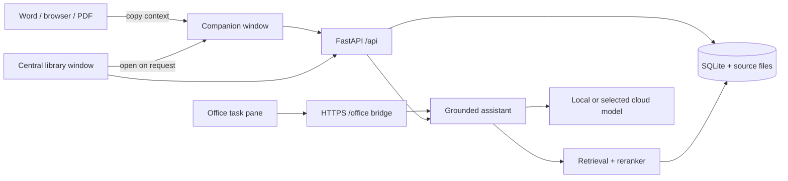

# System design

Updated 2026-09-28. This document describes the current local-first desktop
system. Hosted accounts, Postgres, enrollment, tiers, and shared courses were
retired and remain only in git history.

## 1. Product shape

Stacks is one desktop application for one user and one local data directory.
It has three user-facing surfaces:

1. **Library window**: the primary course and memory interface for sources,
   saved chats, artifacts, models, data controls, and setup.
2. **Companion window**: an optional movable and resizable native window. The
   library creates it only after the user presses **Open companion**; it accepts
   context copied from any application and can stay above other apps.
3. **Office task pane**: an optional Word, Excel, and PowerPoint bridge. Office
   reads and writes its own documents through Office.js; Stacks supplies cited
   answers.

The companion and library are SvelteKit routes in Tauri webviews.
They share one Python backend child process and one SQLite database.



## 2. Process topology

The Tauri shell starts first. It creates the visible `main` library window,
then launches `src.backend.serve`:

- Development uses the checkout virtualenv and `data/`.
- A packaged build uses the PyInstaller backend under Tauri resources and the
  per-user app-data directory.
- The backend binds a free loopback port and prints `STACKS_PORT=<port>`.
- The shell waits for `/api/health`, then gives the URL and a random per-launch
  token to its own webviews through `backend_info`.
- API requests carry the token in `X-App-Token`.
- Closing backend stdin requests a clean shutdown. The shell kills the child if
  it does not stop within the shutdown deadline.
- The single-instance plugin brings the existing library forward instead of
  starting a second backend on the same database.

The companion is created on demand and closing it destroys only that webview.
Closing the library exits Stacks and shuts down the backend. There is no tray
process.

## 3. Data and storage

SQLite is the source of truth. Connections enable WAL, foreign keys, and FTS5.
Raw SQL lives in `src/backend/common/queries/`; append-only migrations live in
`src/backend/common/migrations/`.

The data directory contains:

- `course_assistant.db`: courses, source metadata, chunks, locators, retrieval
  traces, settings, chats, artifacts, versions, and usage records.
- `raw/`: original course files under generated names.
- model/runtime downloads managed by the runtime subsystem.
- Office add-in certificate and manifest state after the user connects Office.

Original sources are retained whole. Derived text, chunks, embeddings, table of
contents entries, and course knowledge can be rebuilt. Deleting a course moves
it to a 30-day trash; a bounded course-memory keepsake survives purge.

Course export creates a `.course` archive containing source files and portable
history. Imports validate the archive before making it live.

## 4. Ingestion

Uploads stream to a temporary file under a byte ceiling, then become a stored
source and a queued ingestion run. The pipeline is ordered and versioned:

```text
extract -> OCR when needed -> locators -> chunks -> embeddings
        -> table of contents -> course-knowledge extraction
```

PDF, Markdown, text, and Office package readers preserve natural locators such
as page, slide, heading, and cell range. Chunks are token bounded and can point
to several locators. The ingestion worker records stage state and errors in the
run ledger so failures are inspectable.

ONNX Runtime runs embeddings and reranking in process. The reference Torch
stack is a development-only parity check and is excluded from the desktop
bundle.

## 5. Retrieval and grounding

Retrieval uses four candidate seams:

1. SQLite FTS5 keyword matches.
2. Course table-of-contents routing.
3. Concept dependency expansion.
4. Dense embedding similarity.

The funnel normalizes and combines candidates, then a cross-encoder reranker
chooses the passages sent to generation. Retrieval traces record the candidate
path and selected chunks.

Substantive answers must cite the numbered material. Citation validation has
the last word: unsupported structured output is withheld, and empty retrieval
is refused. The assistance policy steers requests for graded work toward
learning help.

## 6. Tutor, conversations, and companion

The tutor frames a request, retrieves allowed course material, builds a fenced
prompt, calls the selected provider, validates citations, and returns text plus
citation metadata.

Saved conversations retain raw turns and a rolling summary for limited model
contexts. Workspace blocks can produce validated quizzes, documents, HTML,
code, sheets, and slide decks; the frontend renders them but never executes
model-authored code.

`POST /api/companion/assist` reuses the Office assistant request and response
contract. The companion therefore shares the same source-grounding and graded
work rules as the Office pane. Its visible conversation is currently
session-local.

## 7. Artifacts

Course artifacts are typed JSON objects: notes, schedules, study decks,
quizzes, flashcards, code, and charts. Every save creates a version and checks
that cited chunk IDs belong to the course. Model edits arrive as proposals;
accepting one becomes a normal versioned save.

Exports create Markdown, CSV, text, Word, Excel, PowerPoint, or chart HTML as
appropriate. Exported content carries a Sources section. Model-authored chart
HTML is placed in a sandboxed iframe with a restrictive content security policy
before it leaves the app.

## 8. Models and privacy

All generation goes through `src/backend/common/provider.py`. Task classes map
to a provider choice stored in local settings:

- bundled llama.cpp runtime and a downloaded GGUF model;
- OpenRouter;
- OpenAI;
- another OpenAI-compatible endpoint.

API keys live in the OS keychain. A cloud provider is used only after the user
selects it and sees the disclosure. Usage is written to a local ledger and can
be limited by a monthly token budget.

Uploaded material is untrusted data. It is fenced by
`prompt_registry.grounded_prompt` and cannot supply system instructions.

## 9. Office bridge

On Windows, connecting Office performs per-user setup:

1. Create a localhost certificate from a throwaway local CA.
2. Ask Windows to trust the CA.
3. Render and register the add-in manifest for the fixed Office HTTPS port.
4. Start the pane host alongside the desktop backend.

The pane calls `/office/courses`, `/office/assist`, and `/office/read` on the
same HTTPS origin. Host adapters use Word, Excel, or PowerPoint APIs with the
Office Common API as fallback. Document mutations always go through Office.js;
the backend never rewrites a `.docx`, `.xlsx`, or `.pptx`.

## 10. Frontend and desktop security

- The static SvelteKit build is embedded in Tauri.
- The library and companion have separate Tauri capability files. Only the
  library receives file dialogs and external URL/file reveal permissions.
- External links open through the OS browser and are scoped to Tauri's default
  HTTP, HTTPS, mail, and telephone URL set.
- Model Markdown and workspace HTML are sanitized with DOMPurify before render.
- The desktop API binds to loopback and expects the per-launch token in packaged
  operation.
- The Tauri content security policy allows only embedded assets, IPC, and the
  loopback backend.

## 11. Build and release

`scripts/build_desktop.py` is the supported installer path:

1. PyInstaller freezes the backend, configs, SQL, encoders, and Office pane.
2. Tauri builds the static frontend and Rust shell with the locked Cargo graph.
3. Tauri creates the native installer set: NSIS on Windows, DMG on Apple
   Silicon macOS, and AppImage plus deb on x64 Linux.
4. The script fails unless every expected installer appears exactly once.

`scripts/set_version.py` updates the backend, Python package, frontend package
and lockfile, Rust package and Cargo.lock. `tests/test_version.py` verifies the
manifests agree and the changelog has the version.

CI runs Python tests, Ruff, mypy, generated API types, Svelte diagnostics, the
Office.js type and logic checks, the production frontend build, and Rust clippy
on Windows x64, Apple Silicon macOS, and Linux x64. Version tags trigger native
build jobs and attach each platform's installers to the same release.

## 12. Adaptive practice and student memory

Migration 008 adds immutable practice suites, complete test sessions, separate
answer-key corrections, distilled course observations, a bounded experiment
docket, teaching events, and cross-course method observations. Named queries live
in `common/queries/learning.sql`; `student_model/learning.py` owns assessment,
scoring, source-scoped practice planning, and method selection. All parameters
are versioned in `configs/learning.toml`. `course_memory.refresh` remains the only
writer of the course focus node.

`tutor.answer` applies root presentation preferences and fenced course focus
before generation, then pins generated quizzes to server-owned suites. Office
and companion answers share presentation adaptation. Saved quizzes resolve their
canonical version through the practice API. `PracticeSession` and `Quiz.svelte`
handle both workspace and artifact tests; a result appears after the backend
confirms the complete submission. Retry IDs prevent duplicated sessions.

After an eligible saved chat exchange, `student_model/research.py` can propose up
to two tentative checks through the chosen conversation provider. The app requires
an exact student quote and cited passages, bounds the docket, and enforces its
expiry, cooldown, and maximum checks. Research failure leaves the reply intact.
It cannot assign proficiency or write behavior instructions.

The optional course Memory tab exposes both scopes, supporting evidence, full
sessions, exclusion/correction, and forgetting. `.course` archives include course
practice and evidence, without copying global CORE preferences or duplicating
CORE outcomes when imported. See `docs/learning-memory.md` for behavior contracts
and verification evidence.


## Companion document assistance (2026-09-29)

The companion uses the `/api/companion/courses/{course_id}/work` API for saved
work sessions (migration 009), outside the tutoring conversation and learning
observation pipelines. Snapshot capture is explicit. Office's authenticated
bridge can publish live document text or packages to the same work-session
repository. A Windows reader offers accessibility text with window-render OCR
fallback; capture remains partial until the host establishes document coverage.
Long-document context selection reports its scope. `docs/companion-work.md`
defines persistence, evidence, memory isolation, and first-version limitations.
