# System Design

> Architectural overview of the Course Memory and Adaptive Study System.
> Read this alongside `project.md` (product/plan) and `AGENTS.md` (contract).
> Decisions here are the current *agreed* ones; record changes in `docs/decisions/`.

## 0. TL;DR

An academic assistant that ingests course materials, extracts structured text and
course knowledge (concepts, evidence, TOC), learns a per-student error model
from attempts, and serves source-grounded answers + "what to study next"
recommendations through a small web UI. Deployed for a small user base; data
owned by the operator in Postgres. Memory vocabulary (user memory root,
course-memory child, course knowledge, TOC-as-index) is defined in
`docs/decisions/007_memory_model.md` and controls wherever the word "memory"
appears below.

- **Backend:** Python / FastAPI under `src/backend/`, one package per subsystem
- **Frontend:** `src/frontend/`, talks to backend only via API
- **Database:** Postgres via raw SQL (no ORM); versioned migrations applied by
  `common/migrate.py`
- **Auth:** email + password accounts, per-user isolation, 7-day deletion grace
- **Inference:** several models for different tasks (generative answer/extraction,
  a small stable TOC-writer, optional OCR), called through a **hosted API
  provider that does not retain data** (not self-hosted).
- **Retrieval:** **TOC-guided** — a model-written table of contents locates content
  and token-bounded chunks are fetched via locators; embeddings only if a
  versioned eval question proves the TOC path fails.
- **Data ownership:** course material and study history live in our Postgres.
  Inference is a no-retention API.
- **Deletion:** an exact course archive provides a 90-day copy grace period;
  expiry leaves only per-user evidence-bearing course memories. Account deletion
  retains its separate grace period.

---

## 1. High-level architecture

Implementation status matters throughout this document: schemas, auth,
owner/enrollment permission rules, source-to-course-object identity, ingestion
run state, upload storage, and archive-then-purge services are implemented. File
parsing, retrieval, and tutor orchestration remain planned. Diagrams for those later flows are
the intended design, not claims that the code already performs them.

The system is a **pipeline with a memory**. Think of it like a **library that
learns about you**:

- **Ingestion** is the *librarian* — it takes your messy course files, reads them,
  and files every page into the catalog.
- **Postgres** is the *stacks* — the organized shelves where all the text and
  metadata live.
- **Retrieval** is the *card catalog* — when you ask a question, it finds the right
  pages.
- **Course memory** is the *study guide* the librarian wrote — concepts, definitions,
  and how they connect, each with a page number.
- **Student model** is the *librarian's notes on you* — what you've tried, where you
  stumble, what you've mastered.
- **Tutor** is the *reference desk* — it reads the catalog, the study guide, and the
  notes on you, then answers with citations and tells you what to study next.

The whole thing is one **backend** (the library staff) behind an **API** (the front
desk), a **frontend** (the reading room you sit in), and a set of **models** (the
specialists the staff can call on).

### 1.1 The big picture

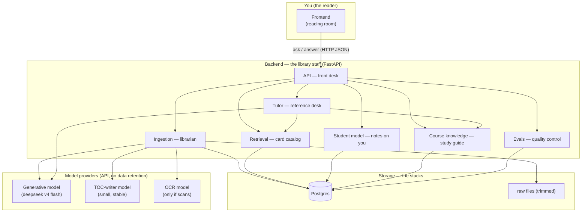

### 1.2 Layer 1 — Ingestion (the librarian)

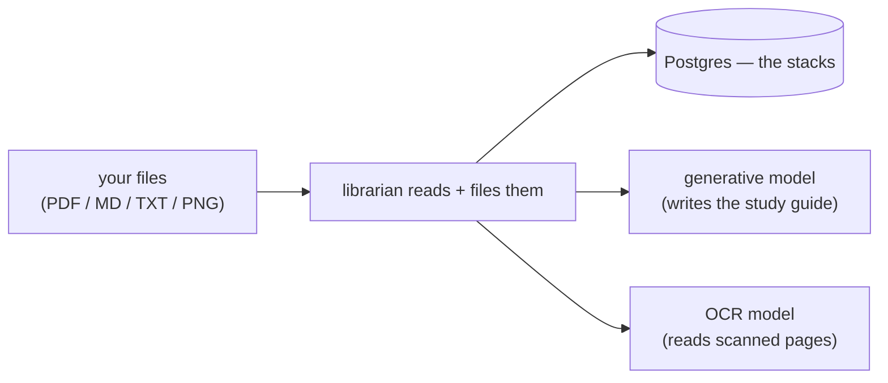

**Analogy:** you hand the librarian a stack of papers. They read each one, note the
page numbers, and file the text onto the shelves. For scanned pages they call in an
OCR specialist to read the handwriting. They also draft a study guide (course
knowledge — the study guide is course content, not memory) as they go.

### 1.3 Layer 2 — Retrieval (the card catalog)

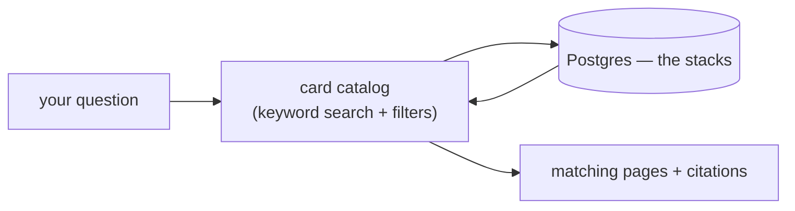

**Analogy:** you ask "what's the factorization condition?" The catalog flips through
its index cards and hands you the exact pages that mention it, with page numbers.
(If keyword search later misses things that *mean* the same thing but use different
words, we add an embedding specialist — but only if a test proves the catalog fails.)

### 1.4 Layer 3 — Course knowledge (the study guide)

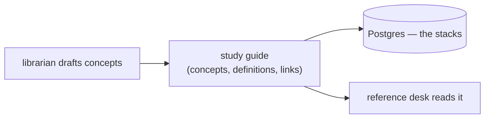

**Analogy:** the librarian's study guide lists each concept, its course-specific
definition, and how concepts depend on each other — every entry with a page number
so you can verify it. It's small enough to read and correct.

### 1.5 Layer 4 — Student model (notes on you)

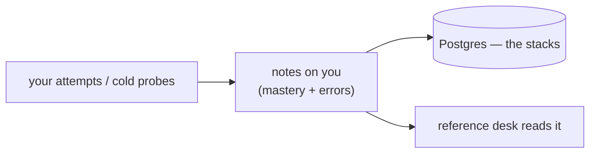

**Analogy:** every time you answer a practice question, the librarian jots a note:
which concept, whether you got it, what kind of mistake, how confident you were.
Over time these notes become a picture of what you actually understand.

### 1.6 Layer 5 — Tutor (the reference desk)

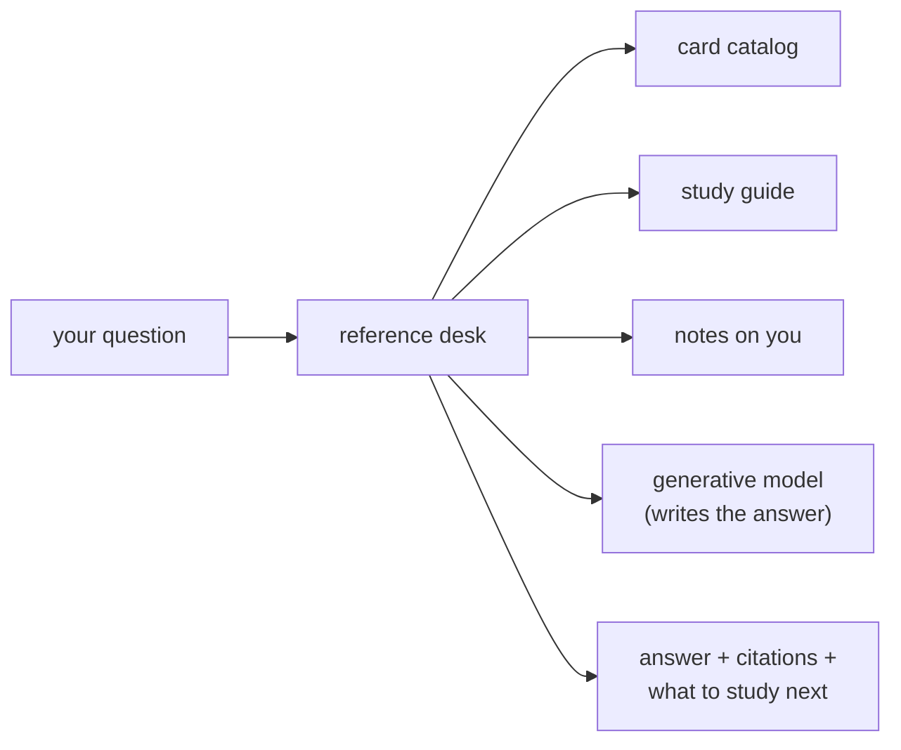

**Analogy:** you ask the reference desk a question. They pull the relevant pages
(catalog), check the study guide (course knowledge), glance at their notes on you (student
model), and write you a clear answer — always pointing to the exact page it came
from, and telling you what to practice next.

### 1.7 How the layers fit together

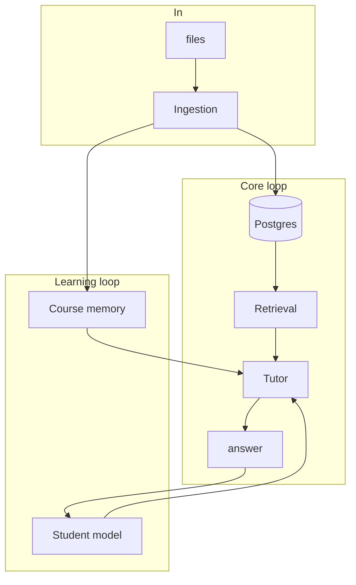

**Data flow at a glance:** files enter through ingestion → parsed to text →
stored in Postgres (source of truth) → retrieval answers questions by searching
that text → tutor generates responses grounded in retrieved passages + course
knowledge + the user's memory (root + course node) + student model.

---

## 2. Storage model

The schema is broken into **six layers** so each diagram stays readable. Read
them in order; each layer builds on the previous. These map to the modules in
`src/backend/common/schemas/`.

### 2.1 Identity & course structure

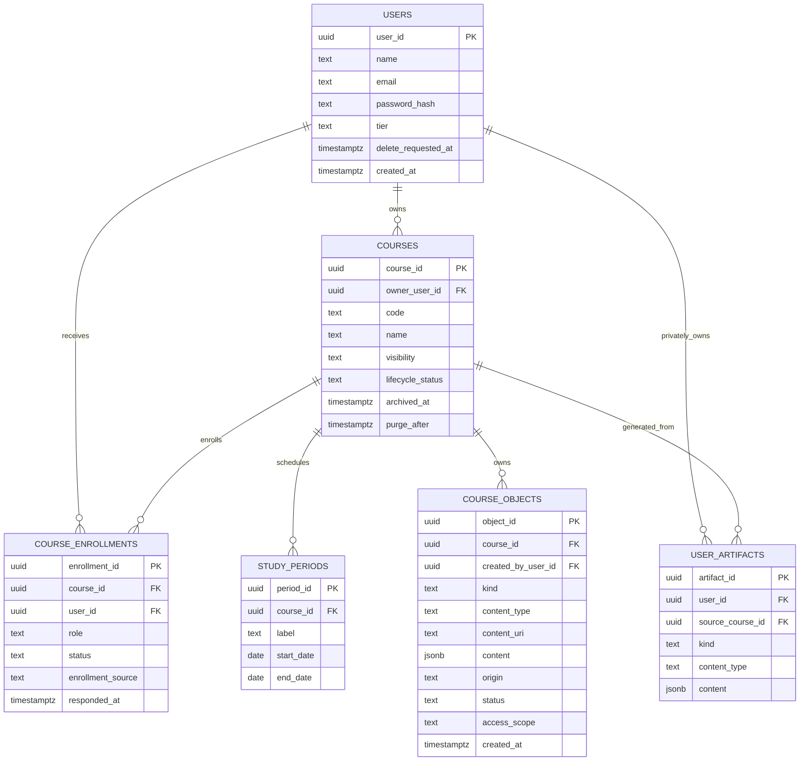

- **`USERS`** carries auth (unique `email`, `password_hash`), account
  lifecycle (`delete_requested_at` — soft delete with a 7-day grace period),
  and the current **tier** (`free` default / `paid`), synced from the
  append-only `user_subscriptions` history by a trigger. Tier gates the
  weekly generation budget and model routing (see §6a).
- **`COURSES`** has one owner and is in exactly one of **three shapes —
  private, invite_only, public** (decision `006_three_course_shapes.md`; the
  closed set). Public courses are anonymously viewable (published objects +
  join code) and self-enrollable; invite_only courses are invisible except
  through their owner-held join code; private courses are reachable only by
  owner invitation. The join code (`courses.code`) is a server-generated
  **canonical code**: 16 chars from a look-alike-free alphabet, DB CHECK
  constrained, displayed grouped as `XXXX-XXXX-XXXX-XXXX` (common/codes.py).
  Course lifecycle (`active`/`archived` + `archived_at`/`purge_after`)
  implements the 90-day archive. Public→restricted transitions are versioned
  lifecycle events; restricted→public is a plain owner update.
- **`COURSE_ENROLLMENTS`** grants an authenticated learner source use and
  generation without canonical-content mutation. Status lifecycle:
  `invited` → `active`, with `declined` and `revoked` retained rows (history
  preserved; a revoked learner may re-enroll via the validated DB path —
  migration 011). Enrollment policy is enforced twice: API pre-checks in
  `permissions.py` and the DB trigger — both must change together.
- **`USER_ARTIFACTS`** stores learner-generated materials outside the canonical
  course object collection. They remain visible only to their user, including
  after enrollment revocation; neither the course owner nor other learners
  inherit access.
- **`STUDY_PERIODS`** replaces the rigid `week`: a user-definable sliding window
  (a lecture, a month, a semester, the stretch before an exam). Granularity is
  set by the user, never hardcoded.
- **`COURSE_OBJECTS`** stores any course-owned object — uploaded source or
  generated artifact. `kind` is the semantic purpose (a **free string**, so new
  kinds need no schema change), `content_type` is the format, and `content_uri`
  points to where the content actually lives (file for binaries, jsonb for
  structured data, text for markdown). Format routes storage and serving. A
  check constraint requires `content_uri` or `content`.

### 2.2 Source content (uploaded material)

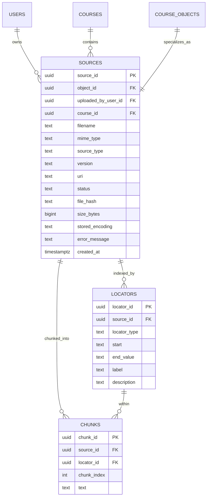

- **Objects are stored whole**; nothing is destroyed at ingest. `file_hash`
  dedups uploads (a re-upload of the same bytes is detected regardless of
  filename); `error_message` records why a `failed` ingest failed.
  `size_bytes` records post-compression stored bytes (the storage-gate
  accounting truth). Uploads stream to disk under a hard byte ceiling —
  oversized bodies are cut mid-stream and never fully enter memory — under
  server-generated names (`source_id`), so path traversal is structurally
  impossible. `stored_encoding` (`identity` / `gzip`, DB CHECK constrained)
  records whether bytes were gzipped; compression applies only when the mime
  type allows and saves ≥10% (PDFs/images/video are skipped).
- Every `SOURCE` is also a canonical `COURSE_OBJECT`. The generic row carries
  ownership, storage, access, and creator information; the source row carries
  upload and parsing details. Raw sources use enrolled scope, so public course
  visibility does not publish uploaded originals.
- **`LOCATORS`** is the per-format "table of contents": `locator_type` is a free
  string (page, slide, section, timestamp, line_range, cell_range, ...), so each
  format keeps its natural unit and new formats need no schema change. Citations
  use the locator label (e.g. "slide 7", "timestamp 12:30"). The SQL column is
  `end_value` (reserved word); the data layer maps it to the Pydantic field `end`.
- **`CHUNKS`** are **token-bounded** retrieval slices sized to fit the model's
  context window (not arbitrary lines), each pointing back to the locator it
  spans. No embedding column — retrieval is TOC-guided; embeddings return only if
  a versioned eval proves the TOC path failing.

### 2.3 Course knowledge (concepts, evidence & TOC)

> Terminology (decision 007): this layer is course KNOWLEDGE, not memory.
> It is shared per-course state — what the course SAYS plus the TOC index
> for FINDING it. The per-user "course memory" node is §2.1's
> `COURSE_MEMORIES` and `common/course_memory.py`.

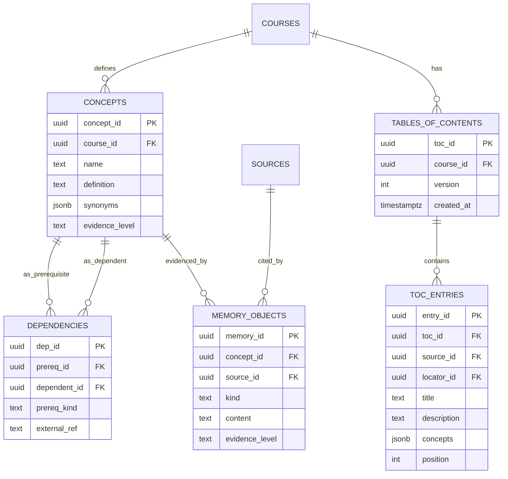

- **`DEPENDENCIES`**: `prereq_id` is **nullable** (a concept may have no prereq),
  and `prereq_kind` (`in_course` / `external`) + `external_ref` represent
  out-of-course prereqs (e.g. Calc 2 integrals depend on Calc 1 integration).
- **`TABLES_OF_CONTENTS`** + **`TOC_ENTRIES`** are the model-written, per-course
  index describing what's in the course and where. It is the retrieval path that
  **replaces embedding similarity** (avoiding cross-model embedding misalignment).
  Written by a small, stable TOC model so descriptions stay consistent over time.
  Versioned, so the current version is knowable and previous versions recoverable.
- **`evidence_level`** on memory objects: `direct` / `derived` / `hypothesis`.
- Legacy naming note (decision 007): `memory_objects` / `memory_id` /
  `MEMORY_OBJECT_EVIDENCE` predate the memory vocabulary. They are course-
  KNOWLEDGE objects (formula, theorem, example, misconception — what the
  course says, tied to concepts and sources), not user memory.

### 2.4 Student model (attempts, mastery & recommendations)

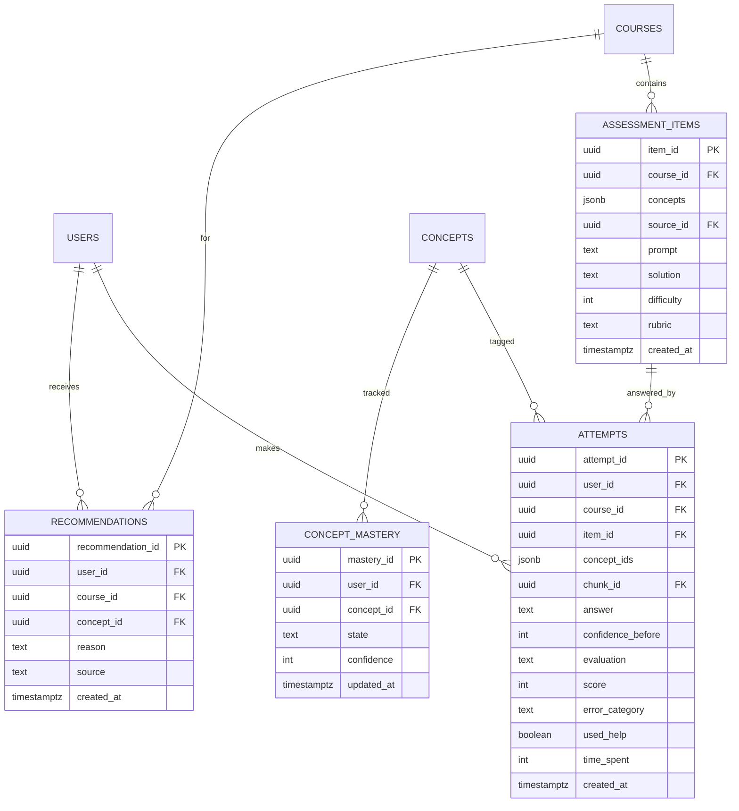

- **`ASSESSMENT_ITEMS`** are the unit a cold probe uses: prompt, concepts tested,
  difficulty, rubric.
- **`ATTEMPTS`** are multi-concept (`concept_ids` jsonb) — an item may test
  several concepts and the attempt records against all of them. `score` is a
  0–100 sliding scale (letter grades are a display-layer conversion, not a
  schema decision); `evaluation` stays narrative.
- **`CONCEPT_MASTERY`** holds the current mastery **state** per user per concept
  (UNIQUE `(user_id, concept_id)`) — a ladder (`unseen` → ... → `transfer`), not
  a single fake-precise score.
- **`RECOMMENDATIONS`** are the "what to study next" output, traceable to a
  concept, a reason, and the source (attempt, TOC, etc.).

### 2.5 Chat history (raw + compressed)

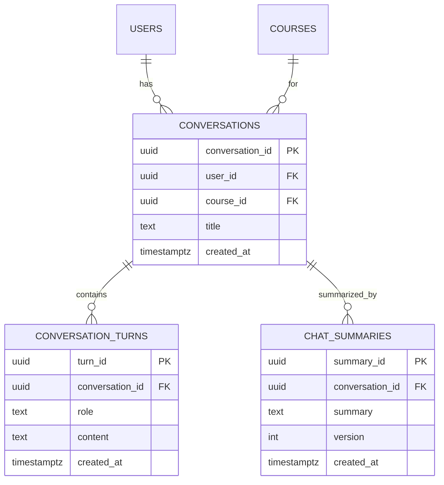

- Chat is stored in **two forms** for two audiences: the raw `CONVERSATION_TURNS`
  (what the user sees), and a compressed `CHAT_SUMMARIES` (what the LLM uses as
  context on the next prompt). Summaries are regenerated when the conversation
  grows past a threshold so the model always prompts against current context.

### 2.6 Evidence & grounding

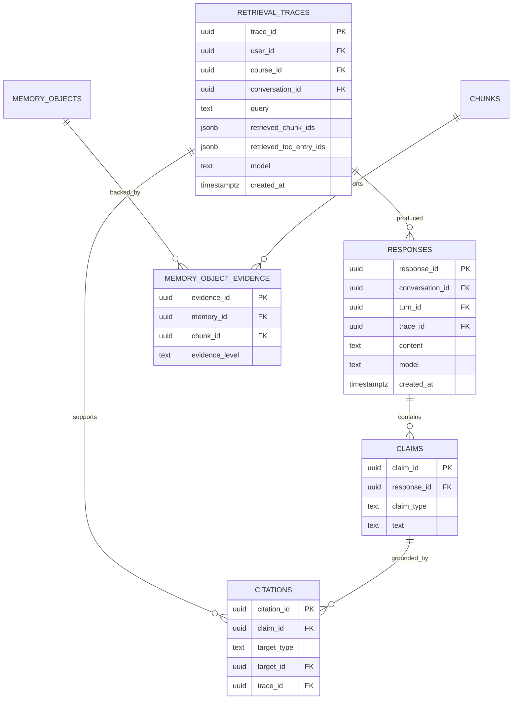

- **`RESPONSES`** are the tutor's answers — the object claims attach to. A
  response links to its conversation, turn, and retrieval trace. The grounding
  chain is `Response → Claim → Citation → RetrievalTrace`.
- **`RETRIEVAL_TRACES`** record what the tutor retrieved and used to produce an
  answer, enabling audit of whether a citation actually supported the answer.
- **`CLAIMS`** + **`CITATIONS`** ground each claim in evidence (a chunk, memory
  object, or TOC entry), with the trace that produced it. `claim_type` and
  `target_type` are free strings; known values live in `schemas/base.py`
  (`KNOWN_CLAIM_TYPES`, `KNOWN_CITATION_TARGETS`).
- **`MEMORY_OBJECT_EVIDENCE`** links a memory object directly to the chunk that
  supports it, so a citation on a memory object can resolve to a chunk within
  two hops.
- **`ARTIFACT_ORIGINS`** (not shown) records how a generated artifact was
  produced — its sources, concepts, and model — so origin is auditable and
  regenerable. **`MODEL_DECISIONS`** (not shown) records the model's
  storage/description decisions for the same reason.

### 2.7 Deletion & lifecycle (distilled records)

Unifying principle: **destruction leaves a distilled record.**

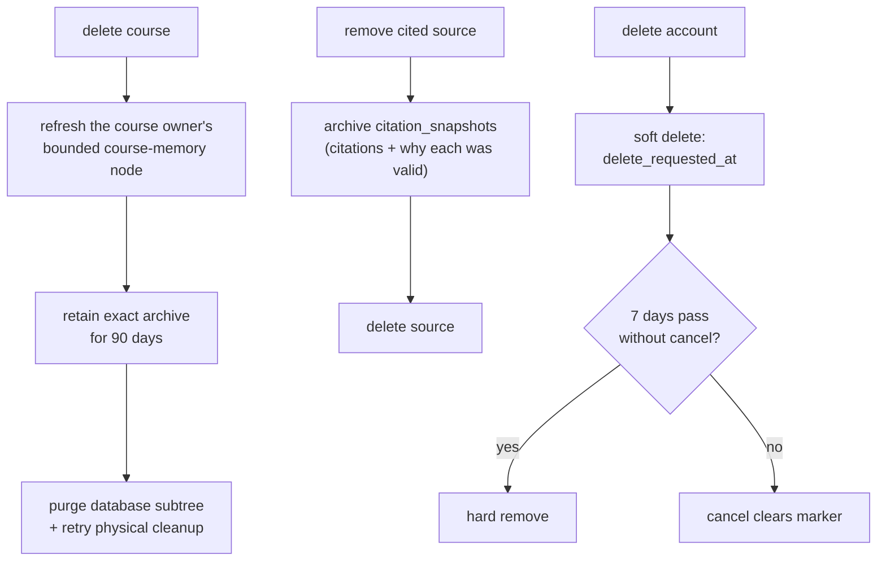

- **`COURSE_MEMORIES`** — the course-memory node (decision 007): a per-user,
  per-course focus record stored ONLY for the course's main user (its
  owner) — a bounded summary (course reference, name, key concepts, and a
  compact evidence snapshot), refreshed on canonical mutations and before
  archival via the single write seam `course_memory.refresh_for_owner`.
  `course_id` is stored without a hard FK so the memory outlives the
  course row. Enrolled learners never get a node (see decision 007).
- **`CITATION_SNAPSHOTS`** — before a source's citations are removed, a
  compressed record of the citations and why each was valid is written, so
  grounding evidence survives the source.
- **Account deletion** is soft (`users.delete_requested_at`) with a 7-day grace
  period; canceling clears the marker.
- **Implemented course delete policy:** normal access ends immediately, current
  participants may copy the exact archive for 90 days, and expiry removes the
  foreign-key tree atomically while enqueueing durable physical cleanup.
  Cleanup jobs retry under a lease up to a configured attempt cap, then go
  dead for operator inspection; a periodic sweep also removes orphaned course
  directories. Course-specific citation snapshots and learner artifacts are
  removed at expiry; the owner's course-memory node is the sole
  course-derived retention exception.

**Key decisions:**

- **Objects are stored whole; extracted, token-bounded chunks are the retrieval
  unit.** Raw files are kept only while cheap, then trimmed (see §5).
- **Access isolation:** public visibility grants anonymous access only to
  published canonical objects. Enrollment grants source use and generation,
  never canonical mutation. Learner generations are private user artifacts;
  student history and tutor preferences also stay private per user.
- **TOC-based retrieval, not embeddings.** A model-written table of contents
  describes the course and locates content, avoiding cross-model embedding
  misalignment. Written by a small, stable TOC model.
- **No rigid type system.** `kind` (course objects), `locator_type`,
  `content_type`, `claim_type`, and `target_type` are free strings, so new kinds
  and formats insert without a schema migration.
- **Evidence is first-class.** Every claim, artifact, and model decision is
  traceable to evidence, so source grounding is enforceable and auditable.

---

## 3. Ingestion pipeline

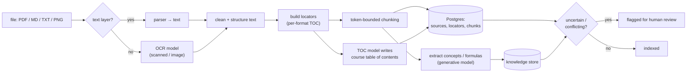

**Steps:** accept file → detect type/OCR need → extract text with structure
offsets → clean → build **locators** (the per-format table of contents) → split
into **token-bounded chunks** → write sources, locators, chunks to Postgres →
propose memory objects with evidence links → a small **TOC model** writes the
course table of contents → flag uncertain extractions for review.

**Rules:** block solution documents from cold-probe context; prefer instructor
sources over student notes; store a retrieval trace for every query.

The persisted pipeline order is text extraction → locators → chunks → cascading
TOC update → course-knowledge extraction. Each stage depends on the previous successful
stage. Stage attempts and handler/configuration versions are recorded; the MVP
configuration allows two total attempts, after which the run becomes failed and
later stages remain unstarted. Handlers must be idempotent so retrying a stage
does not duplicate derived data.

---

## 4. Retrieval & answer flow

Retrieval is **TOC-guided**, not embedding-similarity-based. The model-written
table of contents tells the tutor where content lives, and the tutor fetches the
specific token-bounded chunks via locators. This avoids cross-model embedding
misalignment and keeps retrieval inspectable.

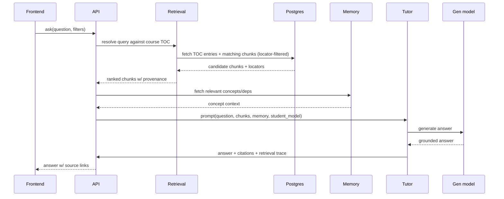

**Retrieval evolution (measured, not assumed):**

1. **Baseline:** TOC-guided chunk selection + metadata filters. No embedding model.
2. **If eval shows gaps:** consider embeddings + `pgvector`, reranker — only when a
   versioned eval question fails the baseline. Embeddings remain optional.

**Never** answer an uploaded-material question without showing sources.

---

## 5. Storage of originals (the trim policy)

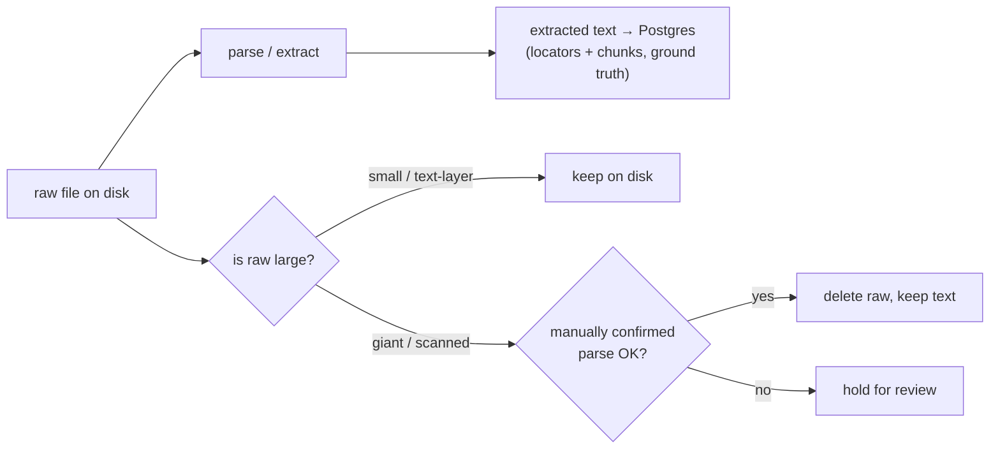

- Extracted text always persists (tiny, ground truth); objects are stored whole.
- Raw originals trimmed when large/scanned, only after a successful confirmed parse.
- Text-layer PDFs are small → usually kept; they cost nothing and let you re-parse.

---

## 6. Model strategy

Inference is **not self-hosted**. Models are called through a **hosted API provider
that does not retain data** (e.g. OpenRouter / Groq / similar). This keeps costs
low (a provider-served DeepSeek v4 flash is cheaper than self-hosting) and pushes
the privacy requirement onto a *contract*: the provider must not retain prompts or
responses. Verify this for whichever provider is chosen.

| Task | Model class | In MVP? | Note |
|---|---|---|---|
| Generative answer / extraction / classification | DeepSeek v4 flash | **Yes** | generative model |
| Table-of-contents writer/updater | **small, stable** model | **Yes** | keeps TOC descriptions consistent over time |
| Embeddings (retrieval) | separate embedding model | No | only if TOC path fails; `pgvector` |
| OCR (scanned/image slides) | OCR/vision model | Only if scans exist | math-in-PNG is hard; avoid if text-layer |
| Reranker | separate reranker | No | later, if retrieval precision suffers |

**"ML earns its role":** retrieval is TOC-guided, not embedding-based. Add
embeddings/OCR/reranker/fine-tuning only for a documented, versioned baseline
failure on a measured eval task.

> Why a dedicated TOC model? A small, stable model keeps course descriptions
> consistent over time (one model's embeddings may not align with another's, so
> we avoid relying on embeddings for retrieval entirely). A separate embedding
> model would be needed only if the TOC path measurably fails.

---

## 6a. Tiers and spend control

Model compute is metered and tier-routed. Every user has a tier (`free`
default, `paid` via an active subscription; history in `user_subscriptions`,
synced to `users.tier` by a trigger). Every model call writes one append-only
row to `generation_ledger` (user, course, task, model, tokens).

- **Weekly budget:** rolling Monday 00:00 UTC window; each tier's
  `weekly_token_budget` (input + output tokens) lives in the versioned
  `configs/tiers.toml`. Generation paths call `budget.check_budget` before
  compute; exceeded budgets raise at the boundary. The check returns an
  inspectable state (spent / budget / remaining / week start) — no opaque
  scores. It gates but does not reserve; brief overshoot under concurrency is
  accepted at this scale.
- **Course limits:** each tier also caps owned courses (`max_owned_courses`:
  free 2, paid 20) via `budget.check_course_limit`; enrollment is not capped,
  and deleted courses free their slot. Per-course storage is capped
  (`max_course_storage_bytes`: free 100 MB, paid 1 GB) via
  `budget.check_course_storage`, and aggregate storage across all owned
  courses is capped (`max_total_storage_bytes`: free 1 GB, paid 10 GB) via
  `budget.check_total_storage` — so storage cannot be multiplied by making
  more courses. Both enforced pre-upload against recorded `sources.size_bytes`
  (stored, post-compression bytes).
- **Free-tier overhead:** free users pay an extra 5% of each generation's
  tokens (`overhead_tokens` in the ledger, counted toward the weekly budget).
  Applied at record time, never mid-generation — in-flight answers are never
  cut off; the overhead only tightens the next gate.
- **Downgrade grace:** downgraded users keep over-cap data, blocked from new
  creation only; a 60-day deadline (`users.downgrade_grace_deadline`) bounds
  the soft landing. Tier is double-verified (`budget.verify_tier`) against
  `users.tier` at the limit gates.
- **Model routing:** the same config maps each generation task
  (`KNOWN_GENERATION_TASKS` — `tutor_answer`, `toc_update`,
  `probe_generation`, `probe_evaluation`, `course_knowledge_extraction`,
  `artifact_generation`) to a model per tier — free gets the cheap generative
  model, paid gets the newer one, the small stable TOC-writer is shared. The
  loader rejects a config that omits a task for any tier.
- **Charging:** ingestion model calls (`toc_update`, `course_knowledge_extraction`) are
  charged to the uploading owner's budget. Payment processing is out of scope;
  subscriptions are operator-managed until a billing flow exists.
- Decision record: `docs/decisions/004_tiers_and_spend_control.md`.

---

## 7. Student model & tutor flow

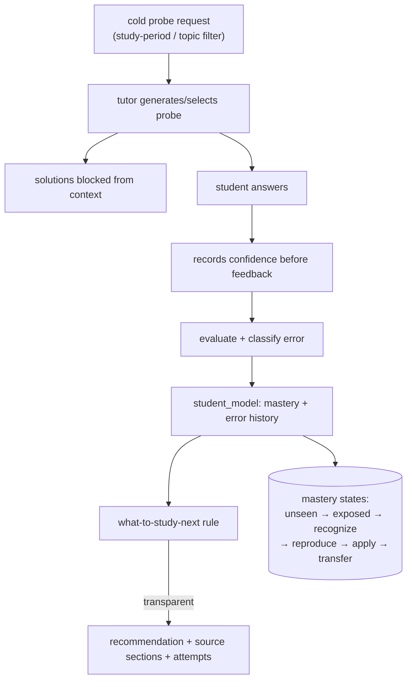

**Per-attempt record:** concept tags, question version, answer, evaluation,
confidence before feedback, correctness, error category, time, date, help used.

**Mastery is a ladder, not one fake-precise score.** Recommendations must be
traceable to specific attempts and concept evidence.

**Tutor presentation is requester-scoped.** Presentation is a user-memory
(root) concern (decision 007): the owner may use their own structured
profile for interactive responses; non-owners use the versioned generic
profile in `configs/tutor.toml` until the full user-memory root exists
(M2). Profiles control presentation only (verbosity, analogy use, response
structure, and source-quotation balance). They cannot change TOC
construction, retrieval, selected evidence, citation requirements,
correctness evaluation, or mastery state — behavior instructions live only
in the root, never in course memory or course knowledge. This keeps the
shared course knowledge neutral.

---

## 8. Deployment topology (small user count)

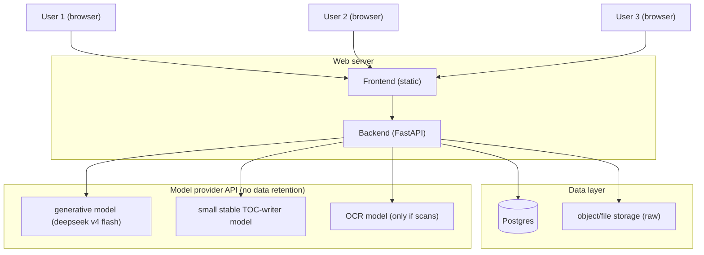

Small scale → no microservices, no k8s. A single web process + Postgres + object
storage. Inference goes out to a **hosted model API** (no data retention) rather
than a self-hosted model — this keeps cost low and avoids running local inference
servers.

---

## 9. Cross-cutting concerns

- **DB access:** isolated in `src/backend/common/db.py` (the single Postgres
  seam); raw SQL queries in `src/backend/common/queries/*.sql`; schema via
  versioned migrations `src/backend/common/migrations/00X_*.sql`, applied by the
  runner `src/backend/common/migrate.py` (`python -m src.backend.common.migrate`)
  against a `schema_migrations` tracking table. Migrations are append-only.
- **Config:** `.env` credentials loaded via `common/config.py` (no
  python-dotenv dependency); tunable/versioned params in `configs/`, not
  hardcoded.
- **Validation:** Pydantic schemas at every boundary
  (`src/backend/common/schemas/`, one module per storage layer).
- **Auth:** public user responses are separate from internal credential records.
  Email is normalized, registration enforces bcrypt-safe password bounds, JWTs
  validate issuer/audience/required claims, pending-deletion accounts cannot log
  in, and production rejects the development signing secret.
- **Course access:** the three course shapes (`private` / `invite_only` /
  `public`) are the closed set — decision
  `docs/decisions/006_three_course_shapes.md`. Policy lives in both
  `common/permissions.py` (application) and the enrollment triggers
  (migrations 011/015); the two must change together. Public discovery,
  enrollment, canonical-content ownership, and private learner artifacts are
  separate authorization concerns (decision 003).
- **Canonical code format:** course join codes and premium/support codes share
  `common/codes.py` — 16 chars, look-alike-free alphabet, DB CHECK
  constrained, grouped display `XXXX-XXXX-XXXX-XXXX`. Codes are validated at
  the API boundary; premium hashes are stored (join codes are policy-gated
  instead, since they grant nothing by themselves).
- **Support/premium codes:** every account gets a personal code at
  registration; the operator flags codes as premium-granting. Redemption is
  transactional (row lock + active-subscription check) and flows through the
  standard subscription machinery so tier stays single-sourced in `users.tier`.
- **Evals:** every subsystem has a regression path under `src/backend/evals/`.
  No feature ships without a way to measure regressions.
- **Logging/traces:** retrieval traces + eval logs under `runs/` (gitignored).
- **No secrets:** never log/commit keys, tokens, or classmates' work.
- **Quality gate:** `pytest`, `ruff check .`, `mypy src` must all pass before
  work is declared done.

---

## 10. Open decisions (record changes in `docs/decisions/`; log in `docs/notes.md`)

- Exact hosting target (VPS vs Railway/Render/Fly/Supabase) — affects local dev mirror.
- **Choose a model API provider that does not retain data** (OpenRouter / Groq /
  similar); verify their data-retention policy before committing.
- Whether OCR is in scope depends on whether pilot slides are scanned/image-heavy.
- When (if ever) to adopt embeddings/reranker — gated on a failing eval question.
- Login throttling and token revocation policy before external deployment.

---

## 11. Definition of done (from project.md)

A student can create an account, upload one course's materials, ask
source-cited questions, take a short closed-notes diagnostic, review their
concept-linked mistakes, and receive a transparent recommendation for what to
study next. The system records provenance for every claim, archives a distilled
record on deletion (90-day archive, permanent course memory, account grace period), and
has a small regression/evaluation suite that prevents silent quality loss.
