# System Design

> Architectural overview of the Course Memory and Adaptive Study System.
> Read this alongside `project.md` (product/plan) and `AGENTS.md` (contract).
> Decisions here are the current *agreed* ones; record changes in `docs/decisions/`.

## 0. TL;DR

A local-first academic assistant that ingests course materials, extracts searchable
text and structured course memory, learns a per-student error model from attempts,
and serves source-grounded answers + "what to study next" recommendations through a
small web UI. Deployed for a small user base; Postgres as the database engine.

- **Backend:** Python / FastAPI under `src/backend/`
- **Frontend:** `src/frontend/`, talks to backend only via API
- **Database:** Postgres (industry-standard; you plan to host for a small user count)
- **Inference:** several models for different tasks (generative answer/extraction,
  a small stable TOC-writer, optional OCR/embeddings), called through a **hosted API
  provider that does not retain data** (not self-hosted).
- **Retrieval:** **TOC-guided** — a model-written table of contents locates content
  and token-bounded chunks are fetched via locators; embeddings (`pgvector`) only if
  a versioned eval question proves the TOC path fails.
- **Data ownership:** local-first applies to data and storage — course material and
  study history are yours, in your Postgres. Inference is a no-retention API.

---

## 1. High-level architecture

The system is a **pipeline with a memory**. Think of it like a **library that
learns about you**:

- **Ingestion** is the *librarian* — it takes your messy course files, reads them,
  and files every page into the catalog.
- **Postgres** is the *stacks* — the organized shelves where all the text and
  metadata live.
- **Retrieval** is the *card catalog* — when you ask a question, it finds the right
  pages.
- **Course memory** is the *study guide* the librarian wrote — concepts, definitions,
  and how they connect, each with a page number.
- **Student model** is the *librarian's notes on you* — what you've tried, where you
  stumble, what you've mastered.
- **Tutor** is the *reference desk* — it reads the catalog, the study guide, and the
  notes on you, then answers with citations and tells you what to study next.

The whole thing is one **backend** (the library staff) behind an **API** (the front
desk), a **frontend** (the reading room you sit in), and a set of **models** (the
specialists the staff can call on).

### 1.1 The big picture

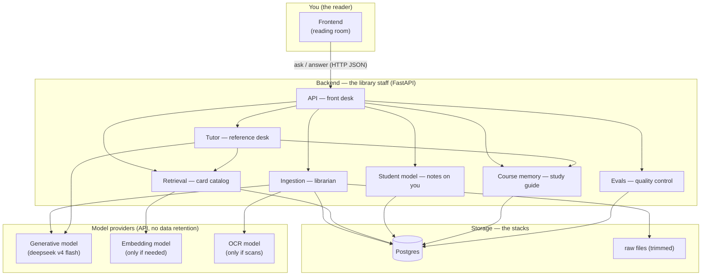

### 1.2 Layer 1 — Ingestion (the librarian)

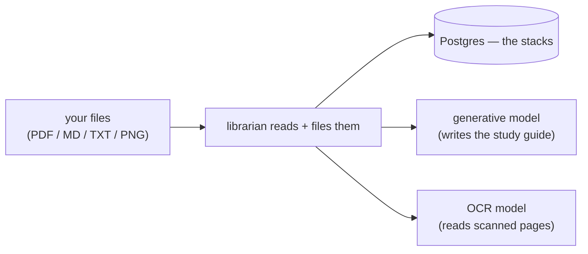

**Analogy:** you hand the librarian a stack of papers. They read each one, note the
page numbers, and file the text onto the shelves. For scanned pages they call in an
OCR specialist to read the handwriting. They also draft a study guide (course
memory) as they go.

### 1.3 Layer 2 — Retrieval (the card catalog)

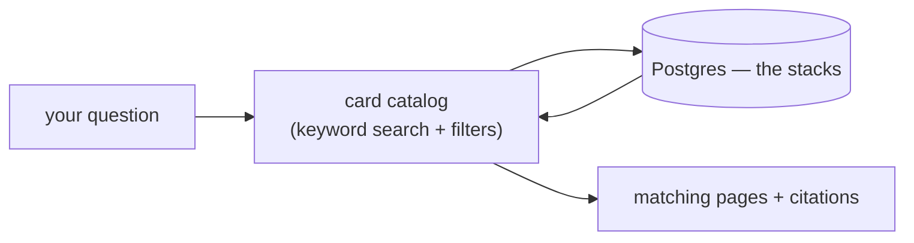

**Analogy:** you ask "what's the factorization condition?" The catalog flips through
its index cards and hands you the exact pages that mention it, with page numbers.
(If keyword search later misses things that *mean* the same thing but use different
words, we add an embedding specialist — but only if a test proves the catalog fails.)

### 1.4 Layer 3 — Course memory (the study guide)

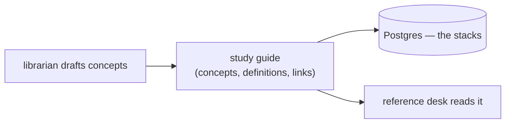

**Analogy:** the librarian's study guide lists each concept, its course-specific
definition, and how concepts depend on each other — every entry with a page number
so you can verify it. It's small enough to read and correct.

### 1.5 Layer 4 — Student model (notes on you)

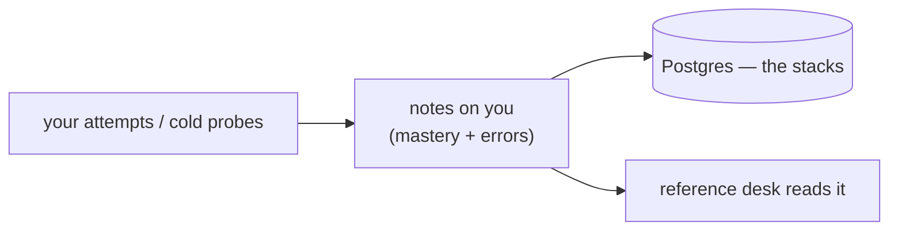

**Analogy:** every time you answer a practice question, the librarian jots a note:
which concept, whether you got it, what kind of mistake, how confident you were.
Over time these notes become a picture of what you actually understand.

### 1.6 Layer 5 — Tutor (the reference desk)

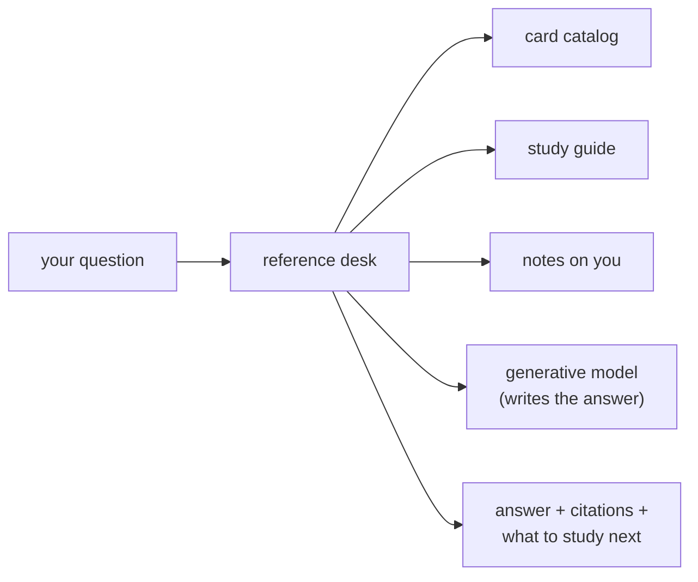

**Analogy:** you ask the reference desk a question. They pull the relevant pages
(catalog), check the study guide (memory), glance at their notes on you (student
model), and write you a clear answer — always pointing to the exact page it came
from, and telling you what to practice next.

### 1.7 How the layers fit together

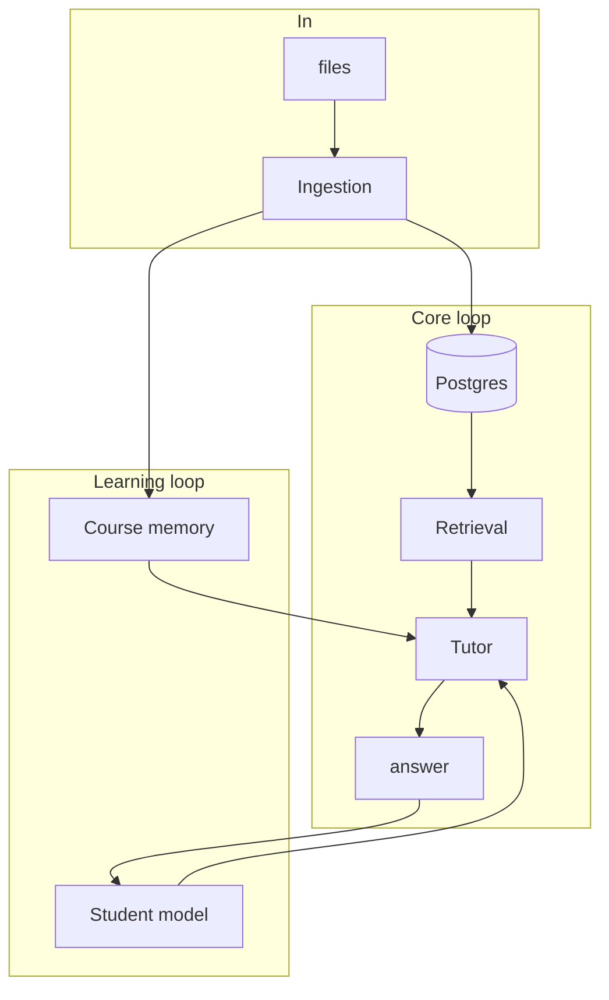

**Data flow at a glance:** files enter through ingestion → parsed to text →
stored in Postgres (source of truth) → retrieval answers questions by searching
that text → tutor generates responses grounded in retrieved passages + course
memory + student model.

---

## 2. Storage model

The schema is broken into **six layers** so each diagram stays readable. Read
them in order; each layer builds on the previous. These map to the modules in
`src/backend/common/schemas/`.

### 2.1 Identity & course structure

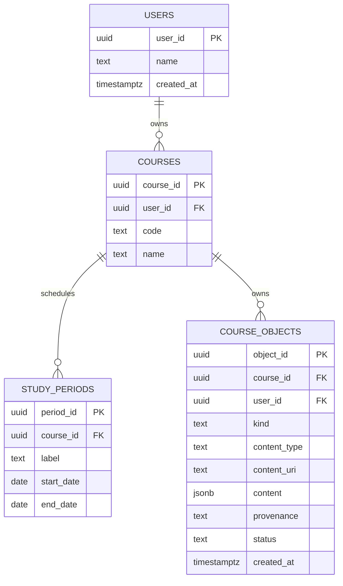

- **`STUDY_PERIODS`** replaces the rigid `week`: a user-definable sliding window
  (a lecture, a month, a semester, the stretch before an exam). Granularity is
  set by the user, never hardcoded.
- **`COURSE_OBJECTS`** stores any course-owned object — uploaded source or
  generated artifact. `kind` is the semantic purpose (a **free string**, so new
  kinds need no schema change), `content_type` is the format, and `content_uri`
  points to where the content actually lives (file for binaries, jsonb for
  structured data, text for markdown). Format routes storage and serving.

### 2.2 Source content (uploaded material)

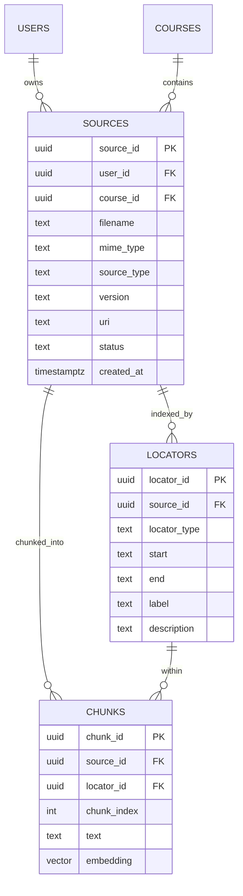

- **Objects are stored whole**; nothing is destroyed at ingest.
- **`LOCATORS`** is the per-format "table of contents": `locator_type` is free
  (page, slide, section, timestamp, line_range, function, ...), so each format
  keeps its natural unit. Citations use the locator label (e.g. "slide 7",
  "timestamp 12:30").
- **`CHUNKS`** are **token-bounded** retrieval slices sized to fit the model's
  context window (not arbitrary lines), each pointing back to the locator it
  spans.

### 2.3 Course memory (concepts, evidence & TOC)

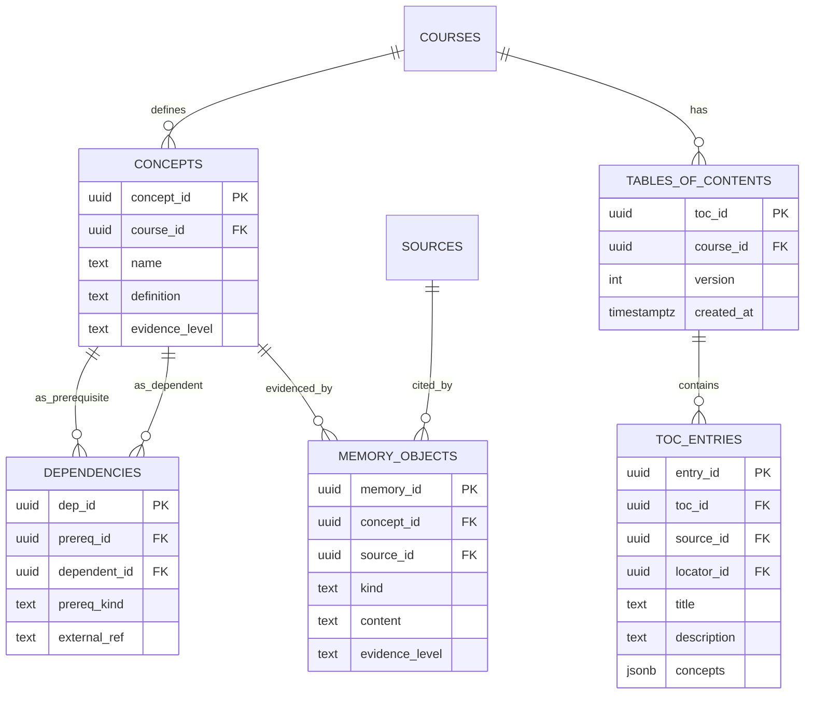

- **`DEPENDENCIES`**: `prereq_id` is **nullable** (a concept may have no prereq),
  and `prereq_kind` (`in_course` / `external`) + `external_ref` represent
  out-of-course prereqs (e.g. Calc 2 integrals depend on Calc 1 integration).
- **`TABLES_OF_CONTENTS`** + **`TOC_ENTRIES`** are the model-written, per-course
  index describing what's in the course and where. It is the retrieval path that
  **replaces embedding similarity** (avoiding cross-model embedding misalignment).
  Written by a small, stable TOC model so descriptions stay consistent over time.
  Versioned, so the current version is knowable and previous versions recoverable.
- **`evidence_level`** on memory objects: `direct` / `derived` / `hypothesis`.

### 2.4 Student model (attempts, mastery & recommendations)

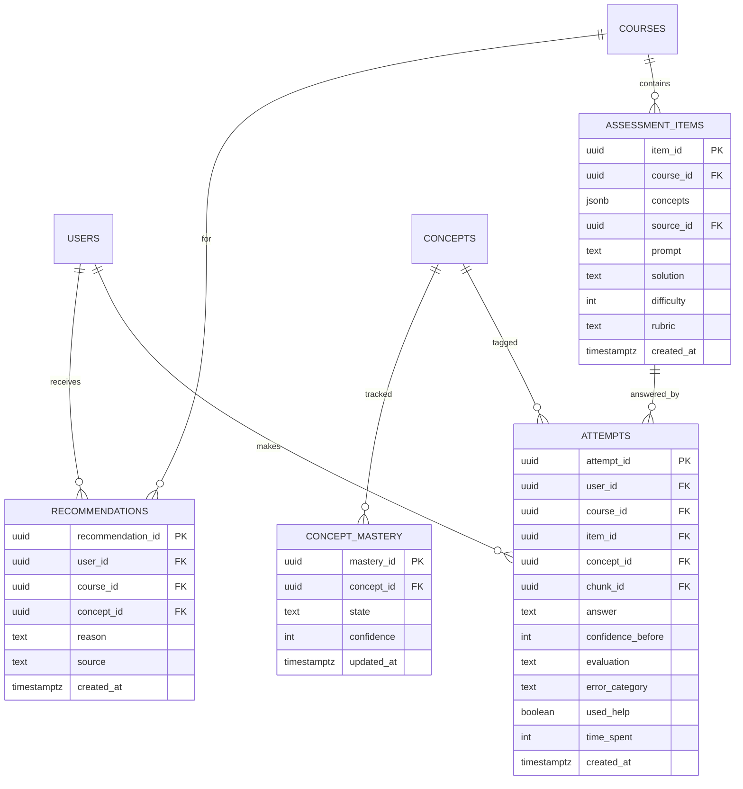

- **`ASSESSMENT_ITEMS`** are the unit a cold probe uses: prompt, concepts tested,
  difficulty, rubric.
- **`CONCEPT_MASTERY`** holds the current mastery **state** per concept — a ladder
  (`unseen` → ... → `transfer`), not a single fake-precise score.
- **`RECOMMENDATIONS`** are the "what to study next" output, traceable to a
  concept, a reason, and the source (attempt, TOC, etc.).

### 2.5 Chat history (raw + compressed)

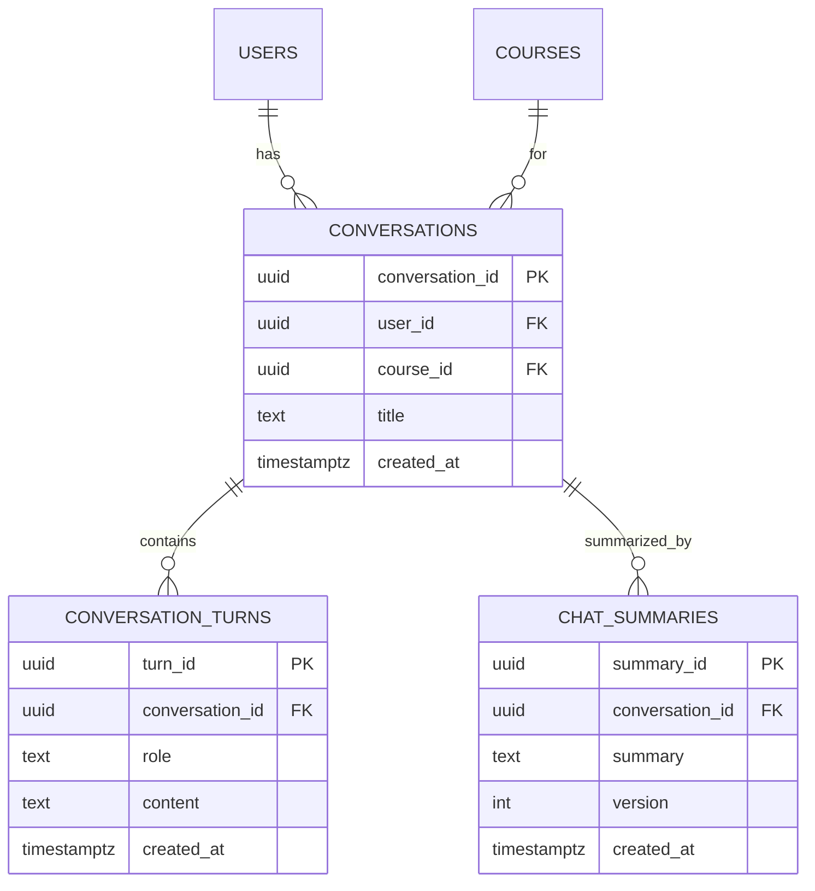

- Chat is stored in **two forms** for two audiences: the raw `CONVERSATION_TURNS`
  (what the user sees), and a compressed `CHAT_SUMMARIES` (what the LLM uses as
  context on the next prompt). Summaries are regenerated when the conversation
  grows past a threshold so the model always prompts against current context.

### 2.6 Provenance & evidence

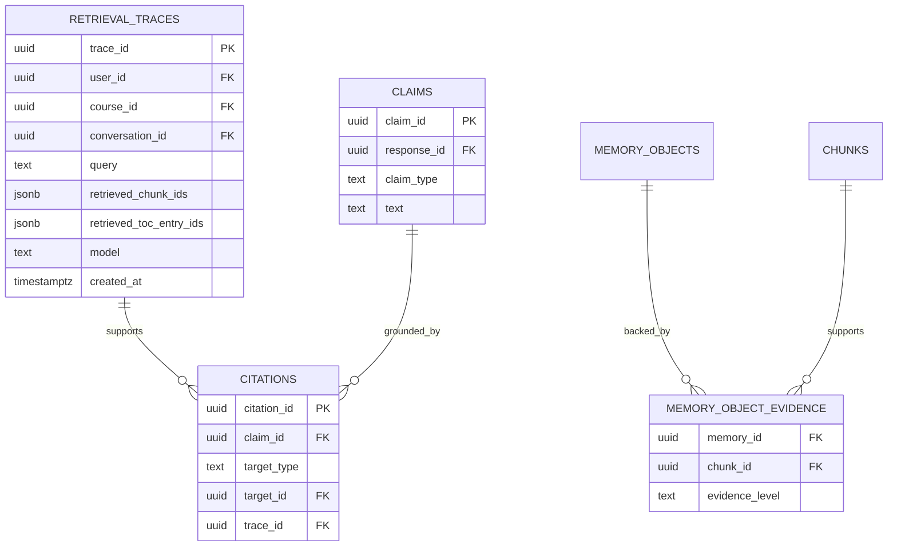

- **`RETRIEVAL_TRACES`** record what the tutor retrieved and used to produce an
  answer, enabling audit of whether a citation actually supported the answer.
- **`CLAIMS`** + **`CITATIONS`** ground each claim in evidence (a chunk, memory
  object, or TOC entry), with the trace that produced it.
- **`MEMORY_OBJECT_EVIDENCE`** links a memory object directly to the chunk that
  supports it, so a citation on a memory object can resolve to a chunk within
  two hops.
- **`ARTIFACT_PROVENANCE`** (not shown) records how a generated artifact was
  produced — its sources, concepts, and model — so origin is auditable and
  regenerable.

**Key decisions:**

- **Objects are stored whole; extracted, token-bounded chunks are the retrieval
  unit.** Raw files are kept only while cheap, then trimmed (see §5).
- **Per-user isolation:** `users` root, everything resolves back to a `user_id`
  either directly or through `sources`/`courses`. Clean per-user delete.
- **TOC-based retrieval, not embeddings.** A model-written table of contents
  describes the course and locates content, avoiding cross-model embedding
  misalignment. Written by a small, stable TOC model.
- **No rigid type system.** `kind` (course objects), `locator_type`, and
  `content_type` are free strings, so new kinds and formats insert without a
  schema migration.
- **Provenance is first-class.** Every claim, artifact, and model decision is
  traceable to evidence, so source grounding is enforceable and auditable.

---

## 3. Ingestion pipeline

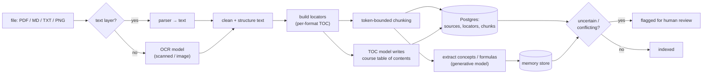

**Steps:** accept file → detect type/OCR need → extract text with structure
offsets → clean → build **locators** (the per-format table of contents) → split
into **token-bounded chunks** → write sources, locators, chunks to Postgres →
propose memory objects with evidence links → a small **TOC model** writes the
course table of contents → flag uncertain extractions for review.

**Rules:** block solution documents from cold-probe context; prefer instructor
sources over student notes; store a retrieval trace for every query.

---

## 4. Retrieval & answer flow

Retrieval is **TOC-guided**, not embedding-similarity-based. The model-written
table of contents tells the tutor where content lives, and the tutor fetches the
specific token-bounded chunks via locators. This avoids cross-model embedding
misalignment and keeps retrieval inspectable.

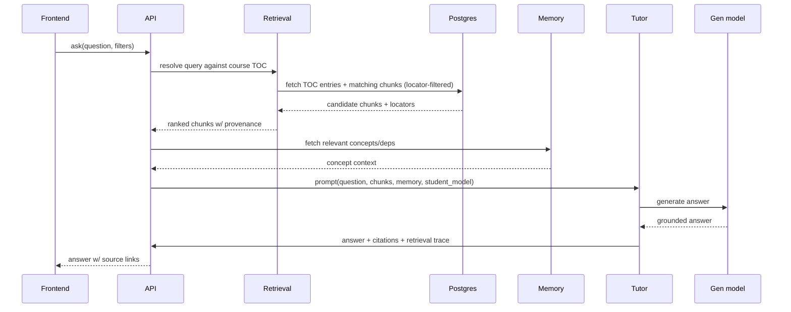

**Retrieval evolution (measured, not assumed):**

1. **Baseline:** TOC-guided chunk selection + metadata filters. No embedding model.
2. **If eval shows gaps:** consider embeddings + `pgvector`, reranker — only when a
   versioned eval question fails the baseline. Embeddings remain optional.

**Never** answer an uploaded-material question without showing sources.

---

## 5. Storage of originals (the trim policy)

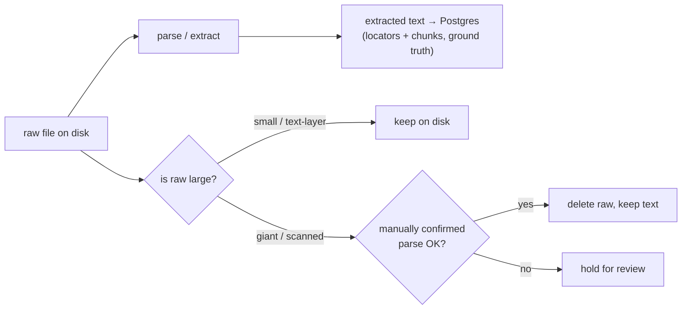

- Extracted text always persists (tiny, ground truth); objects are stored whole.
- Raw originals trimmed when large/scanned, only after a successful confirmed parse.
- Text-layer PDFs are small → usually kept; they cost nothing and let you re-parse.

---

## 6. Model strategy

Inference is **not self-hosted**. Models are called through a **hosted API provider
that does not retain data** (e.g. OpenRouter / Groq / similar). This keeps costs
low (a provider-served DeepSeek v4 flash is cheaper than self-hosting) and pushes
the privacy requirement onto a *contract*: the provider must not retain prompts or
responses. Verify this for whichever provider is chosen.

| Task | Model class | In MVP? | Note |
|---|---|---|---|
| Generative answer / extraction / classification | DeepSeek v4 flash | **Yes** | generative model |
| Table-of-contents writer/updater | **small, stable** model | **Yes** | keeps TOC descriptions consistent over time |
| Embeddings (retrieval) | separate embedding model | No | only if TOC path fails; `pgvector` |
| OCR (scanned/image slides) | OCR/vision model | Only if scans exist | math-in-PNG is hard; avoid if text-layer |
| Reranker | separate reranker | No | later, if retrieval precision suffers |

**"ML earns its role":** retrieval is TOC-guided, not embedding-based. Add
embeddings/OCR/reranker/fine-tuning only for a documented, versioned baseline
failure on a measured eval task.

> Why a dedicated TOC model? A small, stable model keeps course descriptions
> consistent over time (one model's embeddings may not align with another's, so
> we avoid relying on embeddings for retrieval entirely). A separate embedding
> model would be needed only if the TOC path measurably fails.

---

## 7. Student model & tutor flow

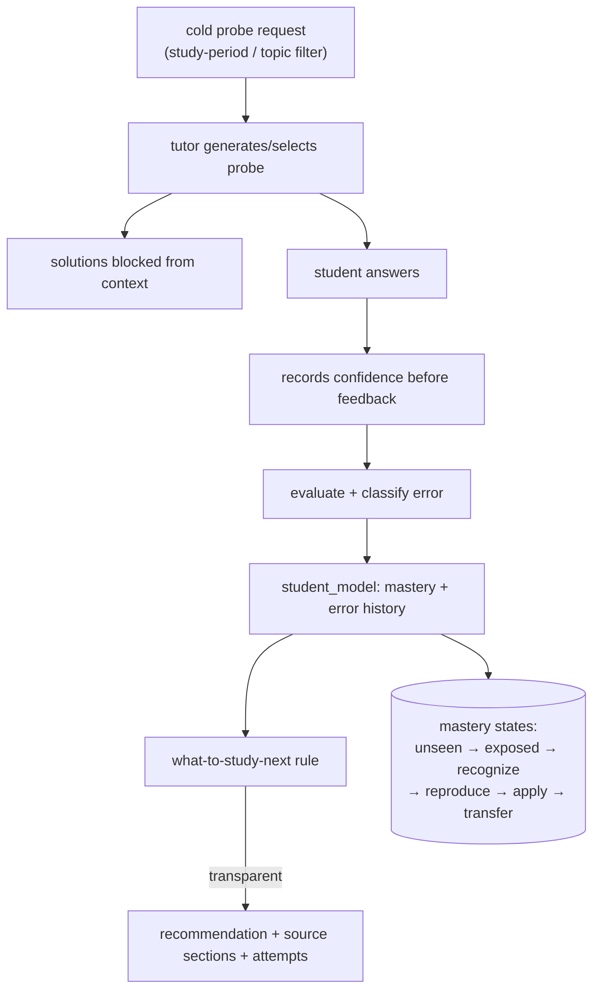

**Per-attempt record:** concept tags, question version, answer, evaluation,
confidence before feedback, correctness, error category, time, date, help used.

**Mastery is a ladder, not one fake-precise score.** Recommendations must be
traceable to specific attempts and concept evidence.

---

## 8. Deployment topology (small user count)

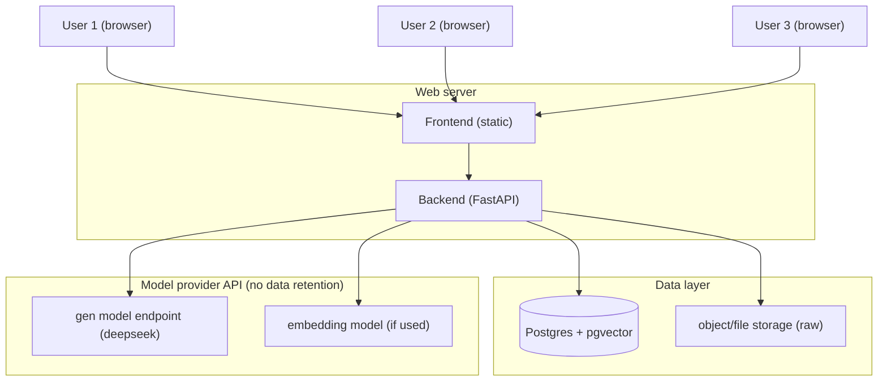

Small scale → no microservices, no k8s. A single web process + Postgres + object
storage. Inference goes out to a **hosted model API** (no data retention) rather
than a self-hosted model — this keeps cost low and avoids running local inference
servers.

---

## 9. Cross-cutting concerns

- **DB access:** isolated in `src/backend/common/db.py`; raw SQL queries in
  `src/backend/common/queries/*.sql`; schema via versioned migrations
  `src/backend/common/migrations/00X_*.sql` with a runner.
- **Validation:** Pydantic schemas at every boundary (`src/backend/common/`).
- **Config:** tunable/versioned params in `configs/`, not hardcoded.
- **Evals:** every subsystem has a regression path under `src/backend/evals/`.
  No feature ships without a way to measure regressions.
- **Logging/traces:** retrieval traces + eval logs under `runs/` (gitignored).
- **No secrets:** never log/commit keys, tokens, or classmates' work.

---

## 10. Open decisions (record changes in `docs/decisions/`)

- Exact hosting target (VPS vs Railway/Render/Fly/Supabase) — affects local dev mirror.
- **Choose a model API provider that does not retain data** (OpenRouter / Groq /
  similar); verify their data-retention policy before committing.
- Docker vs native Postgres for local dev.
- Whether OCR is in scope depends on whether pilot slides are scanned/image-heavy.
- When (if ever) to adopt embeddings/reranker — gated on a failing eval question.
- AI-generated course objects (flashcards, slidedecks) are a **future** feature —
  the `course_objects` table already supports them; no generation logic yet.

---

## 11. Definition of done (from project.md)

A student can upload one course's materials, ask source-cited questions, take a
short closed-notes diagnostic, review their concept-linked mistakes, and receive a
transparent recommendation for what to study next. The system works locally,
records provenance, and has a small regression/evaluation suite that prevents
silent quality loss.
