# System Design

> Architectural overview of the Course Memory and Adaptive Study System.
> Read this alongside `project.md` (product/plan) and `AGENTS.md` (contract).
> Decisions here are the current *agreed* ones; record changes in `docs/decisions/`.

## 0. TL;DR

A local-first academic assistant that ingests course materials, extracts searchable
text and structured course memory, learns a per-student error model from attempts,
and serves source-grounded answers + "what to study next" recommendations through a
small web UI. Deployed for a small user base; Postgres as the database engine.

- **Backend:** Python / FastAPI under `src/backend/`
- **Frontend:** `src/frontend/`, talks to backend only via API
- **Database:** Postgres (industry-standard; you plan to host for a small user count)
- **Inference:** one cheap generative model (DeepSeek v4 flash) for
  generation/extraction/classification, called through a **hosted API provider that
  does not retain data** (not self-hosted).
- **Retrieval:** keyword baseline first (Postgres FTS); embeddings (`pgvector`) only
  when a versioned eval question proves keyword search fails
- **Data ownership:** local-first applies to data and storage — course material and
  study history are yours, in your Postgres. Inference is a no-retention API.

---

## 1. High-level architecture

The system is a **pipeline with a memory**. Think of it like a **library that
learns about you**:

- **Ingestion** is the *librarian* — it takes your messy course files, reads them,
  and files every page into the catalog.
- **Postgres** is the *stacks* — the organized shelves where all the text and
  metadata live.
- **Retrieval** is the *card catalog* — when you ask a question, it finds the right
  pages.
- **Course memory** is the *study guide* the librarian wrote — concepts, definitions,
  and how they connect, each with a page number.
- **Student model** is the *librarian's notes on you* — what you've tried, where you
  stumble, what you've mastered.
- **Tutor** is the *reference desk* — it reads the catalog, the study guide, and the
  notes on you, then answers with citations and tells you what to study next.

The whole thing is one **backend** (the library staff) behind an **API** (the front
desk), a **frontend** (the reading room you sit in), and a set of **models** (the
specialists the staff can call on).

### 1.1 The big picture

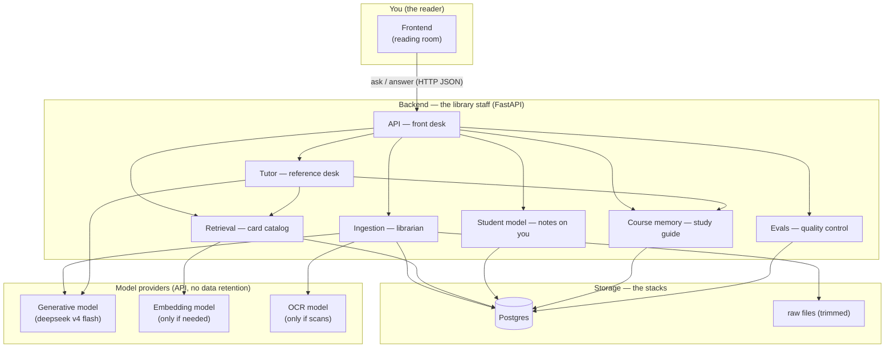

### 1.2 Layer 1 — Ingestion (the librarian)

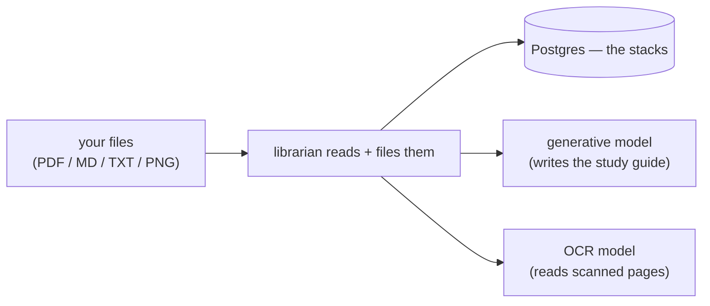

**Analogy:** you hand the librarian a stack of papers. They read each one, note the
page numbers, and file the text onto the shelves. For scanned pages they call in an
OCR specialist to read the handwriting. They also draft a study guide (course
memory) as they go.

### 1.3 Layer 2 — Retrieval (the card catalog)

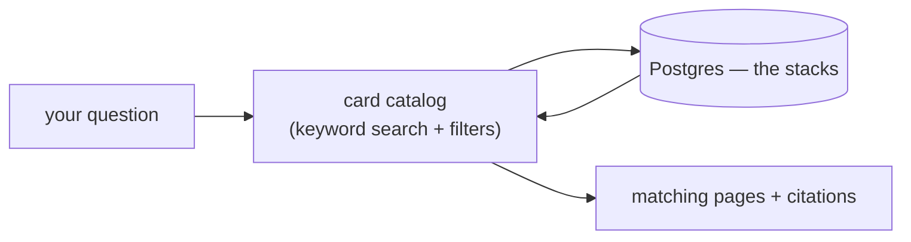

**Analogy:** you ask "what's the factorization condition?" The catalog flips through
its index cards and hands you the exact pages that mention it, with page numbers.
(If keyword search later misses things that *mean* the same thing but use different
words, we add an embedding specialist — but only if a test proves the catalog fails.)

### 1.4 Layer 3 — Course memory (the study guide)

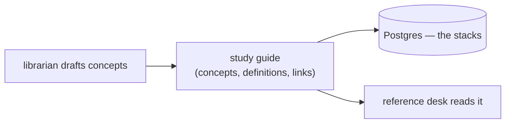

**Analogy:** the librarian's study guide lists each concept, its course-specific
definition, and how concepts depend on each other — every entry with a page number
so you can verify it. It's small enough to read and correct.

### 1.5 Layer 4 — Student model (notes on you)

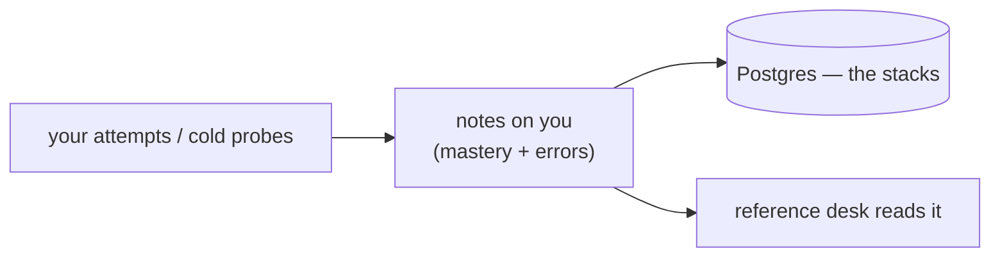

**Analogy:** every time you answer a practice question, the librarian jots a note:
which concept, whether you got it, what kind of mistake, how confident you were.
Over time these notes become a picture of what you actually understand.

### 1.6 Layer 5 — Tutor (the reference desk)

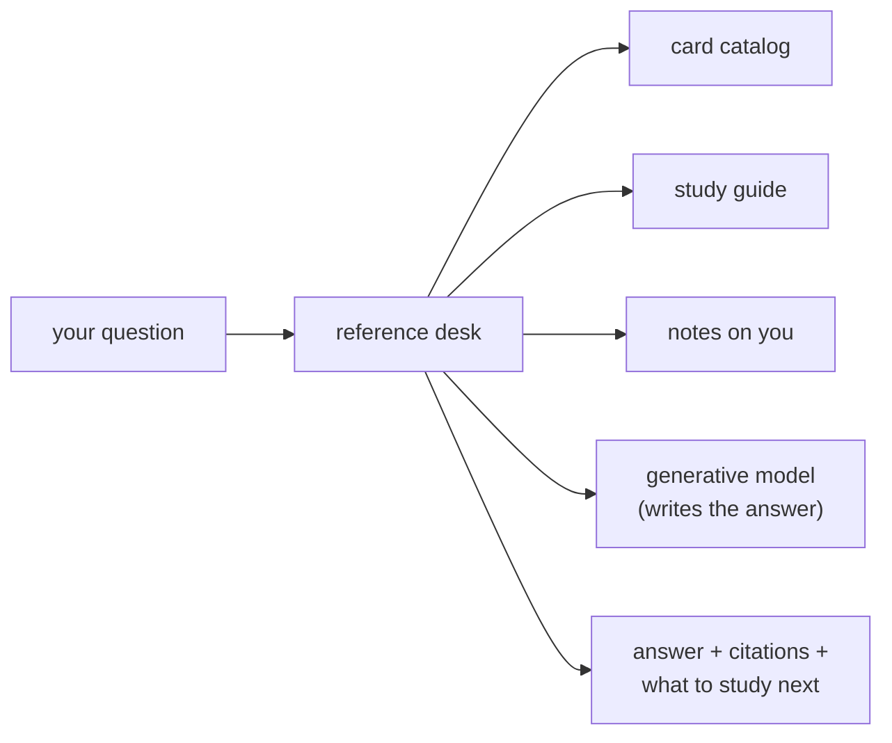

**Analogy:** you ask the reference desk a question. They pull the relevant pages
(catalog), check the study guide (memory), glance at their notes on you (student
model), and write you a clear answer — always pointing to the exact page it came
from, and telling you what to practice next.

### 1.7 How the layers fit together

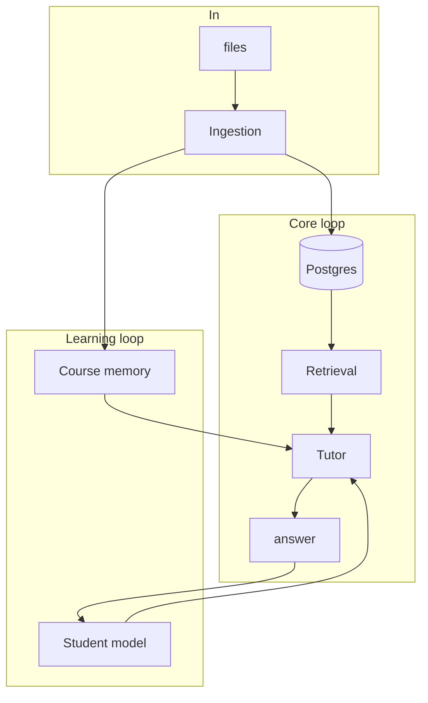

**Data flow at a glance:** files enter through ingestion → parsed to text →
stored in Postgres (source of truth) → retrieval answers questions by searching
that text → tutor generates responses grounded in retrieved passages + course
memory + student model.

---

## 2. Storage model

The schema is broken into **four layers** so each diagram stays readable. Read them
in order; each layer builds on the previous.

### 2.1 Identity & course structure

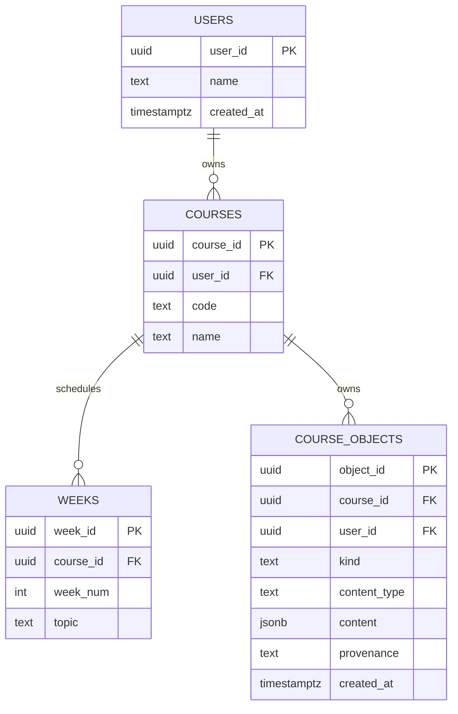

### 2.2 Source content (uploaded material)

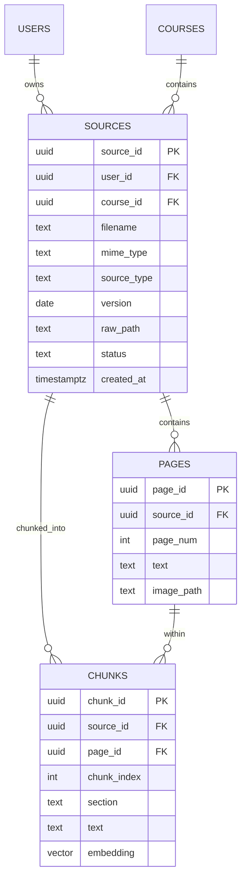

### 2.3 Course memory (concepts & evidence)

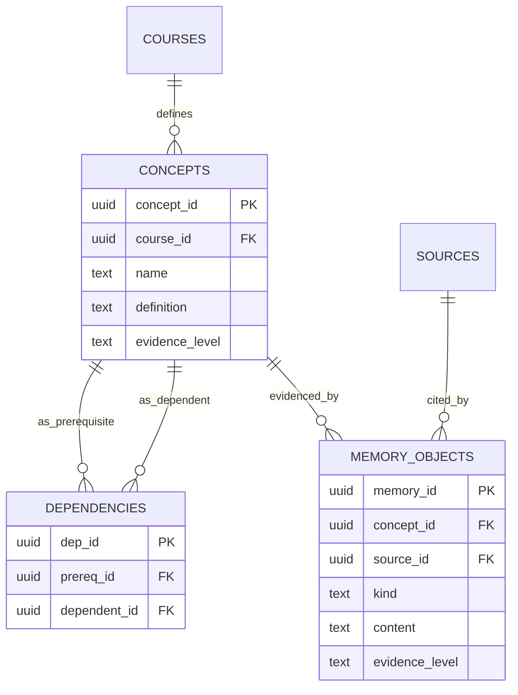

### 2.4 Student model (attempts & mastery)

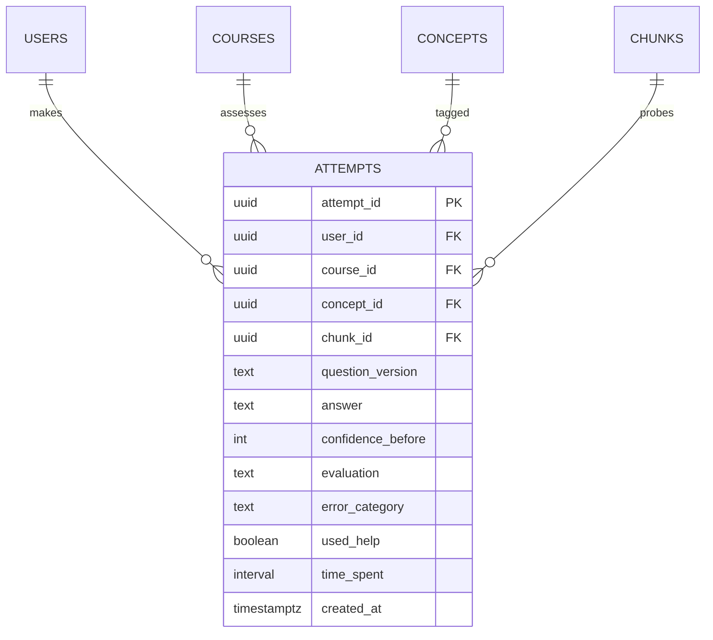

**Key decisions:**

- **Extracted text is the source of truth**, stored in Postgres (pages + chunks).
  Raw files are kept only while cheap, then trimmed (see §5).
- **Per-user isolation:** `users` root, everything resolves back to a `user_id`
  either directly or through `sources`/`courses`. Clean per-user delete.
- **Course-owned objects of varied type:** a general `course_objects` table (§2.1) models
  *any* thing a course owns — uploaded sources, and (later) AI-generated artifacts
  such as flashcards or slidedecks. `kind` distinguishes the type; heterogeneous
  content lives in `jsonb` so new content shapes need **no schema migration**.
  Uploads are one kind of object; generated artifacts are others. This is a
  forward-compatible decision — generation is not built yet, but the schema already
  supports it.
- **Retrieval provenance:** every chunk retains `source_id`, `page_id`, `section`,
  so citations are exact (`source`, `page`, `section`).
- **`evidence_level`** on memory objects: `direct` / `derived` / `hypothesis` —
  distinguishes source-supported claims from inferred ones.

---

## 3. Ingestion pipeline

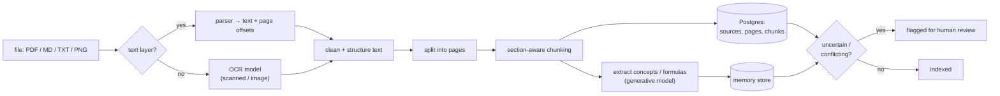

**Steps:** accept file → detect type/OCR need → extract text with page/slide
offsets → clean → chunk with section-aware boundaries → write pages + chunks to
Postgres → propose memory objects with evidence links → flag uncertain extractions
for review.

**Rules:** block solution documents from cold-probe context; prefer instructor
sources over student notes; store a retrieval trace for every query.

---

## 4. Retrieval & answer flow

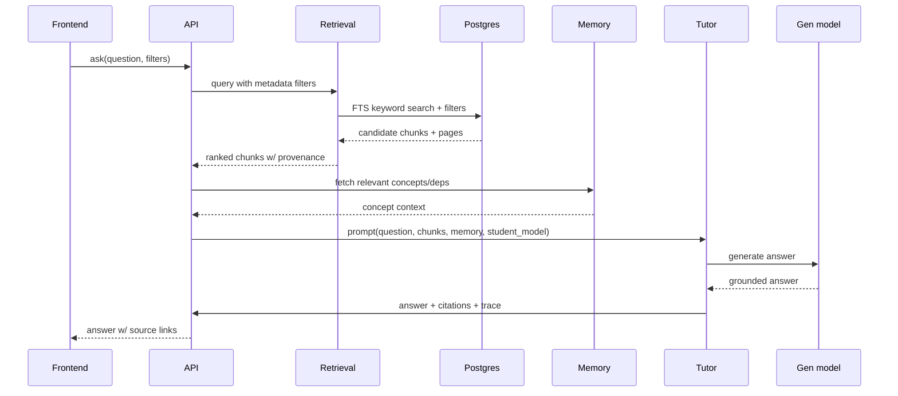

**Retrieval evolution (measured, not assumed):**

1. **Baseline:** Postgres FTS (full-text keyword search) + metadata filters.
   Free, no model.
2. **If eval shows semantic gaps:** add embedding model + `pgvector`,
   reranker on top. Only when a versioned eval question fails the baseline.

**Never** answer an uploaded-material question without showing sources.

---

## 5. Storage of originals (the trim policy)

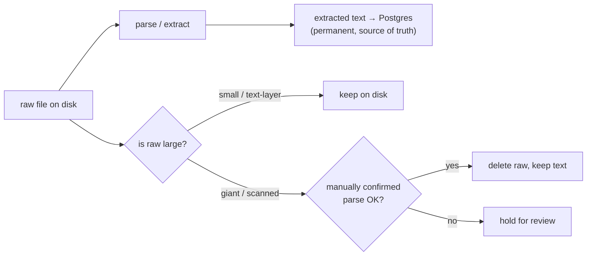

- Extracted text always persists (tiny, ground truth).
- Raw originals trimmed when large/scanned, only after a successful confirmed parse.
- Text-layer PDFs are small → usually kept; they cost nothing and let you re-parse.

---

## 6. Model strategy

Inference is **not self-hosted**. Models are called through a **hosted API provider
that does not retain data** (e.g. OpenRouter / Groq / similar). This keeps costs
low (a provider-served DeepSeek v4 flash is cheaper than self-hosting) and pushes
the privacy requirement onto a *contract*: the provider must not retain prompts or
responses. Verify this for whichever provider is chosen.

| Task | Model class | In MVP? | Note |
|---|---|---|---|
| Generative answer / extraction / classification | DeepSeek v4 flash (1 cheap model) | **Yes** | one model across generation tasks |
| Embeddings (retrieval) | separate embedding model | No | only if FTS eval fails; `pgvector` |
| OCR (scanned/image slides) | OCR/vision model | Only if scans exist | math-in-PNG is hard; avoid if text-layer |
| Reranker | separate reranker | No | later, if retrieval precision suffers |

**"ML earns its role":** start with one cheap generative model + FTS keyword search.
Add embeddings/OCR/reranker/fine-tuning only for a documented, versioned baseline
failure on a measured eval task.

> Why a separate embedding model? An LLM's internal embeddings power token
> prediction, not similarity search. Retrieval needs a small model trained so
> similar-meaning chunks are close in vector space. And we don't need it at all
> until keyword search measurably fails.

---

## 7. Student model & tutor flow

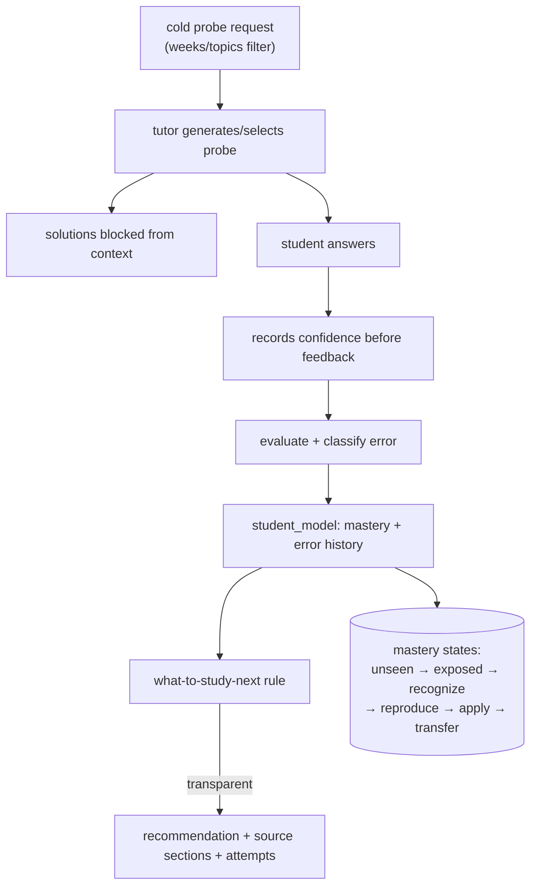

**Per-attempt record:** concept tags, question version, answer, evaluation,
confidence before feedback, correctness, error category, time, date, help used.

**Mastery is a ladder, not one fake-precise score.** Recommendations must be
traceable to specific attempts and concept evidence.

---

## 8. Deployment topology (small user count)

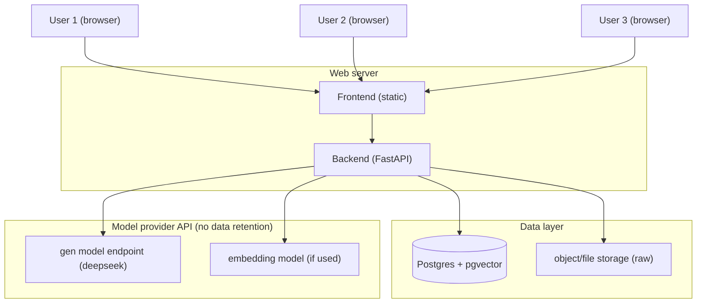

Small scale → no microservices, no k8s. A single web process + Postgres + object
storage. Inference goes out to a **hosted model API** (no data retention) rather
than a self-hosted model — this keeps cost low and avoids running local inference
servers.

---

## 9. Cross-cutting concerns

- **DB access:** isolated in `src/backend/common/db.py`; raw SQL queries in
  `src/backend/common/queries/*.sql`; schema via versioned migrations
  `src/backend/common/migrations/00X_*.sql` with a runner.
- **Validation:** Pydantic schemas at every boundary (`src/backend/common/`).
- **Config:** tunable/versioned params in `configs/`, not hardcoded.
- **Evals:** every subsystem has a regression path under `src/backend/evals/`.
  No feature ships without a way to measure regressions.
- **Logging/traces:** retrieval traces + eval logs under `runs/` (gitignored).
- **No secrets:** never log/commit keys, tokens, or classmates' work.

---

## 10. Open decisions (record changes in `docs/decisions/`)

- Exact hosting target (VPS vs Railway/Render/Fly/Supabase) — affects local dev mirror.
- **Choose a model API provider that does not retain data** (OpenRouter / Groq /
  similar); verify their data-retention policy before committing.
- Docker vs native Postgres for local dev.
- Whether OCR is in scope depends on whether pilot slides are scanned/image-heavy.
- When (if ever) to adopt embeddings/reranker — gated on a failing eval question.
- AI-generated course objects (flashcards, slidedecks) are a **future** feature —
  the `course_objects` table already supports them; no generation logic yet.

---

## 11. Definition of done (from project.md)

A student can upload one course's materials, ask source-cited questions, take a
short closed-notes diagnostic, review their concept-linked mistakes, and receive a
transparent recommendation for what to study next. The system works locally,
records provenance, and has a small regression/evaluation suite that prevents
silent quality loss.
